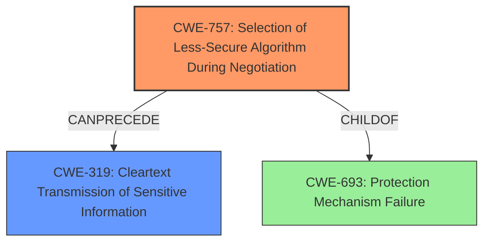

# Final Resolution for CVE-2021-36326

# Summary
| CWE ID | CWE Name | Confidence | CWE Abstraction Level | CWE Vulnerability Mapping Label | CWE-Vulnerability Mapping Notes |
|---|---|---|---|---|---|
| CWE-757 | Selection of Less-Secure Algorithm During Negotiation ('Algorithm Downgrade') | 0.95 | Base | Allowed | Primary CWE: The vulnerability allows an attacker to force the use of a less secure algorithm. |
| CWE-319 | Cleartext Transmission of Sensitive Information | 0.8 | Base | Allowed | Secondary CWE: Downgrading to an unencrypted format results in cleartext transmission. |

## Evidence and Confidence

*   **Confidence Score:** 0.9
*   **Evidence Strength:** HIGH

## Relationship Analysis
The primary relationship impacting the decision is the direct consequence of **CWE-757 (Selection of Less-Secure Algorithm During Negotiation)** leading to **CWE-319 (Cleartext Transmission of Sensitive Information)**. While other CWEs were considered, their abstraction levels or direct applicability were not as strong. CWE-757 acts as the root cause, forcing a downgrade, while CWE-319 is the immediate result.

## Vulnerability Chain
The vulnerability chain starts with the **ROOTCAUSE** being **CWE-757**, where the system fails to enforce the strongest available encryption algorithm. This leads to a downgrade to an unencrypted connection, resulting in **CWE-319**, the **WEAKNESS**, which is the cleartext transmission of sensitive data.

## Summary of Analysis
The initial analysis correctly identifies **CWE-757** and **CWE-319** as the primary and secondary CWEs. The vulnerability description explicitly mentions the "SSL strip vulnerability" and "downgrade in communications between the client and server into an unencrypted format," providing strong evidence for these classifications.

The retriever results and the criticism provided further context, but did not change the core assessment. **CWE-757** remains the most accurate representation of the root cause, with **CWE-319** as its direct consequence.

The decision is based on the direct evidence from the vulnerability description and the clear chain relationship between the two CWEs. The selected CWEs are at the optimal level of specificity, as **CWE-757** and **CWE-319** are base-level CWEs that accurately describe the vulnerability and its impact.