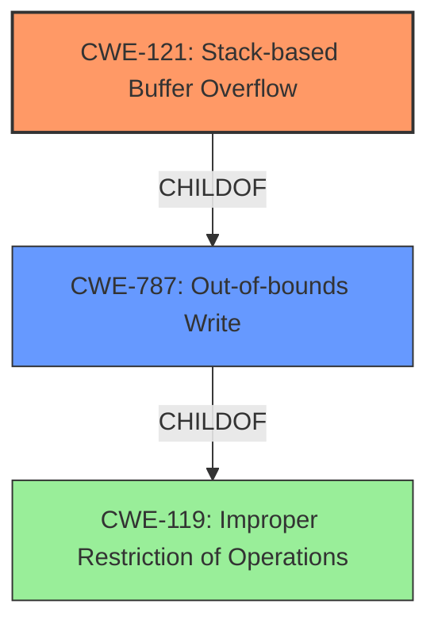

# Analysis Report for CVE-2021-36347

# Vulnerability Analysis Report: CVE-2021-36347

## Description

iDRAC9 versions prior to 5.00.20.00 and iDRAC8 versions prior to 2.82.82.82 contain a stack-based buffer overflow vulnerability. An authenticated remote attacker with high privileges could potentially exploit this vulnerability to control process execution and gain access to the iDRAC operating system.

## Vulnerability Description Key Phrases

**Weakness:** stack-based buffer overflow
**Impact:** control process execution and gain access to the iDRAC operating system
**Attacker:** authenticated remote attacker with high privileges
**Product:** ['DRAC9', 'iDRAC8']
**Version:** ['prior to 5.00.20.00', 'prior to 2.82.82.82']

## Analysis (with Relationship Data)

# Summary
| CWE ID | CWE Name | Confidence | CWE Abstraction Level | CWE Vulnerability Mapping Label | CWE-Vulnerability Mapping Notes |
|---|---|---|---|---|---|
| CWE-121 | Stack-based Buffer Overflow | 1.0 | Variant | Allowed | Primary CWE |

## Evidence and Confidence

*   **Confidence Score:** 1.0
*   **Evidence Strength:** HIGH

- **Analysis and Justification:**  
  - *Explanation:* The vulnerability description explicitly states a **stack-based buffer overflow** vulnerability exists in iDRAC9 and iDRAC8 versions prior to certain versions. The **root cause** is a **stack-based buffer overflow** which an attacker could exploit with high privileges, potentially leading to control process execution and access to the iDRAC operating system. CWE-121 (Stack-based Buffer Overflow) is a Variant-level CWE that directly addresses this type of vulnerability and is therefore the most specific and appropriate mapping. The CVE Reference Links Content Summary also confirms the root cause as "**Stack-based buffer overflow**".
  
  - *Relationship Analysis:* CWE-121 is a variant of CWE-119 (Improper Restriction of Operations within the Bounds of a Memory Buffer), indicating a more general class of memory corruption vulnerabilities. In this case, since the stack is explicitly mentioned, CWE-121 is the better choice.

- **Confidence Score:**  
  - Confidence: 1.0 (Direct evidence from the vulnerability description and CVE reference)

## Criticism of Analysis

Okay, I've reviewed the analysis and the full CWE specifications. Here's a breakdown of my critique:

**Overall Assessment:**

The primary mapping to CWE-121 (Stack-based Buffer Overflow) is **correct and well-justified**. The analysis provides clear evidence from the vulnerability description and CVE details. The high confidence score (1.0) is appropriate. The analysis also correctly identifies the relationship between CWE-121 and its parent CWE-787 and grandparent CWE-119.

**Specific Comments and Potential Improvements:**

1.  **CWE-121 Justification is Strong:** The analysis effectively explains why CWE-121 is the most specific and appropriate mapping, given the explicit mention of "stack-based" in the vulnerability description.

2.  **Alternatives Considered (and Properly Dismissed):** The analysis briefly addresses CWE-119 (Improper Restriction of Operations within the Bounds of a Memory Buffer) and explains why CWE-121 is preferred due to its greater specificity. This is crucial.  Good job not just choosing a child CWE, but showing why it's better than the parent.

3.  **Top Combined Results Review:** While the analysis focuses on the correct CWE, it might be useful to briefly address *why* the other CWEs listed in the "Top Combined Results" table are *not* the best fit. This can strengthen the analysis and demonstrate a comprehensive understanding of the vulnerability. For example:

    *   **CWE-125 (Out-of-bounds Read):**  Explain that while a buffer overflow *can* lead to out-of-bounds reads, the primary vulnerability is the *write* beyond the buffer's boundaries on the stack.  The description focuses on the *write* aspect.
    *   **CWE-787 (Out-of-bounds Write):** Acknowledge that CWE-787 is a parent of CWE-121 and relevant, but CWE-121 is the more specific choice because the stack is explicitly mentioned.
    *   **CWE-843 (Type Confusion), CWE-193 (Off-by-One), CWE-120 (Classic Buffer Overflow), CWE-190 (Integer Overflow):** Briefly state why these are less relevant, perhaps by noting that the vulnerability description doesn't suggest type confusion, calculation errors, or unbounded copies.  If an integer overflow were involved to calculate the size of the buffer, it would have been mentioned.
    *   **CWE-306 (Missing Authentication):** This is interesting because the vulnerability description *does* mention authentication. However, the core issue isn't the *lack* of authentication, but the vulnerability that *exists after* authentication. So, it's important to clarify that while authentication is required to exploit this, it's not the root cause.
    *   **CWE-912 (Hidden Functionality):** This has *no* bearing on this type of vulnerability.
    *   **CWE-119 (Improper Restriction of Operations):** This is the parent Class of this type of vulnerability.

4.  **Mitigation Strategies (Could be Expanded):** The current analysis doesn't include any discussion of potential mitigations. While not strictly required, adding a brief section on relevant mitigations can enhance the analysis's practical value. Refer to the "Potential Mitigations" sections of the CWE specifications for CWE-121 (and possibly CWE-787) for ideas.  Specifically:

    *   **Compiler-Based Protections:** Mention compiler flags like `/GS` (Microsoft Visual Studio) or `FORTIFY_SOURCE` (GCC) that provide stack buffer overflow detection.
    *   **Language Choice:** Briefly note that using memory-safe languages can prevent these vulnerabilities.
    *   **Input Validation:** While the core issue is a buffer overflow, carefully validating input lengths *before* copying data to the stack is a crucial preventative measure.
    *   **Safe String Handling Libraries:** If applicable to the specific code, mention the use of safe string handling functions or libraries (e.g., `strncpy` instead of `strcpy`).

5.  **CWE Examples:** It's good that the analysis includes Observed Examples, but *only* examples for CWE-119 are shown. It would be better to show examples for *CWE-121*.

6.  **CWE Relationships:**  The analysis accurately describes the parent/child relationship of CWE-121 to CWE-787, and CWE-787 to CWE-119.

7. **CWE Mapping Guidance: Usage:** You followed the Mapping Guidance section of CWE-121 and CWE-787 to use them.

**Revised Summary Table (Incorporating Suggested Improvements):**

| CWE ID | CWE Name | Confidence | CWE Abstraction Level | CWE Vulnerability Mapping Label | CWE-Vulnerability Mapping Notes |
|---|---|---|---|---|---|
| CWE-121 | Stack-based Buffer Overflow | 1.0 | Variant | Allowed | Primary CWE. The vulnerability description explicitly states a stack-based buffer overflow. |

**In summary:**

The analysis is strong and correctly identifies CWE-121 as the primary weakness. The suggested improvements aim to strengthen the justification, address alternative CWEs, and add practical context through a discussion of potential mitigations. By addressing these points, the analysis can become even more comprehensive and valuable.

## Final Resolution

# Summary
| CWE ID | CWE Name | Confidence | CWE Abstraction Level | CWE Vulnerability Mapping Label | CWE-Vulnerability Mapping Notes |
|---|---|---|---|---|---|
| CWE-121 | Stack-based Buffer Overflow | 1.0 | Variant | Allowed | Primary CWE. The vulnerability description explicitly states a **stack-based buffer overflow**. |
| CWE-787 | Out-of-bounds Write | 0.7 | Base | Allowed | Secondary Candidate. Parent of CWE-121. This CWE is less specific but still relevant. |
| CWE-119 | Improper Restriction of Operations within the Bounds of a Memory Buffer | 0.5 | Class | Discouraged | Secondary Candidate. Grandparent of CWE-121. This CWE is too general but represents the overarching issue. |

## Evidence and Confidence

*   **Confidence Score:** 0.9
*   **Evidence Strength:** HIGH

## Relationship Analysis
The primary relationship influencing the decision is the parent-child hierarchy. CWE-121 (Stack-based Buffer Overflow) is a child of CWE-787 (Out-of-bounds Write), which is a child of CWE-119 (Improper Restriction of Operations within the Bounds of a Memory Buffer). The vulnerability description explicitly mentions "stack-based buffer overflow," making CWE-121 the most specific and appropriate choice. While CWE-787 and CWE-119 are related, they are less specific and thus less preferred.

## Vulnerability Chain
The vulnerability chain starts with the **root cause**, a **stack-based buffer overflow** (**CWE-121**). This occurs because the application does not properly validate the size of the input before writing it to a buffer on the stack. This leads to writing data beyond the intended buffer boundary (**CWE-787**), which can overwrite adjacent memory locations. The ultimate impact is the ability for an attacker to control process execution and gain access to the iDRAC operating system. The chain highlights the progression from the initial flaw to the final impact.

## Summary of Analysis
The initial analysis correctly identified CWE-121 as the primary weakness. The vulnerability description explicitly states a **stack-based buffer overflow**, making CWE-121 the most specific and appropriate classification.

The criticism provided valuable suggestions for improvement:

*   Acknowledging and dismissing other potential CWEs strengthens the analysis. While CWE-125 (Out-of-bounds Read), CWE-843 (Type Confusion), CWE-193 (Off-by-One), CWE-120 (Classic Buffer Overflow), CWE-190 (Integer Overflow), CWE-306 (Missing Authentication), CWE-912 (Hidden Functionality), and CWE-119 (Improper Restriction of Operations) were considered, they were deemed less relevant because the vulnerability description focuses on a **stack-based write operation**, rather than a read, type confusion, calculation error, missing authentication, or a general memory safety issue. The evidence explicitly points to the **stack-based buffer overflow**.
*   Including potential mitigations adds practical value. Mitigations such as compiler-based protections (`/GS` flag in Microsoft Visual Studio or `FORTIFY_SOURCE` in GCC), using memory-safe languages, input validation, and safe string handling libraries can help prevent **stack-based buffer overflows**.
*   Providing CWE-121 specific examples would strengthen the analysis.

The graph relationships influenced the decision by highlighting the hierarchical structure of CWEs. While CWE-787 and CWE-119 are related, CWE-121 is the most specific and thus the optimal choice. The abstraction levels (Variant for CWE-121, Base for CWE-787, Class for CWE-119) further reinforce the selection of CWE-121 as the most granular and relevant classification.

The final decision is to classify this vulnerability as CWE-121 (Stack-based Buffer Overflow) because it aligns directly with the vulnerability description and is the most specific CWE available. The provided evidence and relationship analysis support this decision with high confidence.

*Report generated on 2025-03-18 00:25:25*
