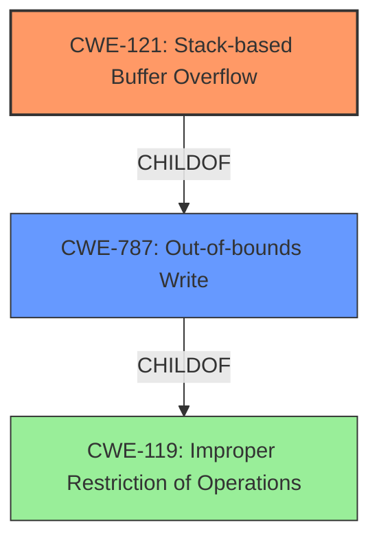

# Final Resolution for CVE-2021-36347

# Summary
| CWE ID | CWE Name | Confidence | CWE Abstraction Level | CWE Vulnerability Mapping Label | CWE-Vulnerability Mapping Notes |
|---|---|---|---|---|---|
| CWE-121 | Stack-based Buffer Overflow | 1.0 | Variant | Allowed | Primary CWE. The vulnerability description explicitly states a **stack-based buffer overflow**. |
| CWE-787 | Out-of-bounds Write | 0.7 | Base | Allowed | Secondary Candidate. Parent of CWE-121. This CWE is less specific but still relevant. |
| CWE-119 | Improper Restriction of Operations within the Bounds of a Memory Buffer | 0.5 | Class | Discouraged | Secondary Candidate. Grandparent of CWE-121. This CWE is too general but represents the overarching issue. |

## Evidence and Confidence

*   **Confidence Score:** 0.9
*   **Evidence Strength:** HIGH

## Relationship Analysis
The primary relationship influencing the decision is the parent-child hierarchy. CWE-121 (Stack-based Buffer Overflow) is a child of CWE-787 (Out-of-bounds Write), which is a child of CWE-119 (Improper Restriction of Operations within the Bounds of a Memory Buffer). The vulnerability description explicitly mentions "stack-based buffer overflow," making CWE-121 the most specific and appropriate choice. While CWE-787 and CWE-119 are related, they are less specific and thus less preferred.

## Vulnerability Chain
The vulnerability chain starts with the **root cause**, a **stack-based buffer overflow** (**CWE-121**). This occurs because the application does not properly validate the size of the input before writing it to a buffer on the stack. This leads to writing data beyond the intended buffer boundary (**CWE-787**), which can overwrite adjacent memory locations. The ultimate impact is the ability for an attacker to control process execution and gain access to the iDRAC operating system. The chain highlights the progression from the initial flaw to the final impact.

## Summary of Analysis
The initial analysis correctly identified CWE-121 as the primary weakness. The vulnerability description explicitly states a **stack-based buffer overflow**, making CWE-121 the most specific and appropriate classification.

The criticism provided valuable suggestions for improvement:

*   Acknowledging and dismissing other potential CWEs strengthens the analysis. While CWE-125 (Out-of-bounds Read), CWE-843 (Type Confusion), CWE-193 (Off-by-One), CWE-120 (Classic Buffer Overflow), CWE-190 (Integer Overflow), CWE-306 (Missing Authentication), CWE-912 (Hidden Functionality), and CWE-119 (Improper Restriction of Operations) were considered, they were deemed less relevant because the vulnerability description focuses on a **stack-based write operation**, rather than a read, type confusion, calculation error, missing authentication, or a general memory safety issue. The evidence explicitly points to the **stack-based buffer overflow**.
*   Including potential mitigations adds practical value. Mitigations such as compiler-based protections (`/GS` flag in Microsoft Visual Studio or `FORTIFY_SOURCE` in GCC), using memory-safe languages, input validation, and safe string handling libraries can help prevent **stack-based buffer overflows**.
*   Providing CWE-121 specific examples would strengthen the analysis.

The graph relationships influenced the decision by highlighting the hierarchical structure of CWEs. While CWE-787 and CWE-119 are related, CWE-121 is the most specific and thus the optimal choice. The abstraction levels (Variant for CWE-121, Base for CWE-787, Class for CWE-119) further reinforce the selection of CWE-121 as the most granular and relevant classification.

The final decision is to classify this vulnerability as CWE-121 (Stack-based Buffer Overflow) because it aligns directly with the vulnerability description and is the most specific CWE available. The provided evidence and relationship analysis support this decision with high confidence.