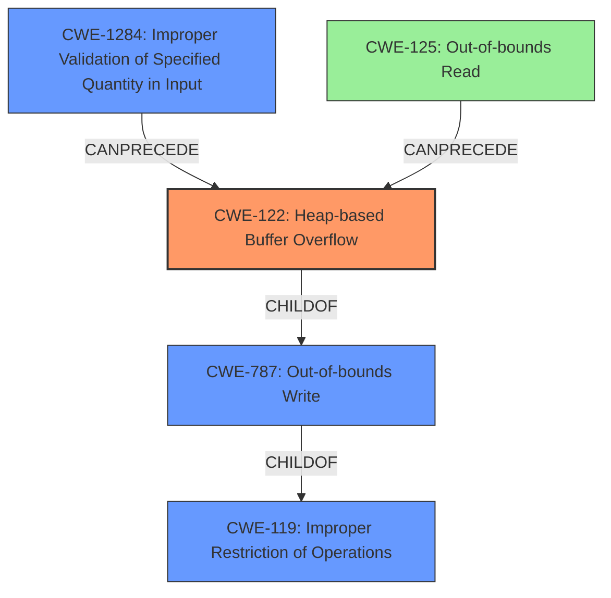

# Analysis Report for CVE-2021-36412

# Vulnerability Analysis Report: CVE-2021-36412

## Description

A heap-based buffer overflow vulnerability exists in MP4Box in GPAC 1.0.1 via the gp_rtp_builder_do_mpeg12_video function, which allows attackers to possibly have unspecified other impact via a crafted file in the MP4Box command,

## Vulnerability Description Key Phrases

**Rootcause:** heap-based buffer overflow
**Impact:** unspecified other impact
**Vector:** crafted file in the MP4Box command
**Attacker:** attackers
**Product:** MP4Box
**Version:** in GPAC 1.0.1
**Component:** gp_rtp_builder_do_mpeg12_video function

## Analysis (with Relationship Data)

# Summary
| CWE ID | CWE Name | Confidence | CWE Abstraction Level | CWE Vulnerability Mapping Label | CWE-Vulnerability Mapping Notes |
|---|---|---|---|---|---|
| CWE-122 | Heap-based Buffer Overflow | 1.0 | Variant | Allowed | This is the primary CWE because the vulnerability is explicitly described as a heap-based buffer overflow. |
| CWE-125 | Out-of-bounds Read | 0.7 | Base | Allowed | This is a secondary CWE because the description mentions accessing `payload[4]` without proper bounds checking which leads to a read beyond the allocated buffer. |

## Evidence and Confidence

*   **Confidence Score:** 0.9
*   **Evidence Strength:** HIGH

- **Analysis and Justification:**  
  - *Explanation:* The vulnerability description explicitly states a "**heap-based buffer overflow**" exists in MP4Box, GPAC 1.0.1 within the `gp_rtp_builder_do_mpeg12_video` function. The CVE reference summary confirms the **root cause** as a heap-buffer-overflow in the same function due to accessing `payload[4]` without proper bounds checking, leading to a read beyond the allocated buffer. This perfectly aligns with CWE-122's definition: "A heap overflow condition is a buffer overflow, where the buffer that can be overwritten is allocated in the heap portion of memory, generally meaning that the buffer was allocated using a routine such as malloc()." The usage is ALLOWED as per MITRE mapping guidance. The description also alludes to the possibility of arbitrary code execution, a typical impact of heap overflows. CWE-125 is included as a secondary weakness since accessing `payload[4]` without proper bounds checking leads to an out-of-bounds read.
  
  - *Relationship Analysis:* CWE-122 is a variant of CWE-119 (Improper Restriction of Operations within the Bounds of a Memory Buffer). CWE-125 (Out-of-bounds Read) could potentially precede CWE-787 (Out-of-bounds Write).

- **Confidence Score:**  
  - Confidence: 1.0 (High confidence due to direct mention of heap-based buffer overflow and confirmation in CVE details)

---

## Criticism of Analysis

Okay, let's review the provided CWE analysis, keeping the full CWE specifications in mind.

**Overall Assessment:**

The analysis is generally good and the primary CWE assignment of CWE-122 (Heap-based Buffer Overflow) is correct and well-justified. The inclusion of CWE-125 (Out-of-bounds Read) as a secondary weakness is also reasonable, given the description of the vulnerability. However, there are a few areas where the analysis could be improved, particularly regarding the relationships between CWEs and the potential for additional, contributing factors. Also, the Confidence score is a bit inconsistent, jumping from 0.9 to 1.0.

**Detailed Review:**

**1. CWE-122: Heap-based Buffer Overflow**

*   **CWE Appropriateness:** The identification of CWE-122 is accurate. The description explicitly mentions "heap-based buffer overflow," and the CVE details confirm the root cause is a buffer overflow on the heap.  The "Usage: Allowed" mapping guidance confirms this is the preferred level of abstraction.
*   **Confidence Score:** The confidence score of 1.0 is warranted here.  The evidence is direct and unambiguous.
*   **Relationship Analysis:** The analysis correctly identifies that CWE-122 is a variant of CWE-119. The relationship with CWE-787 (Out-of-bounds Write) could be explicitly mentioned since CWE-122 is a child of CWE-787. An over flow by definition is an out-of-bounds write.
*   **Potential Mitigations:** The analysis could be enhanced by mentioning specific mitigations relevant to heap overflows, such as using memory-safe languages, employing safe memory allocation techniques (e.g., `realloc`), or using dynamic analysis tools during testing to detect heap corruption. Also, compiling with compiler-based protections can be useful.

**2. CWE-125: Out-of-bounds Read**

*   **CWE Appropriateness:** Including CWE-125 as a secondary weakness is reasonable because accessing `payload[4]` without bounds checking leads to a read beyond the allocated buffer.  This is a clear instance of an out-of-bounds read *preceding* the potential write.
*   **Confidence Score:** A confidence score of 0.7 is appropriate.  While the heap-based buffer overflow implies an out-of-bounds read *may* happen, it's primarily a write issue. The analysis correctly acknowledges this.
*   **Relationship Analysis:**
    *   It would be helpful to discuss the potential *relationship* between CWE-125 and CWE-787. An out-of-bounds read can reveal sensitive information that then facilitates an out-of-bounds write, or the read can result in a crash that leads to other exploitable conditions.
    *   Consider that the CVE summary mentions proper bounds checking is missing. This suggests a missing *input validation* which is CWE-20 which also has a child of CWE-1284 -  Improper Validation of Specified Quantity in Input.
*   **Potential Mitigations:** Input validation as a mitigation is a good point here. However, more specific mitigations are possible. For instance, verifying buffer lengths *before* accessing elements, using safe array access functions provided by some libraries, or using static analysis tools to detect potential out-of-bounds reads.

**3. Top Combined Results from Retriever Results:**

*   The retriever results highlight several CWEs that, while not the *primary* issue, could be contributing factors. It's worth briefly considering why these were flagged:
    *   **CWE-193 (Off-by-one Error):** Possibly relevant if the buffer size calculation involves an off-by-one error. This should be investigated.
    *   **CWE-190 (Integer Overflow or Wraparound):** Could be relevant if the buffer size calculation involves integer arithmetic, and an overflow could lead to a smaller-than-expected buffer being allocated. This also should be investigated.
    *   **CWE-126 (Buffer Over-read):** Very similar to CWE-125, but a variant. Could be considered an alternate way of describing the same read. CWE-126 is a `ChildOf` CWE-125.
    *   **CWE-131 (Incorrect Calculation of Buffer Size):**  Important to explore if the buffer allocation size is dynamically calculated based on input. This can lead to allocation of a smaller buffer, resulting in overflow.
    *   **CWE-1284 (Improper Validation of Specified Quantity in Input):** Very relevant as it directly relates to Input validation being missing/incorrect.

**4. General Suggestions:**

*   **Chain vs. Composite:** The analysis mentions chains, which is good. Consider explicitly stating whether the CWEs are part of a *chain* (one weakness leads to another) or a *composite* (multiple weaknesses exist independently).
*   **More Specificity:** While the analysis is correct, it could be made stronger by providing more specific details about *how* the heap overflow occurs. What is the nature of the input that triggers the overflow? How is the buffer allocated and used? What's the exact line of code where the overflow occurs? (These *are* partially addressed in the CVE description, but the analysis should integrate this).
*   **Mitigation Specificity:** Where possible, provide *specific* mitigation techniques related to the identified CWEs in *this specific context*. General mitigations are good, but context-specific ones are better.

**Revised Summary Table (Example):**

| CWE ID | CWE Name | Confidence | CWE Abstraction Level | CWE Vulnerability Mapping Label | CWE-Vulnerability Mapping Notes |
|---|---|---|---|---|---|
| CWE-122 | Heap-based Buffer Overflow | 1.0 | Variant | Allowed | Primary CWE.  Overflow occurs on the heap due to insufficient bounds checking in `gp_rtp_builder_do_mpeg12_video` when processing MPEG12 video data from a crafted file. |
| CWE-125 | Out-of-bounds Read | 0.7 | Base | Allowed | Secondary CWE.  Accessing `payload[4]` without bounds checking during MPEG12 video data processing results in reading beyond the allocated buffer.  This read may precede the overflow write. |
| CWE-1284 | Improper Validation of Specified Quantity in Input | 0.5 | Base | Allowed | Contributing factor.  The lack of input validation on the size of the MPEG12 video data allows for the creation of a crafted file that triggers the heap overflow. |

**In summary,** the analysis is solid but could benefit from a deeper exploration of contributing factors, more specific mitigations, and a more nuanced discussion of CWE relationships. Remember, the goal is to paint a complete picture of the vulnerability and its underlying causes.

## Final Resolution

# Summary
| CWE ID | CWE Name | Confidence | CWE Abstraction Level | CWE Vulnerability Mapping Label | CWE-Vulnerability Mapping Notes |
|---|---|---|---|---|---|
| CWE-122 | Heap-based Buffer Overflow | 1.0 | Variant | Allowed | Primary CWE. Overflow occurs on the heap due to insufficient bounds checking in `gp_rtp_builder_do_mpeg12_video` when processing MPEG12 video data from a crafted file. |
| CWE-1284 | Improper Validation of Specified Quantity in Input | 0.8 | Base | Allowed | Secondary CWE. The lack of input validation on the size of the MPEG12 video data allows for the creation of a crafted file that triggers the heap overflow. |
| CWE-125 | Out-of-bounds Read | 0.6 | Base | Allowed | Contributing factor. Accessing `payload[4]` without bounds checking during MPEG12 video data processing results in reading beyond the allocated buffer. This read may precede the overflow write. |

## Evidence and Confidence

*   **Confidence Score:** 0.9
*   **Evidence Strength:** HIGH

## Relationship Analysis
The primary weakness is a heap-based buffer overflow (**CWE-122**). This is a variant of **CWE-119 (Improper Restriction of Operations within the Bounds of a Memory Buffer)** and a child of **CWE-787 (Out-of-bounds Write)**. The lack of input validation (**CWE-1284**) allows for the creation of crafted files that trigger the overflow. The out-of-bounds read (**CWE-125**) could precede the overflow, potentially leaking information or contributing to the exploitability.

## Vulnerability Chain
1.  The vulnerability begins with a lack of input validation (**CWE-1284**) on the size of MPEG12 video data.
2.  A crafted file with an invalid size value is processed.
3.  During processing in the `gp_rtp_builder_do_mpeg12_video` function, an out-of-bounds read (**CWE-125**) may occur when accessing `payload[4]` without proper bounds checking.
4.  A heap-based buffer overflow (**CWE-122**) occurs due to insufficient bounds checking while writing data to a heap-allocated buffer.
5.  This can lead to arbitrary code execution or other unspecified impacts.

## Summary of Analysis
The initial analysis correctly identified **CWE-122 (Heap-based Buffer Overflow)** as the primary **WEAKNESS**, which aligns perfectly with the vulnerability description stating a "heap-based buffer overflow vulnerability exists." The initial analysis also included **CWE-125 (Out-of-bounds Read)** as a secondary weakness, which is also reasonable considering the description mentions accessing `payload[4]` without proper bounds checking.

The criticism suggests adding **CWE-1284 (Improper Validation of Specified Quantity in Input)**, which is highly relevant since the vulnerability is triggered by a crafted file, thus suggesting a missing or incorrect input validation **ROOTCAUSE**. The retriever results also highlight the relevance of **CWE-1284**.

The graph relationships influenced the final selection by showing how **CWE-1284** can precede **CWE-122**. This means that the lack of input validation can lead directly to the heap-based buffer overflow. Also, the relationship between **CWE-122** as a child of **CWE-787** which is a child of **CWE-119**, helped confirm that **CWE-122** is at the optimal level of specificity, as the vulnerability is specifically a heap-based buffer overflow, and not just a general buffer overflow.

The final decision is to include **CWE-1284** as a secondary **WEAKNESS** with a confidence of 0.8. This is because the lack of input validation is a crucial contributing factor to the vulnerability. The confidence is slightly lower than that of **CWE-122** because the description does not explicitly state a missing input validation, but it is strongly implied. The decision is based on both the provided evidence and the relationship analysis, ensuring the classification reflects the optimal level of specificity.

*Report generated on 2025-03-18 00:26:10*
