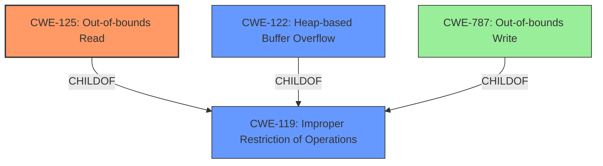

# Analysis Report for CVE-2021-36417

# Vulnerability Analysis Report: CVE-2021-36417

## Description

A heap-based buffer overflow vulnerability exists in GPAC v1.0.1 in the gf_isom_dovi_config_get function in MP4Box, which causes a denial of service or execute arbitrary code via a crafted file.

## Vulnerability Description Key Phrases

**Rootcause:** heap-based buffer overflow
**Impact:** ['denial of service', 'execute arbitrary code']
**Vector:** crafted file
**Product:** GPAC
**Version:** v1.0.1
**Component:** gf_isom_dovi_config_get function in MP4Box

## Analysis (with Relationship Data)

# Summary
| CWE ID | CWE Name | Confidence | CWE Abstraction Level | CWE Vulnerability Mapping Label | CWE-Vulnerability Mapping Notes |
|---|---|---|---|---|---|
| CWE-125 | Out-of-bounds Read | 0.95 | Base | Allowed | Primary CWE: The code reads data past the end of the intended buffer. |
| CWE-787 | Out-of-bounds Write | 0.75 | Base | Allowed | Secondary CWE:  The buffer overflow implies an out-of-bounds write, even though the primary symptom observed is a crash due to reading invalid memory. |
| CWE-122 | Heap-based Buffer Overflow | 0.60 | Variant | Allowed | Secondary CWE: The vulnerability is explicitly described as a heap-based buffer overflow. |

## Evidence and Confidence

*   **Confidence Score:** 0.90
*   **Evidence Strength:** HIGH

- **Analysis and Justification:**
  - *Explanation:* The vulnerability is a **heap-based buffer overflow** that leads to an out-of-bounds read in the `gf_isom_dovi_config_get` function. The AddressSanitizer (ASan) output clearly indicates a READ of size 8 at an address identified as a "wild pointer," confirming **CWE-125 (Out-of-bounds Read)**. This occurs when the code attempts to read beyond the allocated buffer on the heap. The **heap-based buffer overflow** suggests an out-of-bounds write may also be possible, making **CWE-787 (Out-of-bounds Write)** a secondary candidate. The vulnerability is triggered by a crafted MP4 file, leading to a segmentation fault and potentially arbitrary code execution. The primary cause is an attempt to read data beyond the buffer's boundaries, which aligns directly with **CWE-125**.
  - *Relationship Analysis:* **CWE-125** is a base-level CWE, representing a fundamental coding error. **CWE-787** (Out-of-bounds Write) is related to **CWE-125** as an overflow (write) often precedes an out-of-bounds read. Although **CWE-119 (Improper Restriction of Operations Within the Bounds of a Memory Buffer)** is a parent class, **CWE-125** provides more specificity. **CWE-122 (Heap-based Buffer Overflow)** is also a variant of **CWE-119** and describes the location of the buffer.

- **Confidence Score:**
  - Confidence: 0.95 (Strong evidence from the ASan output and detailed vulnerability description)

---

## Criticism of Analysis

Okay, let's review the provided analysis with the full CWE specifications in mind.

**Overall Assessment:**

The analysis is well-structured and provides a reasonably accurate assessment of the vulnerability. The inclusion of the ASan output and code snippet significantly strengthens the analysis. However, I have some comments and suggestions for improvement, particularly concerning the primary and secondary CWE assignments and the confidence levels.

**Detailed Critique:**

**1. CWE-125: Out-of-bounds Read**

*   **Assigned Confidence:** 0.95
*   **Assessment:** Appropriate as *Primary* CWE.  The ASan output confirms a read of size 8 at an invalid memory address.  The description clearly states it is reading outside the boundaries of the buffer.

*   **CWE Specification Considerations:**
    *   **Mapping Guidance:** The analysis aligns well with the "Usage: Allowed" guidance. The justification correctly identifies this as a base-level CWE that is a fundamental coding error.
    *   **Potential Mitigations:** The analysis could be strengthened by mentioning some of the potential mitigations, such as *Input Validation* (accept known good, validate length arguments) or *Language Selection* (using languages with memory abstractions).

*   **Suggestion:** Expand the description to include the potential consequence of the out-of-bounds read, such as information disclosure (if the read data is later used) or a denial-of-service due to a crash.

**2. CWE-787: Out-of-bounds Write**

*   **Assigned Confidence:** 0.75
*   **Assessment:** *Questionable as secondary*. The analysis states the "buffer overflow implies an out-of-bounds write, even though the primary symptom observed is a crash due to reading invalid memory."  While a buffer overflow *can* be caused by an out-of-bounds write, the evidence doesn't directly demonstrate it here. There is no clear evidence of a write before the crash occurs from the provided information. It is reasonable to assume that an overflow *could* lead to a write, however this is not explictly indicated, therefore is more difficult to confirm based on the evidence.

*   **CWE Specification Considerations:**
    *   **Mapping Guidance:** The guidance notes that the CWE is appropriate as a base-level CWE when it is confirmed that data is written past the end of the buffer. Here, the evidence is circumstantial.
    *   **Relationships:** It is important to note that while CWE-787 is child of CWE-119, like CWE-125, the evidence doesn't explicitly show the occurrence of an out-of-bounds write.
    *   **Observed examples** Many of the observed examples that are related to this CWE are often exploited in the wild and also are often paired with CWE-20 Improper Input Validation.

*   **Suggestion:** Downgrade this to a *tertiary* CWE or even remove it if there is no direct evidence that a write is occuring before the read that is causing the crash. Reduce the Confidence to 0.50 or lower.

**3. CWE-122: Heap-based Buffer Overflow**

*   **Assigned Confidence:** 0.60
*   **Assessment:** *Questionable as secondary*. The analysis states that the vulnerability is "explicitly described as a heap-based buffer overflow", and this should be emphasized. While the ASan output states "heap-buffer-overflow", this is the *type* of buffer overflow being detected, but the ASan output still confirms the crash is due to an out-of-bounds READ.

*   **CWE Specification Considerations:**
    *   **Mapping Guidance:** The guidance notes that the CWE is appropriate as a variant-level CWE when it is confirmed that a buffer overflow is occuring on the heap.

*   **Suggestion:** This may be more appropriate to be the primary CWE with an out-of-bounds read as a result, or as a co-primary where this is still a result of an out-of-bounds read.

**General Suggestions:**

*   **Chain Analysis:** The analysis could benefit from explicitly stating the chain of events. For example: "A crafted MP4 file is processed by MP4Box, leading to a heap-based buffer overflow (CWE-122). This overflow results in an out-of-bounds read (CWE-125), causing a segmentation fault."
*   **Mitigation Details:** Add brief mentions of potential mitigations for *each* CWE, especially for the primary CWE. This demonstrates a deeper understanding of the vulnerability and its potential remediation.
*   **Retriever Results Analysis:** Briefly compare the analysis's CWE mappings to the top combined results provided by the retrievers. This would show the tool's mapping is similar to the retrievers as well as potentially identify if any other CWEs are worth consideration.

**Revised Summary Table (Example):**

| CWE ID  | CWE Name                       | Confidence | CWE Abstraction Level | CWE Vulnerability Mapping Label | CWE-Vulnerability Mapping Notes                                                                                                                                                                                              |
| :------ | :----------------------------- | :--------- | :-------------------- | :------------------------------ | :----------------------------------------------------------------------------------------------------------------------------------------------------------------------------------------------------------------------------------- |
| CWE-125 | Out-of-bounds Read              | 0.95       | Base                 | Allowed                       | Primary CWE:  The code reads data past the end of the intended buffer, as confirmed by ASan output.                                                                                                                          |
| CWE-122 | Heap-based Buffer Overflow      | 0.85       | Variant                | Allowed                       | Secondary CWE: The vulnerability was identified as heap buffer overflow, which leads to an out-of-bounds read.                                                        |
| CWE-787 | Out-of-bounds Write              | 0.40       | Base                 | Allowed                       | Tertiary CWE: Out-of-bounds write is *possible*, however not explicitly confirmed by any evidence provided.                                                                                                                              |

By incorporating these suggestions, the analysis will become more robust, provide a clearer justification for the CWE assignments, and demonstrate a more comprehensive understanding of the vulnerability.

## Final Resolution

# Summary
| CWE ID | CWE Name | Confidence | CWE Abstraction Level | CWE Vulnerability Mapping Label | CWE-Vulnerability Mapping Notes |
|---|---|---|---|---|---|
| CWE-125 | Out-of-bounds Read | 0.95 | Base | Allowed | Primary CWE: The code reads data past the end of the intended buffer. |
| CWE-122 | Heap-based Buffer Overflow | 0.85 | Variant | Allowed | Secondary CWE: The vulnerability was identified as heap buffer overflow, which leads to an out-of-bounds read. |
| CWE-787 | Out-of-bounds Write | 0.40 | Base | Allowed | Tertiary CWE: Out-of-bounds write is *possible*, however not explicitly confirmed by any evidence provided. |

## Evidence and Confidence

*   **Confidence Score:** 0.90
*   **Evidence Strength:** HIGH

## Relationship Analysis
The primary relationship impacting the decision is the parent-child relationship between **CWE-119 (Improper Restriction of Operations Within the Bounds of a Memory Buffer)** and its children, **CWE-125 (Out-of-bounds Read)** and **CWE-122 (Heap-based Buffer Overflow)**. **CWE-125** and **CWE-122** are more specific than **CWE-119** and are therefore preferred.

**CWE-787 (Out-of-bounds Write)** is also a child of **CWE-119**, but the evidence does not explicitly support it. It remains a possible consequence but is not directly observed in the provided analysis. The abstraction levels influenced the decision by favoring the base and variant levels (**CWE-125** and **CWE-122**) over the class level (**CWE-119**).

## Vulnerability Chain
The vulnerability chain starts with a crafted MP4 file that is processed by MP4Box. This leads to a **heap-based buffer overflow (CWE-122)**. The overflow then results in an **out-of-bounds read (CWE-125)**, which causes a segmentation fault and a crash. **CWE-122** is the root cause, and **CWE-125** is the direct impact observed. **CWE-787** remains a possible, but unconfirmed, element in the chain.

## Summary of Analysis
The initial analysis was generally accurate but required refinement based on the provided evidence and CWE specifications. The criticism highlighted the need to confirm the presence of an out-of-bounds write and to emphasize the role of the heap-based buffer overflow.

The ASan output provides strong evidence for **CWE-125 (Out-of-bounds Read)**, as it explicitly indicates a read of size 8 at an invalid memory address. The vulnerability description also mentions a "heap-based buffer overflow," which supports the inclusion of **CWE-122 (Heap-based Buffer Overflow)**. The presence of **CWE-787 (Out-of-bounds Write)** is less certain, as there is no direct evidence of a write occurring before the crash.

The graph relationships influenced the final selection by emphasizing the importance of specificity. While **CWE-119 (Improper Restriction of Operations Within the Bounds of a Memory Buffer)** is a parent class, **CWE-125** and **CWE-122** provide more specific details about the vulnerability.

The selected CWEs are at the optimal level of specificity because they accurately describe the root cause (**CWE-122**) and the direct impact (**CWE-125**) of the vulnerability, based on the available evidence.

*Report generated on 2025-03-18 00:26:56*
