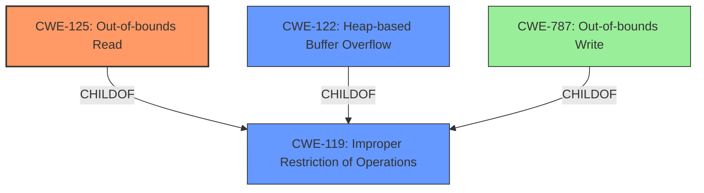

# Final Resolution for CVE-2021-36417

# Summary
| CWE ID | CWE Name | Confidence | CWE Abstraction Level | CWE Vulnerability Mapping Label | CWE-Vulnerability Mapping Notes |
|---|---|---|---|---|---|
| CWE-125 | Out-of-bounds Read | 0.95 | Base | Allowed | Primary CWE: The code reads data past the end of the intended buffer. |
| CWE-122 | Heap-based Buffer Overflow | 0.85 | Variant | Allowed | Secondary CWE: The vulnerability was identified as heap buffer overflow, which leads to an out-of-bounds read. |
| CWE-787 | Out-of-bounds Write | 0.40 | Base | Allowed | Tertiary CWE: Out-of-bounds write is *possible*, however not explicitly confirmed by any evidence provided. |

## Evidence and Confidence

*   **Confidence Score:** 0.90
*   **Evidence Strength:** HIGH

## Relationship Analysis
The primary relationship impacting the decision is the parent-child relationship between **CWE-119 (Improper Restriction of Operations Within the Bounds of a Memory Buffer)** and its children, **CWE-125 (Out-of-bounds Read)** and **CWE-122 (Heap-based Buffer Overflow)**. **CWE-125** and **CWE-122** are more specific than **CWE-119** and are therefore preferred.

**CWE-787 (Out-of-bounds Write)** is also a child of **CWE-119**, but the evidence does not explicitly support it. It remains a possible consequence but is not directly observed in the provided analysis. The abstraction levels influenced the decision by favoring the base and variant levels (**CWE-125** and **CWE-122**) over the class level (**CWE-119**).

## Vulnerability Chain
The vulnerability chain starts with a crafted MP4 file that is processed by MP4Box. This leads to a **heap-based buffer overflow (CWE-122)**. The overflow then results in an **out-of-bounds read (CWE-125)**, which causes a segmentation fault and a crash. **CWE-122** is the root cause, and **CWE-125** is the direct impact observed. **CWE-787** remains a possible, but unconfirmed, element in the chain.

## Summary of Analysis
The initial analysis was generally accurate but required refinement based on the provided evidence and CWE specifications. The criticism highlighted the need to confirm the presence of an out-of-bounds write and to emphasize the role of the heap-based buffer overflow.

The ASan output provides strong evidence for **CWE-125 (Out-of-bounds Read)**, as it explicitly indicates a read of size 8 at an invalid memory address. The vulnerability description also mentions a "heap-based buffer overflow," which supports the inclusion of **CWE-122 (Heap-based Buffer Overflow)**. The presence of **CWE-787 (Out-of-bounds Write)** is less certain, as there is no direct evidence of a write occurring before the crash.

The graph relationships influenced the final selection by emphasizing the importance of specificity. While **CWE-119 (Improper Restriction of Operations Within the Bounds of a Memory Buffer)** is a parent class, **CWE-125** and **CWE-122** provide more specific details about the vulnerability.

The selected CWEs are at the optimal level of specificity because they accurately describe the root cause (**CWE-122**) and the direct impact (**CWE-125**) of the vulnerability, based on the available evidence.