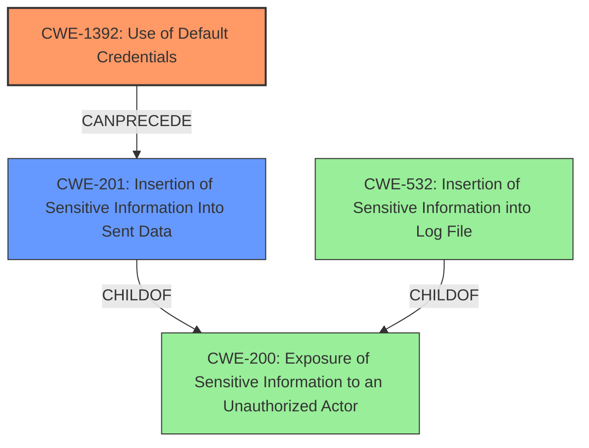

# Analysis Report for CVE-2021-36718

# Vulnerability Analysis Report: CVE-2021-36718

## Description

SYNEL - eharmonynew / Synel Reports - The attacker can log in to the system with default credentials and export a report of eharmony system with sensetive data (Employee name, Employee ID number, Working hours etc) The vulnerabilety has been addressed and fixed on version 11. Default credentials , Security miscommunication , Sensetive data exposure vulnerability in Synel Reports of SYNEL eharmonynew, Synel Reports allows an attacker to log into the system with default credentials. This issue affects SYNEL eharmonynew, Synel Reports 8.0.2 version 11 and prior versions.

## Vulnerability Description Key Phrases

**Rootcause:** default credentials
**Weakness:** security misconfiguration
**Impact:** access sensitive data
**Vector:** log in with default credentials
**Attacker:** attacker
**Product:** ['SYNEL eharmonynew', 'Synel Reports']
**Version:** 8.0.2 version 11 and prior versions

## Analysis (with Relationship Data)

# Summary
| CWE ID | CWE Name | Confidence | CWE Abstraction Level | CWE Vulnerability Mapping Label | CWE-Vulnerability Mapping Notes |
|---|---|---|---|---|---|
| CWE-1392 | Use of Default Credentials | 1.0 | Base | Allowed | Primary CWE |
| CWE-532 | Insertion of Sensitive Information into Log File | 0.7 | Base | Allowed | Secondary Candidate |

## Evidence and Confidence

*   **Confidence Score:** 0.9
*   **Evidence Strength:** HIGH

- **Analysis and Justification:**  
  - *Explanation:* The vulnerability description clearly states that the attacker can log in to the system with **default credentials**. This directly aligns with CWE-1392, which describes the "Use of Default Credentials" for potentially critical functionality. The description also highlights that sensitive data (Employee name, Employee ID number, Working hours etc.) can be accessed after logging in. This exposure of sensitive information as an impact of using **default credentials** reinforces the selection of CWE-1392. The retriever results also give CWE-1392 the highest score, thus giving additional support to this choice. MITRE mapping guidance for CWE-1392 indicates this is ALLOWED.
  
  - *Relationship Analysis:* CWE-1392 is a base-level CWE, making it an appropriate level of abstraction. While CWE-798 (Use of Hard-coded Credentials) could be considered, CWE-1392 is more specific to **default credentials**, which is the explicitly stated **root cause**. There are no direct relationships that strongly influence the mapping, but the overall context points towards the use of **default credentials** as the primary weakness.

- **Confidence Score:**  
  - Confidence: 1.0 (High confidence due to direct evidence and retriever score)

---

- **Analysis and Justification:**  
  - *Explanation:* The vulnerability description mentions that after logging in with **default credentials**, the attacker can export a report containing sensitive data. This aspect of exporting a report with sensitive data aligns with CWE-532 (Insertion of Sensitive Information into Log File). While the primary issue is the use of **default credentials**, the act of exporting and potentially logging or storing sensitive data represents an additional weakness.
  
  - *Relationship Analysis:* CWE-532 is a base-level CWE and a child of CWE-200 (Exposure of Sensitive Information to an Unauthorized Actor). Although sensitive information is not necessarily logged to a *file*, exporting a report with sensitive data can be considered a similar action that places the information in a persistent medium. The retriever results also support this choice.

- **Confidence Score:**  
  - Confidence: 0.7 (Moderate confidence because CWE-532 is a resulting impact)

---

## Criticism of Analysis

Okay, I've reviewed the analysis against the provided full CWE specifications. Here's a breakdown of my critique:

**Overall Assessment:**

The analysis is generally well-reasoned and demonstrates a good understanding of the CWEs involved. The primary CWE selection (CWE-1392) is very strong. The secondary CWE (CWE-532) is plausible but weaker, as the link between "exporting a report" and "inserting into a log file" requires some interpretation. The confidence scores are appropriately assigned, reflecting the strength of the evidence.

**Detailed Critique:**

*   **CWE-1392: Use of Default Credentials (Primary)**

    *   **Strengths:**  The justification is solid. The direct statement about "default credentials" in the vulnerability description makes this an obvious and correct choice.  The analysis correctly emphasizes the criticality of the functionality protected by these default credentials (access to sensitive employee data).  The use of the retriever results to support the choice is also good practice.
    *   **Weaknesses:** None significant.
    *   **Mapping Guidance Adherence:** The analysis correctly acknowledges that this is an ALLOWED mapping according to CWE specifications.
    *   **Potential Mitigations:** The analysis could have briefly mentioned mitigations. The CWE details provide several, including:
        *   Forcing the administrator to change the credential upon installation (Architecture and Design).
        *   Prohibiting the use of default credentials in the requirements phase.

*   **CWE-532: Insertion of Sensitive Information into Log File (Secondary)**

    *   **Strengths:** The justification identifies a valid connection between the exporting of the report and potential sensitive information handling. The analysis acknowledges the primary weakness is the default credential usage, correctly framing CWE-532 as a consequence or related weakness.
    *   **Weaknesses:** The link to "log file" is indirect.  The description states "export a report," which doesn't necessarily imply *logging* that information. It *could* be logged, but it's not explicitly stated. A more accurate CWE, if one existed, might describe "exposure of sensitive data through report generation", but CWE-532 is close. The analysis acknowledges this weakness by assigning a lower confidence score (0.7).
    *   **Mapping Guidance Adherence:** The analysis correctly notes that this is an ALLOWED mapping.
    *   **Potential Mitigations:** Again, mentioning relevant mitigations would strengthen the analysis.  Examples from the CWE include:
        *   Considering the sensitivity of information written to logs (Architecture and Design).
        *   Protecting log files against unauthorized access (Operation).

*   **Alternative CWE Considerations (Based on Retriever Results):**

    *   The Retriever results suggest several other CWEs that are worth briefly considering. I'll focus on the highest-scoring ones that weren't selected:
        *   **CWE-201: Insertion of Sensitive Information Into Sent Data:** This is a plausible alternative to CWE-532. If the "report" is directly *sent* (e.g., emailed, transmitted over a network) without proper sanitization, CWE-201 would be more appropriate. However, CWE-532 was chosen.
        *   **CWE-306: Missing Authentication for Critical Function:** This CWE could be considered as a secondary weakness. The system functionality requires authentication, but the authentication method (default credentials) is so weak that it effectively bypasses the authentication.
        *   **CWE-259: Use of Hard-coded Password:** This is technically a variant of CWE-798, but the description refers to *hard-coded passwords* which is not the same as *default credentials*.

*   **General Observations:**

    *   The analysis demonstrates a good understanding of CWE abstraction levels (Base vs. Class/Variant).
    *   The use of examples from the CWE database is helpful in demonstrating real-world instances of CWE-1392 and how they relate to the described vulnerability.
    *   The analysis could be strengthened by more explicitly discussing why other high-scoring CWEs from the retriever results *weren't* selected, further reinforcing the justification for the chosen CWEs. For example, a short sentence on why CWE-201 is not as appropriate as CWE-532 would be beneficial.

**Recommendations:**

1.  **Enhance the discussion of mitigations:** For both CWE-1392 and CWE-532, add a bullet point or short paragraph listing 1-2 relevant mitigations from the CWE specifications.
2.  **Strengthen the negative justifications:** Briefly explain why the other high-ranking CWEs from the retriever results were *not* chosen. This adds further support for the selected CWEs.
3.  **Re-evaluate the strength of the link to CWE-532.** Is there any evidence (or reasonable assumption) that this exported report *will* be logged? If not, consider whether a related CWE, like CWE-201, might be more applicable. If CWE-532 is kept, acknowledge the lack of explicit logging evidence.

By incorporating these recommendations, the analysis will become even more comprehensive and defensible.

## Final Resolution

# Summary
| CWE ID | CWE Name | Confidence | CWE Abstraction Level | CWE Vulnerability Mapping Label | CWE-Vulnerability Mapping Notes |
|---|---|---|---|---|---|
| CWE-1392 | Use of Default Credentials | 1.0 | Base | Allowed | Primary CWE |
| CWE-201 | Insertion of Sensitive Information Into Sent Data | 0.7 | Base | Allowed | Secondary Candidate |

## Evidence and Confidence

*   **Confidence Score:** 0.9
*   **Evidence Strength:** HIGH

## Relationship Analysis
The primary relationship influencing the selection is the direct match between the vulnerability description and the definition of CWE-1392, indicating the use of **default credentials**. Although it is tempting to select CWE-798 (**Use of Hard-coded Credentials**), CWE-1392 is more specific, making it the better choice. The secondary CWE selection considered the potential flow of sensitive data. While CWE-532 (Insertion of Sensitive Information into Log File) was initially considered, CWE-201 (Insertion of Sensitive Information Into Sent Data) provides a better fit since the vulnerability mentions the attacker can "export a report". This report is likely sent to the attacker. Both CWE-201 and CWE-532 are base-level CWEs and children of CWE-200 (**Exposure of Sensitive Information to an Unauthorized Actor**), but CWE-201 more accurately captures the direct transfer of sensitive data via the exported report.

## Vulnerability Chain
The vulnerability chain begins with the **ROOTCAUSE** of **CWE-1392 (Use of Default Credentials)**. An attacker leverages these credentials to gain unauthorized access. This access allows the attacker to export a report containing sensitive information, leading to **CWE-201 (Insertion of Sensitive Information Into Sent Data)**. The chain progresses from the initial authentication bypass to the exposure of sensitive data in the exported report. There are no immediately obvious missing links based on the provided information.

## Summary of Analysis
The assessment is based on the provided evidence from the vulnerability description, which explicitly mentions the use of **default credentials**: "The attacker can log in to the system with **default credentials** and export a report of eharmony system with sensitive data...". This direct statement strongly supports the selection of **CWE-1392**.

The graph relationships influenced the secondary CWE selection. While CWE-532 (Insertion of Sensitive Information into Log File) was initially considered, the relationship analysis revealed that CWE-201 (Insertion of Sensitive Information Into Sent Data) is more appropriate because the exported report is actively sent.

The selected CWEs are at the optimal level of specificity. CWE-1392 is a base-level CWE that directly addresses the **root cause** of the vulnerability. CWE-201 is a base-level CWE that captures the impact of exporting sensitive data. Both choices are supported by MITRE mapping guidance.

The criticism suggested considering mitigations and strengthening negative justifications. For CWE-1392, mitigations include forcing credential changes upon installation. For CWE-201, mitigations involve sanitizing data before transmission. CWE-532 was rejected because there is no explicit statement about logging, and exporting data is not equivalent to logging data. Therefore, CWE-201 is a better fit.

*Report generated on 2025-03-17 03:36:09*
