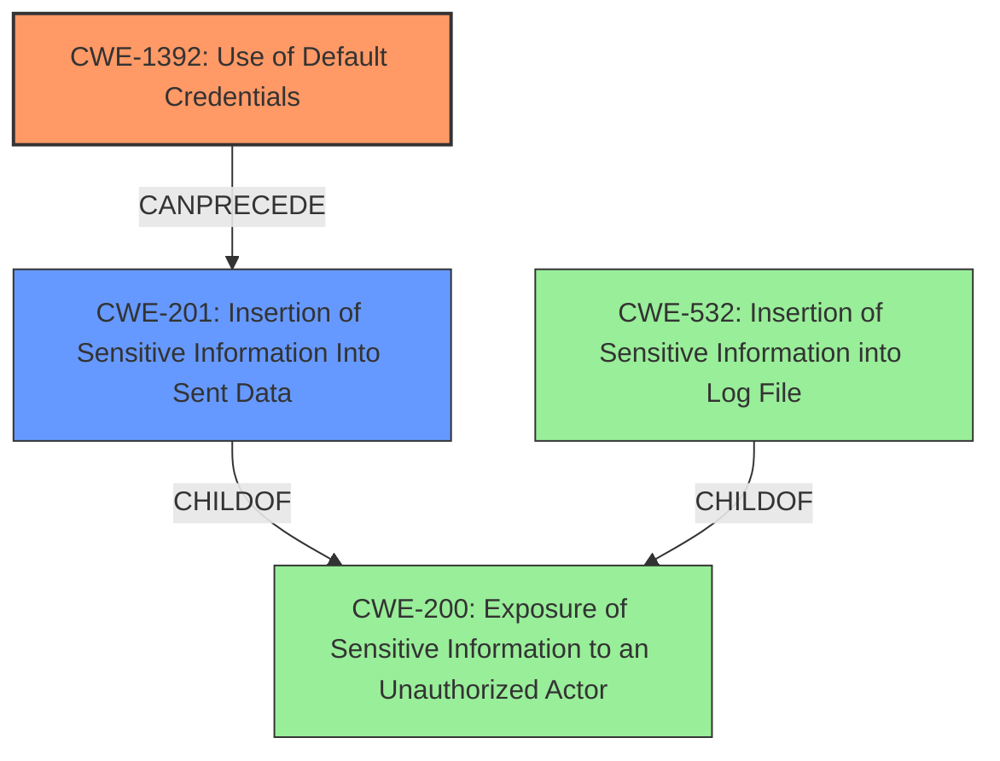

# Final Resolution for CVE-2021-36718

# Summary
| CWE ID | CWE Name | Confidence | CWE Abstraction Level | CWE Vulnerability Mapping Label | CWE-Vulnerability Mapping Notes |
|---|---|---|---|---|---|
| CWE-1392 | Use of Default Credentials | 1.0 | Base | Allowed | Primary CWE |
| CWE-201 | Insertion of Sensitive Information Into Sent Data | 0.7 | Base | Allowed | Secondary Candidate |

## Evidence and Confidence

*   **Confidence Score:** 0.9
*   **Evidence Strength:** HIGH

## Relationship Analysis
The primary relationship influencing the selection is the direct match between the vulnerability description and the definition of CWE-1392, indicating the use of **default credentials**. Although it is tempting to select CWE-798 (**Use of Hard-coded Credentials**), CWE-1392 is more specific, making it the better choice. The secondary CWE selection considered the potential flow of sensitive data. While CWE-532 (Insertion of Sensitive Information into Log File) was initially considered, CWE-201 (Insertion of Sensitive Information Into Sent Data) provides a better fit since the vulnerability mentions the attacker can "export a report". This report is likely sent to the attacker. Both CWE-201 and CWE-532 are base-level CWEs and children of CWE-200 (**Exposure of Sensitive Information to an Unauthorized Actor**), but CWE-201 more accurately captures the direct transfer of sensitive data via the exported report.

## Vulnerability Chain
The vulnerability chain begins with the **ROOTCAUSE** of **CWE-1392 (Use of Default Credentials)**. An attacker leverages these credentials to gain unauthorized access. This access allows the attacker to export a report containing sensitive information, leading to **CWE-201 (Insertion of Sensitive Information Into Sent Data)**. The chain progresses from the initial authentication bypass to the exposure of sensitive data in the exported report. There are no immediately obvious missing links based on the provided information.

## Summary of Analysis
The assessment is based on the provided evidence from the vulnerability description, which explicitly mentions the use of **default credentials**: "The attacker can log in to the system with **default credentials** and export a report of eharmony system with sensitive data...". This direct statement strongly supports the selection of **CWE-1392**.

The graph relationships influenced the secondary CWE selection. While CWE-532 (Insertion of Sensitive Information into Log File) was initially considered, the relationship analysis revealed that CWE-201 (Insertion of Sensitive Information Into Sent Data) is more appropriate because the exported report is actively sent.

The selected CWEs are at the optimal level of specificity. CWE-1392 is a base-level CWE that directly addresses the **root cause** of the vulnerability. CWE-201 is a base-level CWE that captures the impact of exporting sensitive data. Both choices are supported by MITRE mapping guidance.

The criticism suggested considering mitigations and strengthening negative justifications. For CWE-1392, mitigations include forcing credential changes upon installation. For CWE-201, mitigations involve sanitizing data before transmission. CWE-532 was rejected because there is no explicit statement about logging, and exporting data is not equivalent to logging data. Therefore, CWE-201 is a better fit.