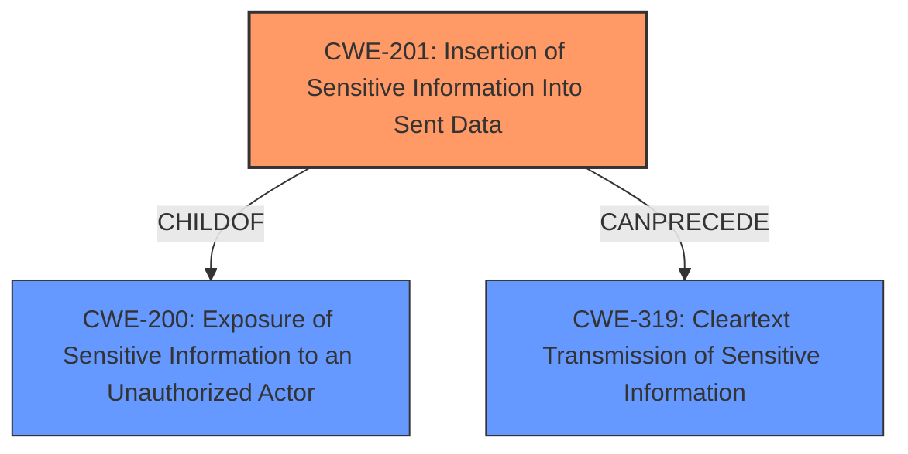

# Analysis Report for CVE-2021-36793

# Vulnerability Analysis Report: CVE-2021-36793

## Description

The routes (aka Extbase Yaml Routes) extension before 2.1.1 for TYPO3, when CsrfTokenViewHelper is used, allows Sensitive Information Disclosure because a session identifier is unsafely present in HTML output.

## Vulnerability Description Key Phrases

**Rootcause:** unsafely present session identifier
**Impact:** sensitive information disclosure
**Product:** TYPO3 routes (aka Extbase Yaml Routes) extension
**Version:** before 2.1.1
**Component:** CsrfTokenViewHelper

## Analysis (with Relationship Data)

# Summary
| CWE ID | CWE Name | Confidence | CWE Abstraction Level | CWE Vulnerability Mapping Label | CWE-Vulnerability Mapping Notes |
|---|---|---|---|---|---|
| CWE-201 | Insertion of Sensitive Information Into Sent Data | 0.85 | Base | Allowed | Primary CWE |
| CWE-319 | Cleartext Transmission of Sensitive Information | 0.60 | Base | Allowed | Secondary Candidate |

## Evidence and Confidence

*   **Confidence Score:** 0.80
*   **Evidence Strength:** HIGH

- **Analysis and Justification:**  
  - *Explanation:* The vulnerability description indicates that a **session identifier** is **unsafely present in HTML output**. This is a clear case of **sensitive information disclosure**, specifically the transmission of sensitive information (the session ID) to an actor (a user viewing the HTML source) who should not have access to it. This aligns directly with CWE-201 [Insertion of Sensitive Information Into Sent Data], where the code transmits data to another actor, but a portion of the data includes **sensitive information** that should not be accessible to that actor. The CVE Reference Links Content Summary further validates this by stating that the vulnerability results in **Sensitive Information Disclosure** because the `CsrfTokenViewHelper` exposes the user's session identifier without proper cryptographic hashing. CWE-201 is a base level CWE, which is appropriate.

  - *Relationship Analysis:* CWE-201 is a child of CWE-200 [Exposure of Sensitive Information to an Unauthorized Actor], but CWE-201 is more specific because it identifies that the sensitive information is being sent in data. The Retriever Results lists CWE-201 [Insertion of Sensitive Information Into Sent Data] with a score of 0.2740. CWE-319 [Cleartext Transmission of Sensitive Information] could be a secondary mapping, as the session identifier is exposed in cleartext (unhashed). While the primary concern is the disclosure, the lack of encryption on the session ID is a contributing factor. However, since the primary issue is the inclusion in the output and not necessarily the transmission itself, it is a secondary consideration.

- **Confidence Score:**  
  - *Example:* Confidence: 0.85 (High evidence from technical description and CVE reference materials)

## Criticism of Analysis

Okay, I've reviewed the analysis and the provided CWE specifications. Here's my critique, focusing on the accuracy of the CWE assignments, the confidence levels, and any potential alternative or missing CWEs:

**Overall Assessment:**

The primary CWE assignment of **CWE-201: Insertion of Sensitive Information Into Sent Data** is accurate and well-justified. The analysis correctly identifies that the session identifier is being *sent* in the HTML output, which aligns with the description of CWE-201. The confidence level of 0.85 is appropriate given the directness of the vulnerability.

The secondary candidate of **CWE-319: Cleartext Transmission of Sensitive Information** is also reasonable, although less directly applicable than CWE-201.  My only suggestion is for some light edits to make it more precise.

**Detailed Review:**

**1. CWE-201: Insertion of Sensitive Information Into Sent Data**

*   **Accuracy:** The mapping to CWE-201 is correct. The vulnerability involves the inclusion of sensitive information (session ID) in data (HTML output) sent to a user's browser. The analysis clearly explains how the session ID is being "inserted" into the data.
*   **Confidence:** The confidence score of 0.85 is well-supported by the provided evidence.
*   **Justification:** The justification is thorough. It correctly points out the specific scenario described in the vulnerability description and links it to the definition of CWE-201. It's good that the analysis also considers the parent CWE-200 and explains why CWE-201 is a more specific and appropriate fit.
*   **CWE Specifications Compliance:** The analysis complies with the CWE specifications for CWE-201. It correctly identifies the Abstraction level as "Base", which is the preferred level.
*   **Mitigations:** The suggested mitigations in the CWE specifications are relevant. Mitigation 2 (Implementation: Remove unnecessary information) directly addresses the core issue. Mitigation 1 (Requirements: Specify sensitive data) is also crucial for preventing similar issues in the future.

**2. CWE-319: Cleartext Transmission of Sensitive Information**

*   **Accuracy:** While the session ID *is* transmitted in cleartext within the HTML output, this is *less* about transmission and *more* about the fact that it has been included in the output in the first place. It isn't a traditional network sniffing scenario. It's the *inclusion* of the session ID in the HTML source code, not necessarily the *transmission* that's the core issue. It is therefore a decent secondary candidate, but not a primary.
*   **Confidence:** The confidence score of 0.60 seems reasonable.
*   **Justification:** You correctly identified that the session ID is unhashed.  However, the analysis could be strengthened by acknowledging that the *primary* problem isn't the transmission itself, but the unsafe *inclusion* in the data that is then sent.
*   **CWE Specifications Compliance:** The Abstraction level is "Base", as expected.
*   **Mitigations:** The mitigations listed in the CWE specifications are generally relevant (e.g., encrypt the data before transmission). However, the *most direct* mitigation would be to *not include the session ID in the HTML output at all* (or, if it is unavoidable, to only include a cryptographically secure hash of the session ID).

**Suggestions:**

*   **Minor Refinement for CWE-319 Justification:** When discussing CWE-319, explicitly state that the *primary* issue is the inclusion of the session ID in the HTML output, and that the cleartext *transmission* is a secondary concern resulting from that inclusion.

**Retriever Results Discussion:**

*   **CWE-540: Inclusion of Sensitive Information in Source Code:** Although not selected, this one is interesting, given the high score in the retriever results. I think the reason that this one is not a perfect fit is that the "source code" is not exposed directly, but rather, the sensitive information ends up in the *generated* HTML which is similar, but different enough to not be a good fit.
*    **CWE-79: Cross-site Scripting:** Given that a prerequisite for exploitation is XSS, I think it's important to understand why this wasn't selected. The current analysis correctly identifies the root cause as the direct inclusion of the sensitive information into sent data.

**Revised Summary Table:**

| CWE ID | CWE Name | Confidence | CWE Abstraction Level | CWE Vulnerability Mapping Label | CWE-Vulnerability Mapping Notes |
|---|---|---|---|---|---|
| CWE-201 | Insertion of Sensitive Information Into Sent Data | 0.85 | Base | Allowed | Primary CWE |
| CWE-319 | Cleartext Transmission of Sensitive Information | 0.60 | Base | Allowed | Secondary Candidate (primarily due to the data's exposure, leading to cleartext transmission) |

**In summary, the analysis is well-done and the CWE assignments are accurate. The suggested refinement for CWE-319 will improve the analysis by more precisely characterizing the vulnerability.**

## Final Resolution

# Summary

| CWE ID | CWE Name | Confidence | CWE Abstraction Level | CWE Vulnerability Mapping Label | CWE-Vulnerability Mapping Notes |
|---|---|---|---|---|---|
| CWE-201 | Insertion of Sensitive Information Into Sent Data | 0.90 | Base | Allowed | Primary CWE |
| CWE-319 | Cleartext Transmission of Sensitive Information | 0.65 | Base | Allowed | Secondary Candidate |

## Evidence and Confidence

*   **Confidence Score:** 0.85
*   **Evidence Strength:** HIGH

## Relationship Analysis
The primary relationship that impacted my decision was the parent-child relationship between CWE-200 [Exposure of Sensitive Information to an Unauthorized Actor] and CWE-201 [Insertion of Sensitive Information Into Sent Data]. The analysis correctly identified CWE-201 as a more specific child of CWE-200 because the vulnerability involves the **sensitive information** being actively inserted into the data sent to the user. This specificity is crucial. CWE-319 [Cleartext Transmission of Sensitive Information] is considered a secondary candidate, as the transmission of the **session identifier** in cleartext is a consequence of its inclusion in the HTML output.

## Vulnerability Chain
The vulnerability chain begins with the improper handling of the **session identifier** by the `CsrfTokenViewHelper`, leading to the **insertion of this sensitive information** into the HTML output (CWE-201). This, in turn, results in the **transmission of the session identifier in cleartext** (CWE-319) to the user's browser. The root cause is the mishandling of the **session identifier**, and the impact is the potential disclosure of sensitive information.

## Summary of Analysis
The initial analysis accurately identified CWE-201 [Insertion of Sensitive Information Into Sent Data] as the primary weakness, supported by the vulnerability description: "a **session identifier** is **unsafely present in HTML output**." This directly indicates that **sensitive information** is being inserted into sent data. The criticism reinforced this selection and suggested a minor refinement for the justification of CWE-319 [Cleartext Transmission of Sensitive Information].

The graph relationships influenced my decision by highlighting the importance of specificity. While CWE-200 [Exposure of Sensitive Information to an Unauthorized Actor] is a relevant parent, CWE-201 [Insertion of Sensitive Information Into Sent Data] provides a more precise description of the vulnerability. The decision to include CWE-319 [Cleartext Transmission of Sensitive Information] as a secondary candidate is based on the understanding that the cleartext transmission is a consequence of the **sensitive information** being included in the HTML output.

The selected CWEs are at the optimal level of specificity because they accurately represent the root cause and the resulting vulnerability. CWE-201 [Insertion of Sensitive Information Into Sent Data] captures the core issue of **sensitive information** being included in the sent data, while CWE-319 [Cleartext Transmission of Sensitive Information] highlights the secondary concern of the **session identifier** being transmitted in cleartext.

*Report generated on 2025-03-17 01:49:47*
