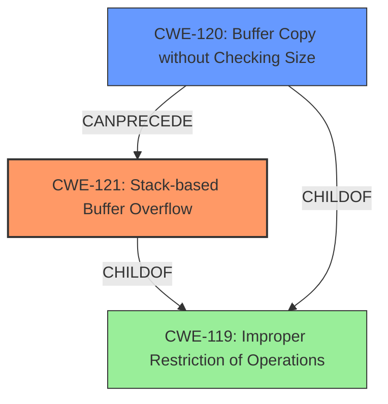

# Final Resolution for CVE-2021-37014

# Summary
| CWE ID | CWE Name | Confidence | CWE Abstraction Level | CWE Vulnerability Mapping Label | CWE-Vulnerability Mapping Notes |
|---|---|---|---|---|---|
| CWE-121 | Stack-based Buffer Overflow | 0.95 | Variant | Allowed | Primary CWE |
| CWE-120 | Buffer Copy without Checking Size of Input ('Classic Buffer Overflow') | 0.6 | Base | Allowed-with-Review | Contributing Factor: The vulnerability likely involves using a buffer copy function without any bounds checking, which is a direct cause of the overflow. |
| CWE-119 | Improper Restriction of Operations within the Bounds of a Memory Buffer | 0.3 | Class | Discouraged | Secondary Candidate |

## Evidence and Confidence

*   **Confidence Score:** 0.9
*   **Evidence Strength:** MEDIUM

## Relationship Analysis
The primary relationship is that CWE-121 is a variant (child) of CWE-119. This means CWE-121 is a more specific type of buffer overflow. CWE-120 is a peer of both, representing a common way that buffer overflows occur. The abstraction levels influenced the selection, favoring the Variant CWE-121 for its specificity, while acknowledging the potential contribution of Base CWE-120.

## Vulnerability Chain
The vulnerability chain starts with a potential **ROOTCAUSE** such as CWE-120 (Buffer Copy without Checking Size of Input), leading to **WEAKNESS** CWE-121 (Stack-based Buffer Overflow). This then results in the impact described in the vulnerability description: device cannot be used properly.

## Summary of Analysis
The initial analysis correctly identified **CWE-121 (Stack-based Buffer Overflow)** as the primary **WEAKNESS**. The criticism correctly pointed out that while technically correct, **CWE-119 (Improper Restriction of Operations within the Bounds of a Memory Buffer)** is too general and is discouraged. The inclusion of **CWE-120 (Buffer Copy without Checking Size of Input)** as a contributing factor is a valuable addition, as it represents a likely cause of the overflow.

The vulnerability description explicitly states "**Stack-based Buffer Overflow**" and that exploitation may lead to the device being unusable.

The graph relationships influenced the final selection by highlighting the hierarchical relationship between **CWE-121** and **CWE-119**, as well as the potential causal link between **CWE-120** and **CWE-121**.

The selected CWEs are at the optimal level of specificity because **CWE-121** directly matches the described vulnerability, while **CWE-120** points to a common root cause.