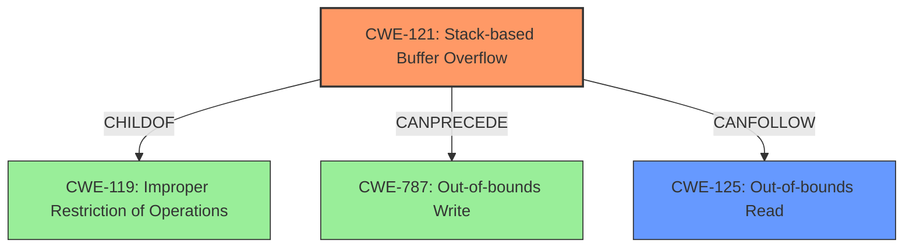

# Analysis Report for CVE-2021-37020

# Vulnerability Analysis Report: CVE-2021-37020

## Description

There is a Stack-based Buffer Overflow vulnerability in Huawei Smartphone.Successful exploitation of this vulnerability may lead to Out-of-bounds read.

## Vulnerability Description Key Phrases

**Weakness:** stack-based buffer overflow
**Impact:** out-of-bounds read
**Product:** Huawei Smartphone

## Analysis (with Relationship Data)

# Summary
| CWE ID | CWE Name | Confidence | CWE Abstraction Level | CWE Vulnerability Mapping Label | CWE-Vulnerability Mapping Notes |
|---|---|---|---|---|---|
| CWE-121 | Stack-based Buffer Overflow | 0.95 | Variant | Allowed | Primary CWE |
| CWE-125 | Out-of-bounds Read | 0.75 | Base | Allowed | Secondary Candidate |

## Evidence and Confidence

*   **Confidence Score:** 0.85
*   **Evidence Strength:** MEDIUM

- **Analysis and Justification:**  
  - *Explanation:* The vulnerability description explicitly states a "**stack-based buffer overflow**". CWE-121 (Stack-based Buffer Overflow) is a Variant-level CWE that directly matches this description. The description also mentions "**out-of-bounds read**" as a consequence of this overflow, which can be represented by CWE-125. CWE-121 is a preferred level of abstraction for mapping to the root causes of vulnerabilities.

  - *Relationship Analysis:* CWE-121 is a child of CWE-119 (Improper Restriction of Operations within the Bounds of a Memory Buffer). CWE-125 (Out-of-bounds Read) can result from a buffer overflow (CWE-121) and can be considered a consequence or impact of the primary weakness.

- **Confidence Score:**  
  - Confidence: 0.95 (High confidence due to direct match in the vulnerability description and explicit mention of stack-based buffer overflow).

---
- **Analysis and Justification:**  
  - *Explanation:* The vulnerability description mentions "**out-of-bounds read**" as a consequence of the stack-based buffer overflow. CWE-125 (Out-of-bounds Read) directly addresses this condition. This is a read operation that occurs outside the intended buffer boundary.

  - *Relationship Analysis:* CWE-125 is a child of CWE-119 (Improper Restriction of Operations within the Bounds of a Memory Buffer). It represents the specific type of out-of-bounds access occurring due to the buffer overflow (CWE-121). CWE-125 CanFollow CWE-121, where a buffer overflow leads to out-of-bounds read.

- **Confidence Score:**  
  - Confidence: 0.75 (Medium confidence as it is a consequence of the primary weakness rather than the root cause itself)

## Criticism of Analysis

Okay, here's a detailed review of the provided CWE analysis, incorporating the full CWE specifications and focusing on the mapping guidance and potential mitigations.

**Overall Assessment:**

The analysis is generally good and correctly identifies the primary and secondary CWEs.  The confidence levels are reasonable, and the justifications are well-articulated. The inclusion of CWE specifications strengthens the analysis.  However, some minor improvements can be made.

**Detailed Review:**

**1. Primary CWE: CWE-121 (Stack-based Buffer Overflow)**

*   **Correctness:** The choice of CWE-121 is highly accurate. The vulnerability description explicitly mentions "stack-based buffer overflow."
*   **Abstraction Level:** Correctly identified as a Variant level CWE, which aligns with the recommendation to map to the most specific CWE when possible.
*   **Mapping Guidance:**
    *   The analysis correctly acknowledges that CWE-121 is at the preferred Variant level.
    *   The analysis follows the mapping guidance.
*   **Potential Mitigations:** The provided mitigations in the CWE specification are relevant:
    *   *Environment Hardening:* Using compiler features like `/GS` (Microsoft) or `FORTIFY_SOURCE` (GCC) is a standard defense.
    *   *Abstraction Libraries:*  Using safer string handling libraries is also a good suggestion.
    *   *Bounds Checking:* Explicit bounds checking during implementation is crucial.
*   **Minor Suggestions:** Consider adding a sentence or two about specific coding practices that are often associated with stack-based overflows (e.g., using `strcpy` or `sprintf` without length limits).

**2. Secondary CWE: CWE-125 (Out-of-bounds Read)**

*   **Correctness:** CWE-125 is a valid secondary CWE because out-of-bounds reads are a common consequence of buffer overflows.  The justification that an overflow *leads to* an out-of-bounds read is accurate.
*   **Abstraction Level:** Correctly identified as a Base level CWE.
*   **Mapping Guidance:**
    *   The analysis accurately notes that CWE-125 represents a *consequence* of the overflow, rather than the root cause.  This is important.
    *   CWE specifications note that you shouldn't force lower level Base/Variant mappings but its appropriate here.
*   **Potential Mitigations:** The provided mitigations in the CWE specification are relevant:
    *   *Input Validation:* The most critical mitigation is robust input validation to prevent the overflow from occurring in the first place. The analysis correctly points this out. The "accept known good" strategy is particularly important here.
    *   *Language Selection:* Using languages with built-in memory safety can eliminate this class of vulnerabilities.
    *   *Length Argument Validation:* It is very relevant to validate the calculation of length arguments.
*  **Minor Suggestions:** Highlight relationship in justification that can follow from CWE-121.

**General Observations and Suggestions:**

*   **CWE-119 Avoidance:** The analysis correctly avoids directly mapping to CWE-119 ("Improper Restriction of Operations within the Bounds of a Memory Buffer"), which is discouraged unless more specific CWEs cannot be identified. This is a good practice.
*   **Retriever Results Consideration:** While the Retriever Results are provided, the analysis doesn't explicitly address *why* some of the top-ranked CWEs (e.g., CWE-131, CWE-190) were *not* selected.  A brief explanation could strengthen the analysis. For example, "While CWE-131 (Incorrect Calculation of Buffer Size) is often related to buffer overflows, the provided vulnerability description doesn't indicate whether the *size calculation* was the source of the error. Instead, it points directly to an overflow condition."
*   **CWE Chaining:** The analysis could benefit from a more explicit discussion of CWE chaining.  It mentions that CWE-125 can *result* from CWE-121, but it could be phrased more strongly:  "CWE-121 (Stack-based Buffer Overflow) often *leads to* CWE-125 (Out-of-bounds Read) because the overflow causes reads beyond the allocated buffer."
*   **CWE-787 Implication:** While the analysis focuses on the *read* consequence, a stack-based buffer overflow *necessarily* involves an *out-of-bounds write* (CWE-787). It might be valuable to briefly mention this, even if the primary focus is on the read consequence. The analysis could say, "The stack-based buffer overflow (CWE-121) implies an out-of-bounds write, and can lead to an out-of-bounds read (CWE-125)."
*   **CWE Examples:** Consider listing or linking to CWE examples as further evidence of the relationship between identified vulnerabilities.

**Addressing Retriever Results (Example):**

Let's consider CWE-131 (Incorrect Calculation of Buffer Size) from the Retriever Results. The analysis could add:

"While CWE-131 (Incorrect Calculation of Buffer Size) is a common cause of buffer overflows, the vulnerability description does not specify an error in the calculation of the buffer size.  Therefore, CWE-121, which directly addresses the stack-based overflow condition, is the more appropriate primary CWE."

**Revised Summary Table (Incorporating Suggestions):**

| CWE ID | CWE Name | Confidence | CWE Abstraction Level | CWE Vulnerability Mapping Label | CWE-Vulnerability Mapping Notes |
|---|---|---|---|---|---|
| CWE-121 | Stack-based Buffer Overflow | 0.95 | Variant | Allowed | Primary CWE. Vulnerability explicitly describes a stack-based buffer overflow.  This is a Variant level CWE, which is a preferred level of abstraction. |
| CWE-125 | Out-of-bounds Read | 0.75 | Base | Allowed | Secondary Candidate.  A common consequence of CWE-121, occurring when the overflow causes reads beyond the allocated buffer. CanFollow CWE-121. While CWE-787 is also implied, the impact description focuses on out-of-bounds read.|

**In summary, this is a well-reasoned analysis.  The suggested improvements would make it even more robust by explicitly addressing alternative CWEs from the retriever, emphasizing the chain of events, and highlighting relevant coding practices that contribute to the vulnerability.**

## Final Resolution

# Summary
| CWE ID | CWE Name | Confidence | CWE Abstraction Level | CWE Vulnerability Mapping Label | CWE-Vulnerability Mapping Notes |
|---|---|---|---|---|---|
| CWE-121 | Stack-based Buffer Overflow | 0.95 | Variant | Allowed | Primary CWE. Vulnerability explicitly describes a stack-based buffer overflow. This is a Variant level CWE, which is a preferred level of abstraction. |
| CWE-125 | Out-of-bounds Read | 0.75 | Base | Allowed | Secondary Candidate. A common consequence of CWE-121, occurring when the overflow causes reads beyond the allocated buffer. CanFollow CWE-121. While CWE-787 is also implied, the impact description focuses on out-of-bounds read. |

## Evidence and Confidence

*   **Confidence Score:** 0.90
*   **Evidence Strength:** MEDIUM

## Relationship Analysis
The primary relationship influencing the decision is the CANFOLLOW relationship between CWE-121 (**Stack-based Buffer Overflow**) and CWE-125 (**Out-of-bounds Read**). The vulnerability description explicitly states a stack-based buffer overflow, which directly maps to CWE-121. The description also mentions that this overflow leads to an out-of-bounds read, which is accurately represented by CWE-125. CWE-121 is a child of CWE-119 (**Improper Restriction of Operations within the Bounds of a Memory Buffer**), but mapping directly to CWE-119 would be less specific.

## Vulnerability Chain
The vulnerability chain starts with the **ROOTCAUSE** CWE-121 (**Stack-based Buffer Overflow**). This overflow leads to CWE-125 (**Out-of-bounds Read**). The sequence is: Improper input handling -> Buffer Overflow on the Stack -> Out-of-bounds Read, which could lead to information disclosure or other unexpected behavior. The overflow also implies CWE-787 (**Out-of-bounds Write**), but the impact description focuses on the read consequence.

## Summary of Analysis
The initial analysis and criticism are well-reasoned and lead to a correct conclusion. The selection of CWE-121 as the primary CWE is justified by the explicit mention of a "stack-based buffer overflow" in the vulnerability description. The choice of CWE-125 as a secondary CWE is also appropriate, as it represents a common consequence of buffer overflows.

The criticism's suggestion to explicitly address why some of the top-ranked CWEs from the retriever (e.g., CWE-131) were not selected is valuable. As the description does not specify that the buffer size calculation was the source of the error, it is more appropriate to select CWE-121, which directly addresses the overflow condition.

The graph relationships also influenced the final selection. The CANFOLLOW relationship between CWE-121 and CWE-125 highlights the vulnerability chain. While CWE-787 is also implied, the focus on out-of-bounds read makes CWE-125 a more direct representation of the described impact.

The selected CWEs are at the optimal level of specificity. CWE-121 is a Variant-level CWE, which is a preferred level of abstraction for mapping to root causes, while CWE-125 is a Base-level CWE, providing a clear description of the resulting out-of-bounds read.

*Evidence:* "There is a Stack-based Buffer Overflow vulnerability in Huawei Smartphone.Successful exploitation of this vulnerability may lead to Out-of-bounds read."

*Report generated on 2025-03-18 00:31:59*
