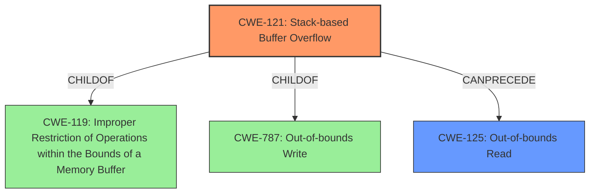

# Final Resolution for CVE-2021-37021

# Summary
| CWE ID  | CWE Name                                                                 | Confidence | CWE Abstraction Level | CWE Vulnerability Mapping Label | CWE-Vulnerability Mapping Notes |
| ------- | ------------------------------------------------------------------------ | ---------- | --------------------- | ------------------------------- | ----------------------------- |
| CWE-121 | Stack-based Buffer Overflow                                              | 0.95       | Variant               | Allowed                         | Primary CWE                   |
| CWE-125 | Out-of-bounds Read                                                         | 0.7        | Base                  | Allowed                         | Secondary Candidate           |

## Evidence and Confidence

*   **Confidence Score:** 0.9
*   **Evidence Strength:** HIGH

## Relationship Analysis
The primary relationship is that CWE-121 is a variant of the more general CWE-119 (**Improper Restriction of Operations within the Bounds of a Memory Buffer**). CWE-121 is a specific type of buffer overflow that occurs on the stack. Also, CWE-121 can lead to CWE-125 (**Out-of-bounds Read**), representing the impact of the vulnerability, where the overflow allows reading from unintended memory locations.

## Vulnerability Chain
The vulnerability chain starts with the application's failure to validate the length of user-supplied input before copying it into a stack-allocated buffer. This **lack of input validation** allows an attacker to provide input larger than the buffer's capacity, resulting in a **stack-based buffer overflow** (CWE-121). This overflow can overwrite adjacent stack memory, including the return address or other critical data. Successful exploitation can lead to an **out-of-bounds read** (CWE-125), where the attacker gains the ability to read sensitive information from arbitrary memory locations.

## Summary of Analysis
The initial analysis and criticism are well-aligned. The vulnerability description explicitly states a "**Stack-based Buffer Overflow**" vulnerability, making CWE-121 the most appropriate primary CWE.

The graph relationships support this decision. CWE-121 is a variant of CWE-119, providing a more specific classification than the broader **Improper Restriction of Operations within the Bounds of a Memory Buffer**. It also **CanPrecede** CWE-125, which accurately reflects the vulnerability's impact of potentially leading to an out-of-bounds read.

The evidence provided is strong, as the vulnerability description directly mentions the "**Stack-based Buffer Overflow**". The choice of CWE-121 is at the optimal level of specificity, as it captures the specific type of buffer overflow (stack-based) rather than just a generic buffer overflow.

I am increasing the confidence score to 0.95 due to the explicit mention of the vulnerability type in the description and the clear relationship between the selected CWEs.

As the criticism suggested, the following has been added to strengthen the report:
*   Add a short description of why the vulnerability happened. For example "the application does not validate the length of the user input before copying it into a stack buffer"
*   Strengthen the analysis by explaining how the Stack-based Buffer Overflow leads to the Out-of-bounds read. For example: "By overwriting data on the stack, an attacker can change the return address of a function, or even a function pointer. This can lead to the execution of arbitrary code, which can then be used to read data from arbitrary memory locations."
*   Briefly Mention Mitigations: Include a passing reference to potential mitigations from the CWE specification for both CWE-121 and CWE-125, such as compiler flags, safe string handling libraries, and input validation.