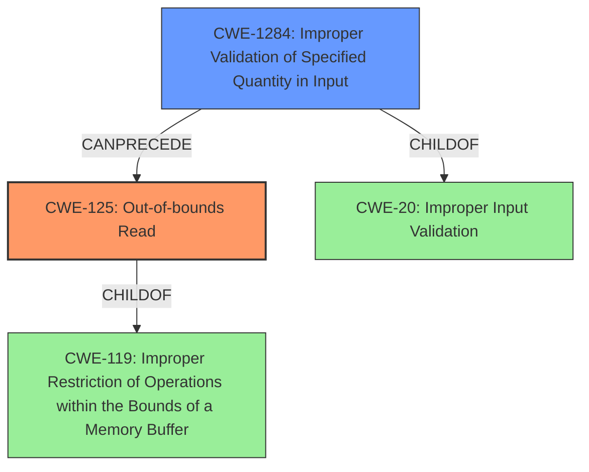

# Final Resolution for CVE-2021-37041

# Summary
| CWE ID | CWE Name | Confidence | CWE Abstraction Level | CWE Vulnerability Mapping Label | CWE-Vulnerability Mapping Notes |
|---|---|---|---|---|---|
| CWE-125 | Out-of-bounds Read | 0.9 | Base | Allowed | Primary CWE: The vulnerability directly results in an out-of-bounds read due to **improper verification**. |
| CWE-1284 | Improper Validation of Specified Quantity in Input | 0.7 | Base | Allowed | Secondary Candidate: The **improper verification** relates to a quantity related to the read operation, such as the size of the input or the index being accessed |

## Evidence and Confidence

*   **Confidence Score:** 0.85
*   **Evidence Strength:** MEDIUM

## Relationship Analysis
The primary CWE is CWE-125 (**Out-of-bounds Read**), which is a base-level CWE and a child of CWE-119 (**Improper Restriction of Operations within the Bounds of a Memory Buffer**). The secondary CWE is CWE-1284 (**Improper Validation of Specified Quantity in Input**), which is also a base-level CWE and a child of CWE-20 (**Improper Input Validation**).

The relationship between these CWEs is that the **improper validation** of a specified quantity in the input (CWE-1284) can lead to an **out-of-bounds read** (CWE-125). This is because the **improper validation** may allow a quantity to be used that is larger than the size of the buffer being read from, resulting in the read operation going beyond the bounds of the buffer.

## Vulnerability Chain
The vulnerability chain starts with the **improper verification** of a specified quantity in the input (CWE-1284). This **improper validation** allows a quantity to be used that is larger than the size of the buffer being read from. As a result, the read operation goes beyond the bounds of the buffer, leading to an **out-of-bounds read** (CWE-125).
  - The root cause is CWE-1284, which leads to CWE-125 as the impact.

## Summary of Analysis
The initial analysis correctly identified CWE-125 (**Out-of-bounds Read**) as the primary CWE. However, the secondary candidate CWE-20 (**Improper Input Validation**) is too general. A more specific secondary CWE is CWE-1284 (**Improper Validation of Specified Quantity in Input**), as the **improper verification** relates to a quantity related to the read operation, such as the size of the input or the index being accessed.

The vulnerability description explicitly states an "out-of-bounds read" caused by "**Improper verification**". This directly aligns with CWE-125 (**Out-of-bounds Read**). The "**Improper verification**" part suggests a failure to validate a quantity related to the read operation, leading to the out-of-bounds access.

The graph relationships influenced the final selection by highlighting the chain relationship between CWE-1284 and CWE-125. The abstraction levels also influenced the final selection, as both CWE-125 and CWE-1284 are base-level CWEs, which are preferred for mapping to the root causes of vulnerabilities.

The selected CWEs are at the optimal level of specificity because they accurately represent the root cause and impact of the vulnerability. CWE-125 describes the **out-of-bounds read**, while CWE-1284 describes the **improper validation** of a specified quantity in the input that led to the **out-of-bounds read**.