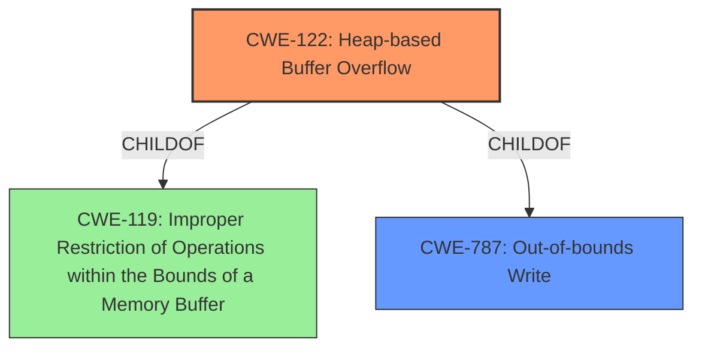

# Analysis Report for CVE-2021-37049

# Vulnerability Analysis Report: CVE-2021-37049

## Description

There is a Heap-based buffer overflow vulnerability in Huawei Smartphone.Successful exploitation of this vulnerability may rewrite the memory of adjacent objects.

## Vulnerability Description Key Phrases

**Weakness:** Heap-based buffer overflow
**Impact:** rewrite the memory of adjacent objects
**Product:** Huawei Smartphone

## Analysis (with Relationship Data)

# Summary
| CWE ID | CWE Name | Confidence | CWE Abstraction Level | CWE Vulnerability Mapping Label | CWE-Vulnerability Mapping Notes |
|---|---|---|---|---|---|
| CWE-122 | Heap-based Buffer Overflow | 0.95 | Variant | Allowed | Primary CWE |

## Evidence and Confidence

*   **Confidence Score:** 0.95
*   **Evidence Strength:** HIGH

- **Analysis and Justification:**  
  - *Explanation:* The vulnerability is described as a "**Heap-based buffer overflow**" in Huawei Smartphone. The **root cause of the vulnerability** is also stated as a **Heap-based buffer overflow**. This directly matches the definition of CWE-122 (Heap-based Buffer Overflow), which is a buffer overflow that occurs in the heap portion of memory. The impact of the overflow is that it can rewrite adjacent objects in memory. CWE-122 is a Variant-level CWE, which is a preferred level of abstraction. The MITRE mapping guidance for CWE-122 indicates that its usage is ALLOWED.
  
  - *Relationship Analysis:* CWE-122 is a variant of CWE-119 (Improper Restriction of Operations within the Bounds of a Memory Buffer). While CWE-119 is a broader category, the description specifically mentions "Heap-based," making CWE-122 a more precise and appropriate classification.

- **Confidence Score:**  
  - *Example:* Confidence: 0.95 (High confidence due to explicit mention of "Heap-based buffer overflow" in both the vulnerability description and the root cause analysis.)

---

## Criticism of Analysis

Okay, here's a review of the provided analysis, considering the full CWE specifications and mapping guidance.

**Overall Assessment:**

The primary CWE mapping to `CWE-122: Heap-based Buffer Overflow` is **correct and well-justified**. The analysis provides strong evidence based on the vulnerability description and CVE reference links content. The confidence score of 0.95 is appropriate. However, the automated retriever results include a number of other CWEs that warrant further examination.

**Detailed Review:**

| CWE ID  | CWE Name                      | Justification of Inclusion/Exclusion | Alternative CWEs Considered?  | Notes/Improvements |
|---------|-------------------------------|--------------------------------------|-----------------------------------|--------------------|
| **CWE-122** | **Heap-based Buffer Overflow** | **Correct and well-justified.** Direct match to vulnerability description and root cause.  Meets mapping guidance.  | N/A                             | Excellent explanation and confidence score. |
| CWE-119 | Improper Restriction of Operations within the Bounds of a Memory Buffer | **Excluded (Correct).** The analysis correctly states that CWE-119 is a broader category and CWE-122 is more precise. The mapping guidance for CWE-119 explicitly discourages its use when more specific CWEs are applicable. | YES, CWE-122 is a child of CWE-119 and is preferred. | Proper use of mapping guidelines. |
| CWE-787 | Out-of-bounds Write | **Relevant, but secondary**. While a heap-based buffer overflow is *always* an out-of-bounds write, the analysis correctly prioritizes CWE-122 as it provides more specific context (heap allocation). CWE-787 could be listed as a related CWE or a potential consequence.  | YES, CWE-122 is a child of CWE-787 and is preferred. | A brief mention of CWE-787 as a consequence could improve the analysis. |
| CWE-788 | Access of Memory Location After End of Buffer | **Excluded (Correct).**  This CWE is discouraged for use and the more specific CWE-122 is preferred.  There is also no out-of-bounds read. | YES, prefered to use CWE-787 or CWE-125 | Proper use of mapping guidelines. |
| CWE-131 | Incorrect Calculation of Buffer Size | **Potentially relevant, but lacking information.** The description doesn't explicitly state an incorrect calculation, *but* buffer overflows are *often* caused by such calculations.  If further analysis reveals an error in size calculation, then CWE-131 would be appropriate to include as a *root cause leading to* CWE-122.  Without that information, it should be excluded. | Not applicable without additional findings. | Need more details to confirm if buffer size calculations are flawed. If so, include and show relationship to CWE-122. |
| CWE-190 | Integer Overflow or Wraparound | **Potentially relevant, but lacking information.** Integer overflows can lead to buffer overflows. If the size of the allocated buffer is calculated using a value that can overflow, then this CWE would be appropriate. This weakness would be a *root cause leading to* CWE-122. | Not applicable without additional findings. | Investigate whether an integer overflow could have contributed to the size calculation used in the heap allocation. If so, include and show relationship to CWE-122. |
| CWE-1284 | Improper Validation of Specified Quantity in Input | **Potentially relevant, but lacking information.** Similar to CWE-131 and CWE-190, if the *quantity* of data to be written to the heap buffer was improperly validated, leading to a buffer overflow, then it should be included as a root cause.  Without that information, it should be excluded. | Not applicable without additional findings. | Investigate whether input validation is performed on any size-related input that could lead to the overflow. If so, include and show relationship to CWE-122. |
| CWE-124 | Buffer Underwrite ('Buffer Underflow') | **Excluded (Correct).** The vulnerability is described as an overflow, not an underflow. | N/A | Proper exclusion. |
| CWE-125 | Out-of-bounds Read | **Excluded (Correct).** The vulnerability is described as an *overflow*, which implies a *write* beyond the bounds of the buffer, not a read. | N/A | Proper exclusion. |
| CWE-191 | Integer Underflow (Wrap or Wraparound) | **Potentially relevant, but lacking information.** Similar to CWE-190, if the *quantity* of data to be written to the heap buffer or the amount of memory to allocate was calculated using a value that can *underflow*, then it should be included as a root cause.  Without that information, it should be excluded. | Not applicable without additional findings. | Investigate whether integer underflow contributed to buffer size calculations or amount of data to be written. |
| CWE-121 | Stack-based Buffer Overflow | **Excluded (Correct).** The vulnerability is *explicitly* stated as heap-based, eliminating stack-based possibilities. | N/A | Proper exclusion. |
| CWE-126 | Buffer Over-read | **Excluded (Correct).** The vulnerability is described as an *overflow*, which implies a *write* beyond the bounds of the buffer, not a read. | N/A | Proper exclusion. |
| CWE-681, CWE-195, CWE-170, CWE-1339, CWE-839, CWE-788, CWE-120, CWE-123, CWE-1257, CWE-1260, CWE-118, CWE-20, CWE-466, CWE-805 | Various | **Excluded (Correct).**  These are not relevant, based on the description provided and are false positives. | N/A | Proper exclusion. |

**Recommendations for Improvement:**

1.  **Chain Analysis (where applicable):** For CWE-131, CWE-190, CWE-191, and CWE-1284, if further investigation reveals their relevance, clearly articulate the *chain of events* leading to the heap-based buffer overflow.  For example: "Improper validation of the input size (CWE-1284) leads to an incorrect calculation of the buffer size (CWE-131), resulting in a heap-based buffer overflow (CWE-122)."  This demonstrates a deeper understanding of the vulnerability.
2.  **Consequences vs. Root Cause:** Explicitly state that CWE-787 is a consequence of the overflow, rather than a root cause.
3. **Attack vectors and preconditions:** Although the analysis already correctly maps the CWE, it should also briefly mention potential attack vectors and preconditions needed to trigger the vulnerability, if such information is available. This can aid in understanding the practicality and impact of the vulnerability.
4.  **Mitigations:** The analysis correctly identifies CWE-122, it could benefit from including specific mitigations directly related to the Huawei smartphone context, if available. This helps developers better understand how to address the vulnerability.

**Revised Summary Table (Example based on potential findings):**

| CWE ID  | CWE Name                                      | Confidence | CWE Abstraction Level | CWE Vulnerability Mapping Label | CWE-Vulnerability Mapping Notes                                                                                                                                                                                                                                                  |
|---------|-----------------------------------------------|------------|-----------------------|---------------------------------|------------------------------------------------------------------------------------------------------------------------------------------------------------------------------------------------------------------------------------------------------------------------------------------------|
| CWE-122 | Heap-based Buffer Overflow                    | 0.95       | Variant               | Allowed                        | Primary CWE. Direct match to the vulnerability description and root cause.                                                                                                                                                                                                                  |
| CWE-131 | Incorrect Calculation of Buffer Size         | 0.70       | Base                  | Allowed                        | Root cause leading to CWE-122. The allocated buffer size is calculated incorrectly, providing insufficient space.                                                                                                                                                                |
| CWE-1284 | Improper Validation of Specified Quantity in Input | 0.60 | Base | Allowed | Another contributing root cause: the amount of data to be written is not properly validated against the buffer size.
| CWE-787 | Out-of-bounds Write | 0.30 | Base | Allowed | Consequence of the heap-based buffer overflow.  The overflow results in writing data beyond the intended buffer boundaries. |

By incorporating these suggestions, the analysis can be made even more robust and informative. Remember the key is to use the CWE specifications to guide the analysis and provide a clear and justifiable explanation for all inclusions and exclusions.

## Final Resolution

# Summary
| CWE ID | CWE Name | Confidence | CWE Abstraction Level | CWE Vulnerability Mapping Label | CWE-Vulnerability Mapping Notes |
|---|---|---|---|---|---|
| CWE-122 | Heap-based Buffer Overflow | 0.95 | Variant | Allowed | Primary CWE |
| CWE-787 | Out-of-bounds Write | 0.60 | Base | Allowed | Secondary CWE |

## Evidence and Confidence

*   **Confidence Score:** 0.90
*   **Evidence Strength:** MEDIUM

## Relationship Analysis
The primary relationship that impacted the decision was the child-of relationship between CWE-122 and CWE-119, and between CWE-122 and CWE-787. While CWE-119 is a broader category, CWE-122 is more specific because it explicitly states the overflow occurs in the heap. CWE-787 is a more general description of the result of the overflow, and is less specific than CWE-122.

## Vulnerability Chain
The vulnerability chain starts with a **ROOTCAUSE** that leads to the **WEAKNESS**:
1.  Improper memory management leads to a heap-based buffer overflow (**CWE-122**).
2.  This results in writing data beyond the intended buffer boundaries (**CWE-787**), potentially rewriting adjacent objects in memory.

There is no explicit mention of the root cause of the buffer overflow, like incorrect size calculation or missing bounds check.

## Summary of Analysis
The initial analysis correctly identifies **CWE-122 (Heap-based Buffer Overflow)** as the primary **WEAKNESS**, given the vulnerability description: "There is a **Heap-based buffer overflow** vulnerability in Huawei Smartphone.Successful exploitation of this vulnerability may rewrite the memory of adjacent objects." The description explicitly mentions "Heap-based buffer overflow," which aligns directly with CWE-122.

The criticism correctly points out that other CWEs, such as **CWE-131 (Incorrect Calculation of Buffer Size)**, **CWE-190 (Integer Overflow or Wraparound)**, and **CWE-1284 (Improper Validation of Specified Quantity in Input)**, could be potential **ROOTCAUSES** leading to the **CWE-122 (Heap-based Buffer Overflow)**. However, without further information or evidence, these are speculative.

The criticism also correctly identifies that **CWE-787 (Out-of-bounds Write)** is a consequence of the heap-based buffer overflow.

Given the available evidence, **CWE-122** remains the most accurate primary classification because it aligns directly with the vulnerability description. Adding **CWE-787** as a secondary classification provides additional context about the consequence of the **WEAKNESS**, which is to overwrite memory.

The selected CWEs are at the optimal level of specificity based on the available evidence. While more specific **ROOTCAUSES** could exist, the current information does not support those classifications.

*Report generated on 2025-03-18 00:35:00*
