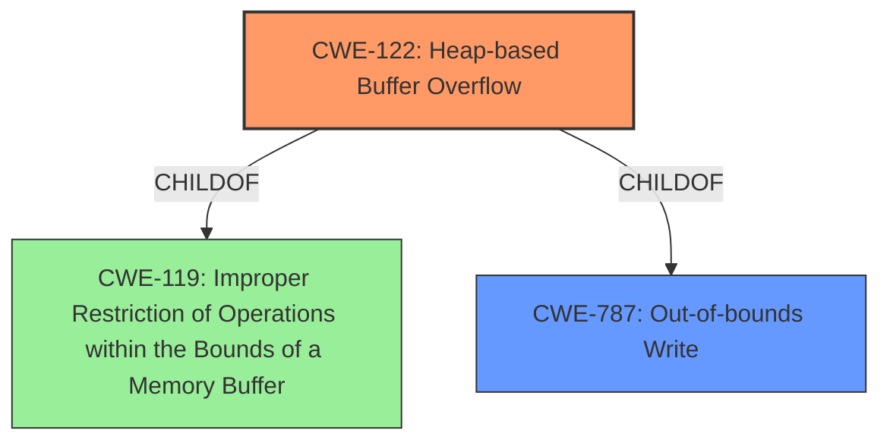

# Final Resolution for CVE-2021-37049

# Summary
| CWE ID | CWE Name | Confidence | CWE Abstraction Level | CWE Vulnerability Mapping Label | CWE-Vulnerability Mapping Notes |
|---|---|---|---|---|---|
| CWE-122 | Heap-based Buffer Overflow | 0.95 | Variant | Allowed | Primary CWE |
| CWE-787 | Out-of-bounds Write | 0.60 | Base | Allowed | Secondary CWE |

## Evidence and Confidence

*   **Confidence Score:** 0.90
*   **Evidence Strength:** MEDIUM

## Relationship Analysis
The primary relationship that impacted the decision was the child-of relationship between CWE-122 and CWE-119, and between CWE-122 and CWE-787. While CWE-119 is a broader category, CWE-122 is more specific because it explicitly states the overflow occurs in the heap. CWE-787 is a more general description of the result of the overflow, and is less specific than CWE-122.

## Vulnerability Chain
The vulnerability chain starts with a **ROOTCAUSE** that leads to the **WEAKNESS**:
1.  Improper memory management leads to a heap-based buffer overflow (**CWE-122**).
2.  This results in writing data beyond the intended buffer boundaries (**CWE-787**), potentially rewriting adjacent objects in memory.

There is no explicit mention of the root cause of the buffer overflow, like incorrect size calculation or missing bounds check.

## Summary of Analysis
The initial analysis correctly identifies **CWE-122 (Heap-based Buffer Overflow)** as the primary **WEAKNESS**, given the vulnerability description: "There is a **Heap-based buffer overflow** vulnerability in Huawei Smartphone.Successful exploitation of this vulnerability may rewrite the memory of adjacent objects." The description explicitly mentions "Heap-based buffer overflow," which aligns directly with CWE-122.

The criticism correctly points out that other CWEs, such as **CWE-131 (Incorrect Calculation of Buffer Size)**, **CWE-190 (Integer Overflow or Wraparound)**, and **CWE-1284 (Improper Validation of Specified Quantity in Input)**, could be potential **ROOTCAUSES** leading to the **CWE-122 (Heap-based Buffer Overflow)**. However, without further information or evidence, these are speculative.

The criticism also correctly identifies that **CWE-787 (Out-of-bounds Write)** is a consequence of the heap-based buffer overflow.

Given the available evidence, **CWE-122** remains the most accurate primary classification because it aligns directly with the vulnerability description. Adding **CWE-787** as a secondary classification provides additional context about the consequence of the **WEAKNESS**, which is to overwrite memory.

The selected CWEs are at the optimal level of specificity based on the available evidence. While more specific **ROOTCAUSES** could exist, the current information does not support those classifications.