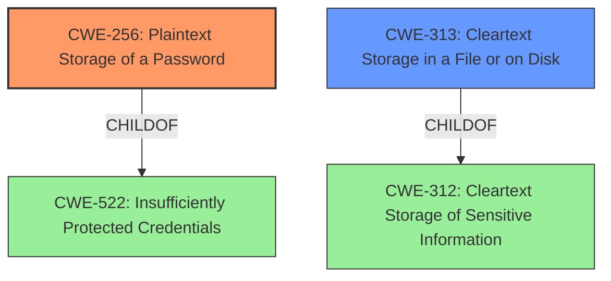

# Final Resolution for CVE-2021-37452

# Summary
| CWE ID | CWE Name | Confidence | CWE Abstraction Level | CWE Vulnerability Mapping Label | CWE-Vulnerability Mapping Notes |
|---|---|---|---|---|---|
| CWE-256 | Plaintext Storage of a Password | 1.0 | Base | Allowed | Primary CWE. Mitigations include avoiding storing passwords in easily accessible locations and using cryptographic hashes. |
| CWE-313 | Cleartext Storage in a File or on Disk | 0.8 | Variant | Allowed | Secondary Candidate. A potential mitigation involves encrypting data at rest. CWE-256 is preferred as it specifically addresses passwords. |

## Evidence and Confidence

*   **Confidence Score:** 1.0
*   **Evidence Strength:** HIGH

## Relationship Analysis
The primary relationship considered was the parent-child relationship between CWE-522 (Insufficiently Protected Credentials) and CWE-256 (Plaintext Storage of a Password). Although CWE-522 is a parent, CWE-256 provides a more specific classification. CWE-313 is a sibling of other cleartext storage CWEs, but it is not password-specific, making it a less optimal primary choice. The abstraction levels (Base and Variant) are both acceptable according to MITRE guidelines, favoring the Base level when possible.

## Vulnerability Chain
The vulnerability chain starts with the **ROOTCAUSE**: **CWE-256 (Plaintext Storage of a Password)**. This leads to the **WEAKNESS** of having passwords stored in an insecure manner, making them accessible to local users who can read the configuration files. The impact is the unauthorized disclosure of user credentials, potentially leading to unauthorized access and further compromise.

## Summary of Analysis
The initial analysis accurately identified **CWE-256 (Plaintext Storage of a Password)** as the primary **weakness**. The vulnerability description states, "NCH Quorum v2.03 and earlier allows local users to discover **cleartext** login information relating to users by reading the local .dat configuration files." This directly supports the selection of **CWE-256**.

The criticism provided useful suggestions, including explicitly mentioning mitigations for **CWE-256** and **CWE-313**, and justifying the selection of **CWE-256** over other potential candidates like **CWE-522 (Insufficiently Protected Credentials)**. The graph relationships confirmed that **CWE-256** is a more specific child of **CWE-522**, making it the optimal choice. **CWE-313 (Cleartext Storage in a File or on Disk)** remains a secondary candidate as it relates to the storage of sensitive information in a file, but **CWE-256** is more directly relevant to the storage of passwords. The final decision is based on the evidence provided, the relationship analysis, and the mapping guidance, ensuring that the selected **CWEs** are at the optimal level of specificity. The high confidence score reflects the clear and direct evidence supporting the classification.