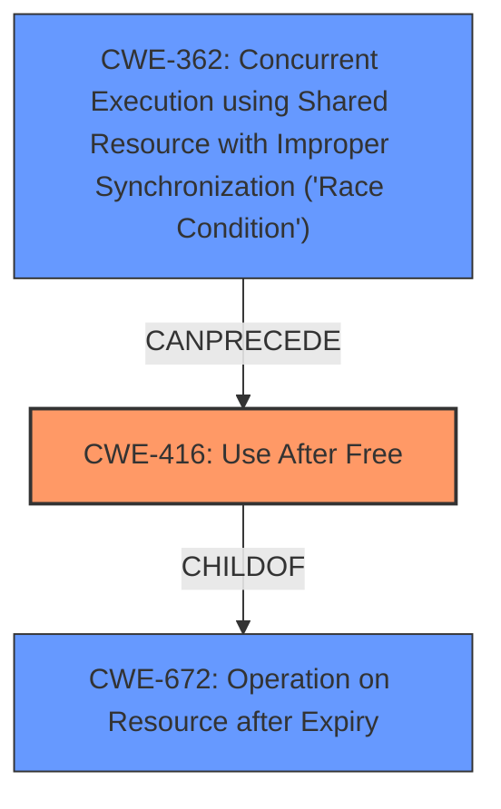

# Final Resolution for CVE-2021-3752

# Summary

| CWE ID  | CWE Name                                                                                               | Confidence | CWE Abstraction Level | CWE Vulnerability Mapping Label | CWE-Vulnerability Mapping Notes                            |
| ------- | ------------------------------------------------------------------------------------------------------ | ---------- | --------------------- | ----------------------------- | -------------------------------------------------------- |
| CWE-416 | **CWE-416: Use After Free**                                                                           | 0.95       | Variant               | Allowed                       | Primary **WEAKNESS**                                     |
| CWE-362 | **CWE-362: Concurrent Execution using Shared Resource with Improper Synchronization ('Race Condition')** | 0.85       | Class                 | Allowed-with-Review         | Secondary **ROOTCAUSE**, condition that enables CWE-416 |

## Evidence and Confidence

*   **Confidence Score:** 0.92
*   **Evidence Strength:** HIGH

## Relationship Analysis

The primary relationship is that **CWE-362** can precede **CWE-416**. The race condition (**CWE-362**) allows the memory to be freed while another thread still holds a pointer to it, leading to the **use-after-free** (**CWE-416**). **CWE-416** is also a child of **CWE-672** (Operation on Resource after Expiry), reflecting that the memory is used after its intended lifetime. While **CWE-362** is a Class, a more specific child isn't readily apparent without deeper code analysis, and the current level of detail is sufficient. The abstraction levels influenced the choice by prioritizing the Variant (**CWE-416**) and acknowledging the Class level of **CWE-362**.

## Vulnerability Chain

The vulnerability chain starts with the **ROOTCAUSE**, a **CWE-362 (Race Condition)**, where concurrent execution leads to a timing window. This allows a simultaneous connect and disconnect, which results in the **WEAKNESS**, a **CWE-416 (Use After Free)**, when `chan->data` is accessed after the memory has been freed. The impact is a system crash or privilege escalation.

## Summary of Analysis

The initial analysis and the criticism both accurately identify **CWE-416 (Use After Free)** as the primary **WEAKNESS** due to the clear description of memory being accessed after being freed: "A **use-after-free** flaw was found...in the way user calls connect to the socket and disconnect simultaneously". They also both point to **CWE-362 (Race Condition)** as a contributing factor.

The graph relationships confirm that **CWE-362** can precede **CWE-416**. **CWE-416** being a child of **CWE-672** further clarifies the nature of the vulnerability.

The selection of **CWE-416** is at the optimal level of specificity as it directly describes the core **WEAKNESS**. While **CWE-362** is a Class, exploring further child CWEs doesn't provide a significantly better fit without deeper code analysis. The analysis acknowledges the Class level of **CWE-362** and justifies its selection as the enabler of the **use-after-free**. The addition of mitigation strategies for both **CWE-416** and **CWE-362** as suggested in the criticism enhances the understanding of potential remediation.