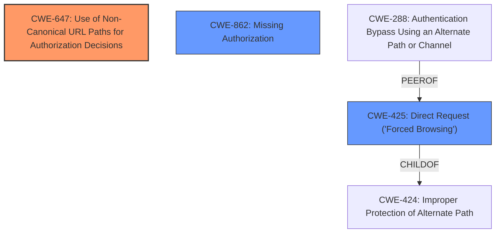

# Analysis Report for CVE-2021-37598

# Vulnerability Analysis Report: CVE-2021-37598

## Description

WP Cerber before 8.9.3 allows bypass of /wp-json access control via a trailing ? character.

## Vulnerability Description Key Phrases

**Impact:** bypass of /wp-json access control
**Vector:** trailing ? character
**Product:** WP Cerber
**Version:** before 8.9.3

## Analysis (with Relationship Data)

# Summary
| CWE ID | CWE Name | Confidence | CWE Abstraction Level | CWE Vulnerability Mapping Label | CWE-Vulnerability Mapping Notes |
|---|---|---|---|---|---|
| CWE-425 | Direct Request ('Forced Browsing') | 0.75 | Base | Allowed | Primary CWE |

## Evidence and Confidence

*   **Confidence Score:** 0.75
*   **Evidence Strength:** MEDIUM

- **Analysis and Justification:**  
  - *Explanation:* The vulnerability description states a "bypass of /wp-json access control via a trailing ? character". This indicates that the intended access control mechanisms are circumvented by manipulating the request. CWE-425 (Direct Request ('Forced Browsing')) describes a scenario where an application does not adequately enforce authorization on restricted URLs, scripts, or files. Adding a trailing `?` character could be a method of directly requesting a resource that should otherwise be protected, thus bypassing access control. The `?` likely interferes with the intended URL parsing or authorization logic.
  - *Relationship Analysis:* No direct relationships were found in the provided information for CWE-425. However, it could be related to other authorization issues if the underlying problem is a general lack of proper authorization checks.

- **Confidence Score:**  
  - Confidence: 0.75 (The description directly aligns with bypassing access control using a specific technique.)
---

## Criticism of Analysis

Okay, let's review the analysis of the WP Cerber vulnerability (bypass of /wp-json access control via a trailing ? character) against the provided CWE specifications.

**Overall Assessment:**

The analysis correctly identifies CWE-425 (Direct Request ('Forced Browsing')) as a primary CWE. The justification is sound, and the confidence level of 0.75 is reasonable. However, several other CWEs should be considered to provide a more complete picture of the vulnerability.  CWE-647 (Use of Non-Canonical URL Paths for Authorization Decisions) is strongly related and should be included. Furthermore, the underlying cause might stem from CWE-862 (Missing Authorization) or CWE-41 (Improper Resolution of Path Equivalence).

**Detailed Critique:**

**1. CWE-425 (Direct Request ('Forced Browsing')) - Primary CWE**

*   **Strengths:** The reasoning for selecting CWE-425 is accurate. The vulnerability description directly suggests bypassing access control by manipulating the request, which aligns well with the core concept of CWE-425. The explanation of how the trailing `?` character could interfere with URL parsing is also plausible.
*   **Weaknesses:** While CWE-425 is a good starting point, it's more of a symptom than the root cause.  The analysis should delve deeper into *why* the trailing `?` allows the bypass.  Is it because the application isn't properly normalizing the URL before checking authorization? Is it simply missing an authorization check for requests with a `?`? This leads to consideration of other CWEs.
*   **Improvements:**
    *   The explanation should be enhanced to discuss the specific mechanism by which the `?` bypasses authorization. Does the application use a whitelist of allowed URLs that doesn't account for query strings? Does it strip the query string *after* authorization checks?
    *   The analysis should explicitly state that mitigating CWE-425 often involves *more robust authorization checks* and *proper URL normalization*.
*   **Mitigation Applicability:** The provided mitigations for CWE-425 are relevant:
    *   "Apply appropriate access control authorizations for each access to all restricted URLs, scripts or files."  This is a direct solution.
    *   "Consider using MVC based frameworks such as Struts."  While Struts is mentioned, the general point is valid: use a framework that handles authorization and routing in a secure and consistent manner.

**2. CWE-647 (Use of Non-Canonical URL Paths for Authorization Decisions) - Strong Secondary CWE**

*   **Justification:**  This CWE is *highly* relevant. The vulnerability leverages a non-canonical representation of the URL (with the trailing `?`) to bypass authorization. The core problem is that the application's authorization logic likely makes decisions based on a URL path without properly canonicalizing it.
*   **Missing Analysis:**  This CWE is not mentioned as primary.
*   **Improvements:**
    *   Add CWE-647 as a *co-primary* or *secondary* CWE.
    *   The explanation should clearly state that the application needs to ensure that URLs are in a canonical form *before* authorization decisions are made.
*   **Mitigation Applicability:**
    *   "Make access control policy based on path information in canonical form." This is *exactly* what's needed.
    *   "Reject all alternate path encodings that are not in the expected canonical form." This is a crucial step in preventing this type of bypass.

**3. CWE-862 (Missing Authorization) - Potential Root Cause (Needs Further Investigation)**

*   **Justification:** The trailing `?` might be exposing a path where authorization is simply *missing*. It's possible that the code path handling URLs with `?` doesn't have the same authorization checks as the code path for "clean" URLs.
*   **Improvements:**
    *   Investigate the code to see if authorization checks are performed consistently for all possible URL variations.
    *   If authorization is genuinely missing for URLs with `?`, then CWE-862 should be elevated.
*   **Mitigation Applicability:**
    *   "Divide the product into anonymous, normal, privileged, and administrative areas. Reduce the attack surface by carefully mapping roles with data and functionality."  This is generally good advice, but it's most effective when combined with explicit authorization checks.
    *   "Ensure that access control checks are performed related to the business logic."  This highlights the need to consider authorization at different levels of the application.

**4. CWE-41 (Improper Resolution of Path Equivalence) - Possible Contributing Factor**

*   **Justification:** While less direct than CWE-647, CWE-41 could be relevant if the trailing `?` is causing the application to treat the URL as equivalent to another path it shouldn't be. The description of CWE-41 mentions the use of special characters in file and directory names. While not directly related to a file system, the application might be improperly equating the URL with a trailing `?` with a valid authorized URL.
*   **Improvements:**
    *   Analyze how the application handles URL parsing. Is it improperly resolving the path due to the `?`?
*   **Mitigation Applicability:**
    *   "Assume all input is malicious. Use an "accept known good" input validation strategy" This applies well to url validation and should be implemented

**5. Other CWEs Considered and Rejected (With Justification):**

*   **CWE-434 (Unrestricted Upload of File with Dangerous Type):** Not relevant. This vulnerability doesn't involve file uploads.
*   **CWE-352 (Cross-Site Request Forgery (CSRF)):** Not relevant.  This is a direct bypass of access control, not a forgery attack.
*   **CWE-158 (Improper Neutralization of Null Byte or NUL Character):** Unlikely.  While NUL byte injection is a common vulnerability, the `?` character is the identified trigger here.
*   **CWE-266 (Incorrect Privilege Assignment):**  Indirectly relevant. The vulnerability leads to incorrect privilege assignment, but the root cause is more specific (URL handling and authorization).
*   **CWE-625 (Permissive Regular Expression):** Only relevant if the application uses a regular expression to parse the URL and the regex is too permissive, allowing the trailing `?` to bypass checks. Needs further investigation.
*   **CWE-201 (Insertion of Sensitive Information Into Sent Data):** Not relevant. The vulnerability is not about leaking sensitive information in the request or response.
*   **CWE-288 (Authentication Bypass Using an Alternate Path or Channel), CWE-424 (Improper Protection of Alternate Path):** Only apply if the trailing `?` is considered an alternate path, which is not likely. It's simply a URL manipulation.
*   **CWE-471 (Modification of Assumed-Immutable Data (MAID)):** Only applies if the URL is considered immutable data, which is not a valid assumption.
*   **CWE-98 (Improper Control of Filename for Include/Require Statement in PHP Program ('PHP Remote File Inclusion')):** Not relevant because no files are included using the URL.

**Recommendations:**

1.  **Elevate CWE-647 to a primary or secondary CWE.**  It's a direct and accurate description of the vulnerability.
2.  **Investigate CWE-862 more thoroughly.** Determine if authorization is genuinely missing in the code path handling URLs with `?`.
3.  **Refine the description of CWE-425** to focus on the bypassed access control and include mention of URL normalization.
4.  **Add mitigation strategies** that specifically address URL normalization and canonicalization.
5.  **Re-evaluate CWE-625** if regular expressions are used for URL parsing.
6.  **Explicitly document** the reasons for rejecting the less relevant CWEs in the analysis.

By incorporating these suggestions, the analysis will be more comprehensive and provide a clearer understanding of the vulnerability and its underlying causes.

## Final Resolution

# Summary
| CWE ID | CWE Name | Confidence | CWE Abstraction Level | CWE Vulnerability Mapping Label | CWE-Vulnerability Mapping Notes |
|---|---|---|---|---|---|
| CWE-647 | Use of Non-Canonical URL Paths for Authorization Decisions | 0.9 | Variant | Allowed | Primary CWE |
| CWE-425 | Direct Request ('Forced Browsing') | 0.75 | Base | Allowed | Secondary Candidate |
| CWE-862 | Missing Authorization | 0.6 | Class | Allowed-with-Review | Secondary Candidate |

## Evidence and Confidence

*   **Confidence Score:** 0.85
*   **Evidence Strength:** MEDIUM

## Relationship Analysis
The primary focus is on identifying the most specific and accurate CWE to represent the vulnerability. CWE-647 is chosen as the primary CWE due to its direct relevance to the vulnerability description, which involves bypassing access control via a non-canonical URL path. CWE-425, while initially considered, is more of a symptom. CWE-862, though potentially a root cause, requires further investigation.

## Vulnerability Chain
The vulnerability chain starts with the application's failure to properly canonicalize URLs before making authorization decisions (**ROOTCAUSE: CWE-647**). This leads to a situation where a manipulated URL (with a trailing '?') bypasses the intended access controls (**WEAKNESS: CWE-425**). If authorization checks are missing for URLs with a `?`, then **CWE-862** could be involved as a root cause or contributing factor. The final impact is unauthorized access to resources.

## Summary of Analysis
The initial analysis correctly identified **CWE-425 (Direct Request ('Forced Browsing'))**, but the criticism highlighted the importance of considering more specific and root-cause-oriented CWEs. The vulnerability description "WP Cerber before 8.9.3 allows bypass of /wp-json access control via a trailing ? character" strongly suggests that the application is not properly handling non-canonical URL paths. Therefore, **CWE-647 (Use of Non-Canonical URL Paths for Authorization Decisions)** is the more accurate primary **WEAKNESS**.

The graph relationships influenced the decision by illustrating how **CWE-425** is a symptom of a deeper problem, while **CWE-647** addresses the root cause. The abstraction levels also played a role, with the Variant level of **CWE-647** providing a more specific description than the Base level of **CWE-425**. **CWE-862 (Missing Authorization)** is included as a secondary candidate because the trailing `?` could be exposing a code path where authorization checks are missing, but this requires further investigation.

*Report generated on 2025-03-17 01:35:50*
