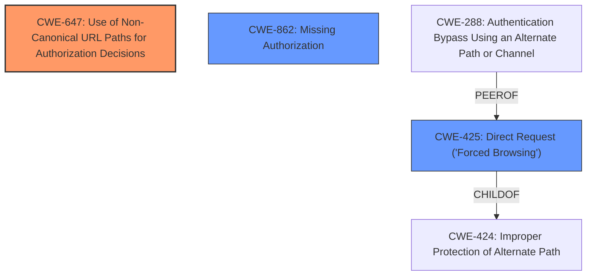

# Final Resolution for CVE-2021-37598

# Summary
| CWE ID | CWE Name | Confidence | CWE Abstraction Level | CWE Vulnerability Mapping Label | CWE-Vulnerability Mapping Notes |
|---|---|---|---|---|---|
| CWE-647 | Use of Non-Canonical URL Paths for Authorization Decisions | 0.9 | Variant | Allowed | Primary CWE |
| CWE-425 | Direct Request ('Forced Browsing') | 0.75 | Base | Allowed | Secondary Candidate |
| CWE-862 | Missing Authorization | 0.6 | Class | Allowed-with-Review | Secondary Candidate |

## Evidence and Confidence

*   **Confidence Score:** 0.85
*   **Evidence Strength:** MEDIUM

## Relationship Analysis
The primary focus is on identifying the most specific and accurate CWE to represent the vulnerability. CWE-647 is chosen as the primary CWE due to its direct relevance to the vulnerability description, which involves bypassing access control via a non-canonical URL path. CWE-425, while initially considered, is more of a symptom. CWE-862, though potentially a root cause, requires further investigation.

## Vulnerability Chain
The vulnerability chain starts with the application's failure to properly canonicalize URLs before making authorization decisions (**ROOTCAUSE: CWE-647**). This leads to a situation where a manipulated URL (with a trailing '?') bypasses the intended access controls (**WEAKNESS: CWE-425**). If authorization checks are missing for URLs with a `?`, then **CWE-862** could be involved as a root cause or contributing factor. The final impact is unauthorized access to resources.

## Summary of Analysis
The initial analysis correctly identified **CWE-425 (Direct Request ('Forced Browsing'))**, but the criticism highlighted the importance of considering more specific and root-cause-oriented CWEs. The vulnerability description "WP Cerber before 8.9.3 allows bypass of /wp-json access control via a trailing ? character" strongly suggests that the application is not properly handling non-canonical URL paths. Therefore, **CWE-647 (Use of Non-Canonical URL Paths for Authorization Decisions)** is the more accurate primary **WEAKNESS**.

The graph relationships influenced the decision by illustrating how **CWE-425** is a symptom of a deeper problem, while **CWE-647** addresses the root cause. The abstraction levels also played a role, with the Variant level of **CWE-647** providing a more specific description than the Base level of **CWE-425**. **CWE-862 (Missing Authorization)** is included as a secondary candidate because the trailing `?` could be exposing a code path where authorization checks are missing, but this requires further investigation.