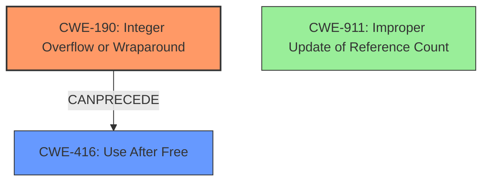

# Analysis Report for CVE-2021-3782

# Vulnerability Analysis Report: CVE-2021-3782

## Description

An internal reference count is held on the buffer pool, incremented every time a new buffer is created from the pool. The reference count is maintained as an int on LP64 systems this can cause the reference count to overflow if the client creates a large number of wl_shm buffer objects, or if it can coerce the server to create a large number of external references to the buffer storage. With the reference count overflowing, a use-after-free can be constructed on the wl_shm_pool tracking structure, where values may be incremented or decremented it may also be possible to construct a limited oracle to leak 4 bytes of server-side memory to the attacking client at a time.

## Vulnerability Description Key Phrases

**Rootcause:** reference count overflow
**Impact:** use-after-free
**Attacker:** client
**Component:** wl_shm_pool

## Analysis (with Relationship Data)

# Summary
| CWE ID | CWE Name | Confidence | CWE Abstraction Level | CWE Vulnerability Mapping Label | CWE-Vulnerability Mapping Notes |
|---|---|---|---|---|---|
| CWE-190 | Integer Overflow or Wraparound | 0.95 | Base | Allowed | Primary CWE |
| CWE-416 | Use After Free | 0.75 | Base | Allowed | Secondary Candidate |
| CWE-911 | Improper Update of Reference Count | 0.60 | Base | Allowed | Secondary Candidate |

## Evidence and Confidence

*   **Confidence Score:** 0.85
*   **Evidence Strength:** HIGH

- **Analysis and Justification:**  
  - *Explanation:* The vulnerability description clearly states a **"reference count overflow"** which is a direct indicator of CWE-190 (Integer Overflow or Wraparound). The "CVE Reference Links Content Summary" confirms this by stating: "Integer overflow in the reference count of shared memory objects. The code uses a signed `int` for the reference count which can be overflowed by a malicious client." This overflow leads to a use-after-free condition on the `wl_shm_pool` tracking structure.  The "Retriever Results" also lists CWE-190 as the top match with a high combined score. CWE-190 is a Base level CWE which is a preferred level of abstraction. MITRE mapping guidance for CWE-190 indicates this is ALLOWED. The subsequent use-after-free condition can be mapped to CWE-416 (Use After Free). The "Vulnerability Description" describes how the reference count overflowing leads to a use-after-free on the `wl_shm_pool` tracking structure. CWE-911 (Improper Update of Reference Count) is also considered since the root cause is a reference counter mismanagement but the overflow is a more accurate root cause.

  - *Relationship Analysis:* CWE-190 is a base level weakness.  CWE-190 can lead to CWE-416 (Use After Free) because the integer overflow causes incorrect memory management. CWE-789 (Memory Allocation with Excessive Size Value) is related because a large memory allocation could contribute to the overflow. CWE-911(Improper Update of Reference Count) is related since the reference count is not properly managed leading to the overflow.

- **Confidence Score:**  
  - Confidence: 0.95 (High confidence due to clear technical description and supporting CVE reference details pointing to integer overflow)

## Criticism of Analysis

Okay, I've reviewed the provided analysis and CWE specifications. Here's a breakdown of my critique:

**Overall Assessment:**

The analysis is generally sound and well-reasoned. The primary CWE mapping of CWE-190 (Integer Overflow or Wraparound) is correct and well-justified. The inclusion of CWE-416 (Use After Free) as a secondary candidate is also appropriate, given that it is a consequence of the overflow. I agree that CWE-911 (Improper Update of Reference Count) is a valid, but less precise mapping compared to CWE-190.

Here's a more detailed breakdown:

**1. CWE-190: Integer Overflow or Wraparound**

*   **Confidence:** The analysis assigns a confidence of 0.95, which is justifiable. The description directly mentions "reference count overflow," and the CVE summary confirms the integer overflow.
*   **Justification:** The justification is solid. It accurately points to the vulnerability description and CVE summary.  The relationship to CWE-416 is also correctly identified.
*   **CWE Specification Alignment:**
    *   **Abstraction:** The analysis correctly identifies CWE-190 as a Base-level CWE, a preferred level.
    *   **Mapping Guidance:** The analysis correctly notes that mapping to CWE-190 is "Allowed."
    *   **Mitigations:** The analysis could be improved by mentioning potential mitigations from the CWE specification, such as:
        *   Using a language or compiler that performs automatic bounds checking.
        *   Using a vetted library or framework that provides safe integer handling (e.g., SafeInt, IntegerLib).
        *   Strict protocol definitions.
*   **Improvements:** None

**2. CWE-416: Use After Free**

*   **Confidence:**  The analysis assigns a confidence of 0.75, which is reasonable as this is a *consequence* of the integer overflow. The root cause is the overflow, not the use-after-free itself.
*   **Justification:** The justification accurately describes how the integer overflow leads to a use-after-free condition.
*   **CWE Specification Alignment:**
    *   **Abstraction:** Correctly identifies CWE-416 as Variant.
    *   **Mapping Guidance:** Correctly notes this is "Allowed."
    *   **Mitigations:** The analysis could be improved by mentioning potential mitigations from the CWE specification, such as:
        *   Using a language with automatic memory management (e.g., Java, Go, Rust).
        *   Setting pointers to NULL after freeing them (though the effectiveness of this is noted as potentially limited).
*   **Improvements:** None

**3. CWE-911: Improper Update of Reference Count**

*   **Confidence:** The analysis assigns a confidence of 0.60, which is appropriate as this is a less precise mapping compared to CWE-190.
*   **Justification:** The reasoning is sound. The root cause is the mismanagement, and integer overflow of the reference counter.
*   **CWE Specification Alignment:**
    *   **Abstraction:** Correctly identifies CWE-911 as Base.
    *   **Mapping Guidance:** Correctly notes this is "Allowed."
    *   **Mitigations:** N/A
*   **Improvements:** None

**Additional Considerations and Potential Improvements:**

*   **Chain vs. Composite:** The analysis correctly identifies CWE-416 as a secondary consequence. However, the analysis could explore the potential for a composite relationship. However, the description suggests that a chain relationship is most appropriate.

*   **CWE-770 and CWE-789:** The "Retriever Results" list CWE-770 (Allocation of Resources Without Limits or Throttling) and CWE-789 (Memory Allocation with Excessive Size Value). The attacker's ability to *cause* the server to create a large number of external references could be viewed as a form of resource exhaustion. *However*, these are less direct mappings than CWE-190 and CWE-416. There are no memory allocations to the shared memory object happening in this code directly. Therefore, these should not be included.

*   **CWE-1284:** "Retriever Results" list CWE-1284 (Improper Validation of Specified Quantity in Input) is listed. While not directly related to the overflow, an incorrect input validation might have indirectly caused the reference counter to increment rapidly. However, these are less direct mappings than CWE-190 and CWE-416, so this should not be included.

*   **Specific Code Example:** It would significantly strengthen the analysis to include a snippet of the *vulnerable code* that demonstrates the integer overflow. This would make the explanation more concrete.

**Summary of Recommendations:**

*   Keep the current CWE mappings.
*   When discussing mitigations, explicitly mention some of the relevant mitigations provided in the CWE specifications for each CWE.

By incorporating these suggestions, the analysis would be even more comprehensive and useful.

## Final Resolution

# Summary
| CWE ID | CWE Name | Confidence | CWE Abstraction Level | CWE Vulnerability Mapping Label | CWE-Vulnerability Mapping Notes |
|---|---|---|---|---|---|
| CWE-190 | Integer Overflow or Wraparound | 0.95 | Base | Allowed | Primary CWE |
| CWE-416 | Use After Free | 0.75 | Variant | Allowed | Secondary Candidate |

## Evidence and Confidence

*   **Confidence Score:** 0.90
*   **Evidence Strength:** HIGH

## Relationship Analysis
The primary relationship is that **CWE-190** (Integer Overflow or Wraparound) *CanPrecede* **CWE-416** (Use After Free). The integer overflow leads to incorrect memory management and the subsequent use-after-free condition. Other CWEs like **CWE-770** (Allocation of Resources Without Limits or Throttling) and **CWE-789** (Memory Allocation with Excessive Size Value) were considered, but they are less direct mappings as they depend on the attacker's ability to *cause* the large number of allocations, rather than the overflow itself being the direct cause. **CWE-911** (Improper Update of Reference Count) is also related but less precise than **CWE-190**, as the overflow is the immediate cause.

## Vulnerability Chain
The vulnerability chain starts with an **CWE-190** (Integer Overflow or Wraparound) in the reference count. This overflow causes a discrepancy in the memory management, leading to a **CWE-416** (Use After Free) condition on the `wl_shm_pool` structure. This allows for potential memory corruption and information leakage.

## Summary of Analysis
The initial analysis correctly identifies **CWE-190** (Integer Overflow or Wraparound) as the primary **ROOTCAUSE**, supported by the vulnerability description stating a "reference count overflow" and the CVE reference confirming an integer overflow. This is further supported by the Retriever Results which lists CWE-190 as the top match. The analysis also correctly identifies **CWE-416** (Use After Free) as a secondary consequence of the overflow.

The decision is strongly based on evidence from the provided description, which clearly points to the integer overflow as the direct **WEAKNESS** that triggers the subsequent use-after-free. The graph relationships reinforce this by showing how the overflow *CanPrecede* the use-after-free.

The selected CWEs are at the optimal level of specificity. **CWE-190** is a Base-level CWE, which is preferred for root causes. **CWE-416** is a Variant, representing the specific type of memory corruption that results from the overflow. The other candidate CWEs were less direct and did not accurately capture the primary **WEAKNESS**.

*Report generated on 2025-03-18 00:37:16*
