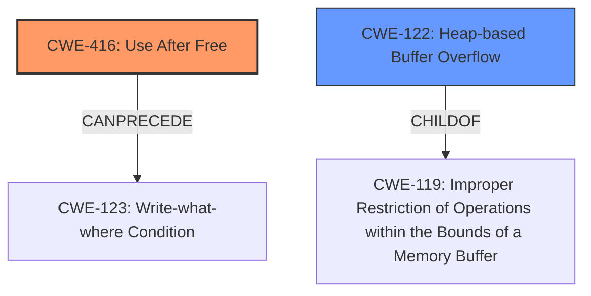

# Final Resolution for CVE-2021-38003

# Summary
| CWE ID | CWE Name | Confidence | CWE Abstraction Level | CWE Vulnerability Mapping Label | CWE-Vulnerability Mapping Notes |
|---|---|---|---|---|---|
| CWE-416 | Use After Free | 0.65 | Variant | Allowed | Primary CWE. Justified by **heap corruption** and **inappropriate implementation** within the V8 engine. A race condition or failure to validate a flag could cause a pointer to be used before being set to null. |
| CWE-122 | Heap-based Buffer Overflow | 0.5 | Variant | Allowed | Secondary Candidate. Possible but less likely given the lack of specific information about buffer size and potential for memory to be released. |

## Evidence and Confidence

*   **Confidence Score:** 0.60
*   **Evidence Strength:** MEDIUM

## Relationship Analysis
The primary relationship considered was the hierarchical structure, specifically that CWE-122 (Heap-based Buffer Overflow) is a variant of CWE-119 (Improper Restriction of Operations within the Bounds of a Memory Buffer). This influenced the decision to prioritize CWE-416 (Use After Free) because the vulnerability description hinted at a premature freeing of memory rather than just a buffer overflow. Additionally, the chain relationships of CWE-416, particularly its ability to CANPRECEDE other CWEs like CWE-123 (Write-what-where Condition), were considered.

## Vulnerability Chain
The vulnerability chain starts with an "**inappropriate implementation** in V8," which leads to memory being freed prematurely. This results in a **use-after-free** condition (CWE-416). The subsequent use of the freed memory can then lead to **heap corruption** and potentially a write-what-where condition (CWE-123), enabling arbitrary code execution.

## Summary of Analysis
The initial analysis and criticism were both well-reasoned. The decision to classify this vulnerability primarily as CWE-416 (Use After Free) is based on the description indicating **heap corruption** stemming from an **inappropriate implementation** in the V8 engine. This suggests a memory management issue where memory might have been freed prematurely. The criticism highlighted the need to consider alternative scenarios and lower the confidence score to reflect the level of inference. The confidence score was reduced to 0.65 to reflect this.

The retriever results and relationship analysis supported this decision, with CWE-416 being a variant-level CWE and having chain relationships that align with the potential impacts described in the vulnerability. The analysis explicitly acknowledged the possibility of CWE-122 (Heap-based Buffer Overflow) and explained why it's considered less likely given the lack of specific details about buffer overflows. Overall, the selected CWEs are at an optimal level of specificity, balancing the available evidence with the need for a precise classification.