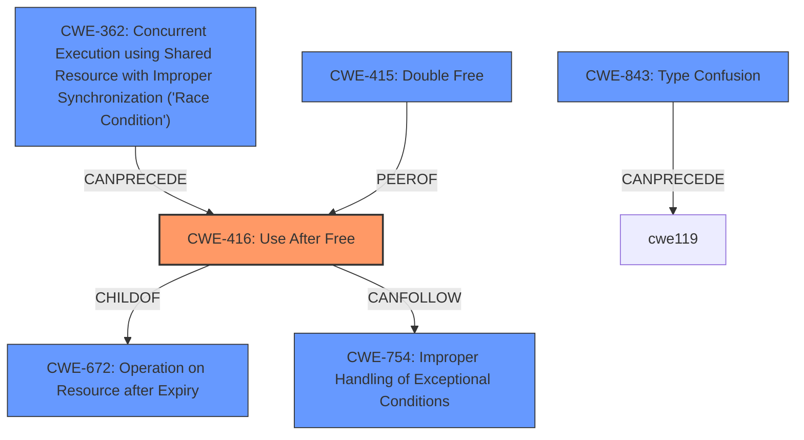

# Analysis Report for CVE-2021-38005

# Vulnerability Analysis Report: CVE-2021-38005

## Description

Use after free in loader in Google Chrome prior to 96.0.4664.45 allowed a remote attacker to potentially exploit heap corruption via a crafted HTML page.

## Vulnerability Description Key Phrases

**Rootcause:** use after free
**Weakness:** heap corruption
**Vector:** crafted HTML page
**Attacker:** remote attacker
**Product:** Google Chrome
**Version:** prior to 96.0.4664.45
**Component:** loader

## Analysis (with Relationship Data)

# Summary
| CWE ID | CWE Name | Confidence | CWE Abstraction Level | CWE Vulnerability Mapping Label | CWE-Vulnerability Mapping Notes |
|---|---|---|---|---|---|
| CWE-416 | Use After Free | 1.0 | Variant | Primary | Allowed |

## Evidence and Confidence

*   **Confidence Score:** 1.0
*   **Evidence Strength:** HIGH

- **Analysis and Justification:**  
  - *Explanation:* The vulnerability description clearly states "**use after free** in loader" which directly maps to CWE-416 (Use After Free). The description mentions a remote attacker exploiting **heap corruption** via a crafted HTML page, which is a typical exploitation scenario for use-after-free vulnerabilities. The "CVE Reference Links Content Summary" confirms "**Use after free**" as the root cause. CWE-416 is a Variant level CWE, providing a specific description of the vulnerability. The MITRE mapping guidance for CWE-416 allows this mapping.
  
  - *Relationship Analysis:* While other CWEs like CWE-122 (Heap-based Buffer Overflow) and CWE-415 (Double Free) are related to memory corruption, the explicit mention of "use after free" makes CWE-416 the most appropriate and specific choice.

- **Confidence Score:**  
  - Confidence: 1.0 (High confidence due to direct evidence in the vulnerability description and CVE details)

## Criticism of Analysis

Okay, I've reviewed the analysis against the full CWE specifications provided. Here's my critique:

**Overall Assessment:**

The analysis is largely correct in identifying **CWE-416 (Use After Free)** as the primary CWE. The justification is well-articulated and supported by the vulnerability description and CVE reference summary. The analysis correctly states why other related CWEs are not the *most* appropriate.  The confidence score of 1.0 is justified.

**Detailed Critique:**

*   **CWE-416 (Use After Free) - Primary:**
    *   **Correct Mapping:**  The mapping to CWE-416 is accurate and aligns perfectly with the vulnerability description. The description explicitly mentions "use after free," making this the most direct and specific match.
    *   **Abstraction Level:** Correctly identified as a "Variant" level CWE, which is the preferred level of abstraction.
    *   **Justification:** The justification is thorough and explains why CWE-416 is selected over other memory corruption CWEs. The explanation also includes the role a crafted HTML page plays in exploiting this vulnerability, which aligns with common UAF exploitation techniques in web browsers.
    *   **Mitigations:** The potential mitigations for CWE-416 are relevant:
        *   Using a language with automatic memory management is a sound architectural choice.
        *   Setting pointers to NULL after freeing them is a good practice but has limitations in complex scenarios.

*   **Consideration of other CWEs and Retriever Results:**
    *   The analysis addresses why CWE-122 (Heap-based Buffer Overflow) is not the primary CWE, which is correct. A use-after-free condition *can* lead to heap corruption, but the root cause is the use of freed memory, not a buffer overflow.
    *   The Retriever Results section shows several CWEs with high scores, such as CWE-843 (Type Confusion), CWE-366 (Race Condition within a Thread), and CWE-415 (Double Free). The analysis could briefly discuss why these are not as appropriate, even if they are potentially related. For example:
        *   **CWE-843 (Type Confusion):** While memory corruption is involved, the core issue is not accessing a resource with an incompatible type; it's accessing *freed* memory.
        *   **CWE-366 (Race Condition):** Race conditions *can* sometimes lead to use-after-free, but this is not explicitly stated in the vulnerability description.  Without more evidence, it's not the primary cause.
        *   **CWE-415 (Double Free):** Double free is a distinct vulnerability from use after free.

*   **CWE Specification Review:**
    *   The analysis correctly uses the CWE specifications to inform its decision. The mapping guidance for CWE-416 explicitly "allows" the mapping at the Variant level.

**Suggestions for Improvement:**

*   **Acknowledge Potential Chaining:** While CWE-416 is the primary weakness, briefly acknowledge how it *could* be part of a chain. For example, a race condition (CWE-362) might lead to memory being freed prematurely, *then* being accessed (CWE-416). However, state that the provided information doesn't explicitly support this chaining, so CWE-416 remains the primary issue.
*  **Expand on Memory Corruption:** Mention that while heap corruption is a *consequence* of UAF, it's not the root cause. The crafted HTML page exploits the UAF, leading to memory corruption.

**Revised Summary Table (Incorporating suggestions):**

| CWE ID | CWE Name | Confidence | CWE Abstraction Level | CWE Vulnerability Mapping Label | CWE-Vulnerability Mapping Notes |
|---|---|---|---|---|---|
| CWE-416 | Use After Free | 1.0 | Variant | Primary | Allowed |
| CWE-Other | Related Memory Corruption Issues | Low | N/A | Secondary | N/A- Possible consequence of UAF exploitation |

**Conclusion:**

The analysis is sound and accurately identifies the primary CWE. The justification is strong and well-supported. The suggestions for improvement primarily focus on acknowledging related CWEs and potential chaining scenarios to provide a more comprehensive view of the vulnerability.

## Final Resolution

# Summary
| CWE ID | CWE Name | Confidence | CWE Abstraction Level | CWE Vulnerability Mapping Label | CWE-Vulnerability Mapping Notes |
|---|---|---|---|---|---|
| CWE-416 | Use After Free | 1.0 | Variant | Primary | Allowed |

## Evidence and Confidence

*   **Confidence Score:** 1.0
*   **Evidence Strength:** HIGH

## Relationship Analysis
The primary relationship considered is the direct match between the vulnerability description and **CWE-416 (Use After Free)**. While other CWEs like **CWE-362 (Concurrent Execution using Shared Resource with Improper Synchronization ('Race Condition'))**, **CWE-415 (Double Free)**, and **CWE-843 (Incompatible type)** are related to memory corruption and could potentially be part of a vulnerability chain, they are not the direct cause described in the vulnerability. **CWE-416 (Use After Free)** is a variant of a more general class of memory management errors, but it's the most specific and accurate classification based on the provided information.

## Vulnerability Chain
The vulnerability chain starts with the crafted HTML page, which triggers the **use-after-free** condition in the loader component of Google Chrome. This **CWE-416 (Use After Free)** leads to **heap corruption**, allowing a remote attacker to potentially execute arbitrary code.

Crafted HTML Page -> **CWE-416 (Use After Free)** -> Heap Corruption -> Remote Code Execution

## Summary of Analysis
The initial analysis and criticism both converge on **CWE-416 (Use After Free)** as the most appropriate primary CWE. The vulnerability description explicitly mentions "use after free," providing strong evidence for this classification. The high confidence score of 1.0 is justified.

The graph relationships, specifically the peer relationship between **CWE-415 (Double Free)** and **CWE-416 (Use After Free)**, highlight the potential for confusion between these two similar vulnerabilities. However, the vulnerability description clearly points to **CWE-416 (Use After Free)**.

The mapping guidance for **CWE-416 (Use After Free)** allows this mapping, further reinforcing the decision.

The selected CWE is at the optimal level of specificity because it directly reflects the root cause described in the vulnerability. More general CWEs like **CWE-119 (Improper Restriction of Operations within the Bounds of a Memory Buffer)** or **CWE-122 (Heap-based Buffer Overflow)** would not accurately capture the specific nature of the vulnerability.

*Report generated on 2025-03-18 00:37:52*
