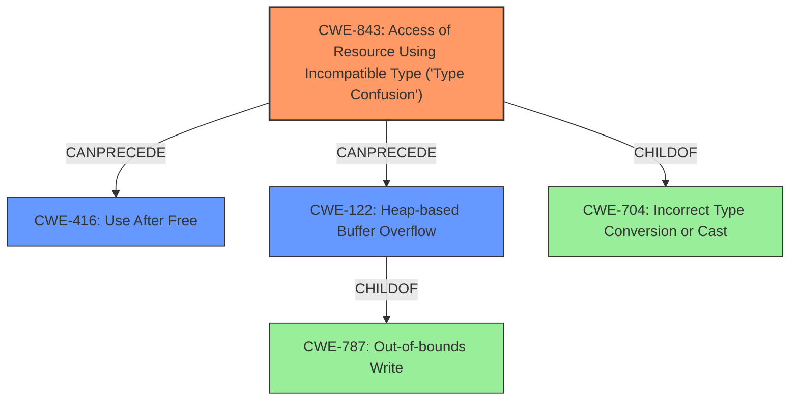

# Analysis Report for CVE-2021-38012

# Vulnerability Analysis Report: CVE-2021-38012

## Description

Type confusion in V8 in Google Chrome prior to 96.0.4664.45 allowed a remote attacker to potentially exploit heap corruption via a crafted HTML page.

## Vulnerability Description Key Phrases

**Rootcause:** type confusion
**Impact:** heap corruption
**Vector:** crafted HTML page
**Attacker:** remote attacker
**Product:** Google Chrome
**Version:** prior to 96.0.4664.45
**Component:** V8

## Analysis (with Relationship Data)

# Summary
| CWE ID | CWE Name | Confidence | CWE Abstraction Level | CWE Vulnerability Mapping Label | CWE-Vulnerability Mapping Notes |
|---|---|---|---|---|---|
| CWE-843 | Access of Resource Using Incompatible Type ('Type Confusion') | 0.95 | Base | Allowed | Primary CWE |
| CWE-416 | Use After Free | 0.65 | Variant | Allowed | Secondary Candidate |
| CWE-122 | Heap-based Buffer Overflow | 0.55 | Variant | Allowed | Secondary Candidate |

## Evidence and Confidence

*   **Confidence Score:** 0.85
*   **Evidence Strength:** HIGH

- **Analysis and Justification:**  
  - *Explanation:* The vulnerability description clearly states that there is a **type confusion** issue in the V8 JavaScript engine, leading to potential **heap corruption**. The "CVE Reference Links Content Summary" section confirms "**Type Confusion in V8**" as the root cause. CWE-843, "Access of Resource Using Incompatible Type ('Type Confusion')", is the most appropriate primary CWE because it precisely describes the **type confusion** weakness. The "Usage: Allowed" mapping guidance for CWE-843 further supports its selection.

  - *Relationship Analysis:* CWE-843 doesn't have direct relationships with the other CWEs returned by the retriever. However, type confusion can lead to memory corruption issues such as Use-After-Free (CWE-416) or Heap-based Buffer Overflow (CWE-122). The retriever results and similar CVE descriptions also suggest CWE-787 (Out-of-bounds Write) and CWE-704 (Incorrect Type Conversion or Cast) as potential related weaknesses.

- **Confidence Score:**  
  - *Example:* Confidence: 0.95 (High confidence based on clear description of type confusion and confirmation in CVE Reference Links Content Summary)

---

- **Analysis and Justification:**  
  - *Explanation:* Given that the vulnerability description mentions "**heap corruption**" as a potential impact resulting from the **type confusion**, it's reasonable to consider CWE-416 (Use After Free) as a secondary candidate. **Type confusion** can potentially lead to a scenario where memory is accessed after it has been freed. However, the description doesn't explicitly state that the **type confusion** leads directly to a use-after-free condition. Thus, the confidence in this mapping is lower.

  - *Relationship Analysis:* CWE-416 can be a consequence of other weaknesses. While the description doesn't provide explicit details about memory management, CWE-416 is plausible given the **heap corruption** impact.

- **Confidence Score:**  
  - *Example:* Confidence: 0.65 (Moderate confidence because **heap corruption** is mentioned, but there is no direct evidence of use-after-free)

---

- **Analysis and Justification:**  
  - *Explanation:* Similarly, given the impact of "**heap corruption**" it is reasonable to consider CWE-122 (Heap-based Buffer Overflow) as a secondary candidate. The **type confusion** could potentially lead to out-of-bounds writes on the heap, resulting in a buffer overflow. However, as with CWE-416, there isn't explicit evidence in the description to confirm that **type confusion** leads directly to a heap overflow.

  - *Relationship Analysis:* CWE-122 is a variant of buffer overflow, which is caused by writing data beyond the allocated buffer. The **type confusion** could lead to this scenario, but further details are needed to confirm it.

- **Confidence Score:**  
  - *Example:* Confidence: 0.55 (Moderate confidence because **heap corruption** is mentioned, but there is no direct evidence of a heap overflow)

## Criticism of Analysis

Okay, here's a review of the CWE analysis, incorporating the full CWE specifications.

**Overall Assessment**

The analysis is generally good, well-reasoned, and explains the confidence levels for each CWE mapping.  The primary CWE, CWE-843, is a strong fit. The secondary candidates (CWE-416 and CWE-122) are plausible consequences, given the "heap corruption" impact.  The review has considered the abstract level and mapping guidance of each CWE.

**Detailed Review of Each CWE Mapping**

*   **CWE-843: Access of Resource Using Incompatible Type ('Type Confusion')**

    *   **Confidence:** 0.95
    *   **Assessment:** This is the most accurate primary CWE. The analysis correctly identifies "type confusion" as the root cause from both the vulnerability description and the CVE Reference Links Content Summary.
    *   **Justification:** The description of CWE-843 aligns perfectly with the stated vulnerability.  The "Usage: Allowed" mapping guidance for CWE-843 is correct. The analysis also correctly notes that languages without memory safety, like C/C++, are more likely to see out-of-bounds memory access issues arising from type confusion.
    *   **Suggestions:** None.

*   **CWE-416: Use After Free**

    *   **Confidence:** 0.65
    *   **Assessment:** This is a reasonable secondary candidate but requires a lower confidence level, as the analysis correctly points out. The "heap corruption" impact *could* be a result of a use-after-free condition stemming from type confusion.
    *   **Justification:** The analysis correctly highlights that the description doesn't explicitly state that the type confusion *directly* leads to a use-after-free. The observed examples in CWE-416's specification demonstrate how race conditions and insufficient resource locking can lead to this vulnerability.
    *   **Suggestions:** Consider explicitly mentioning that while *heap corruption* is an observed impact, the connection to use-after-free is more speculative and depends on the specifics of the memory management within V8. Mentioning the potential mitigations of CWE-416, choosing languages with automatic memory management or setting pointers to NULL after freeing them, would further strengthen the analysis.

*   **CWE-122: Heap-based Buffer Overflow**

    *   **Confidence:** 0.55
    *   **Assessment:**  This is another plausible secondary candidate, with appropriate confidence.
    *   **Justification:** Similar to CWE-416, heap corruption *could* be caused by a heap-based buffer overflow due to type confusion leading to out-of-bounds writes. The analysis acknowledges that there isn't direct evidence to confirm this.
    *   **Suggestions:** Same as for CWE-416, the analysis should stress the dependency on the specific details of the memory corruption and allocation within V8. The analysis could mention mitigations such as using languages with automatic bounds checking or using vetted libraries to abstract away risky APIs, as specified in the CWE-122 specification.

**Additional Considerations and Potential Improvements:**

*   **CWE-787 (Out-of-bounds Write):**  While not explicitly selected as a secondary candidate, the analysis mentions CWE-787 in the "Relationship Analysis" section of the CWE-843 analysis. Since CWE-122 is a *variant* of CWE-787, consider explicitly addressing why you chose the more specific CWE-122 instead of the more general CWE-787. It's a good choice, but explaining the reasoning adds clarity. The description of CWE-787 mentions "memory corruption" as a consequence, further reinforcing its connection to the vulnerability. However, it is not explicit in the description.

*   **CWE-704 (Incorrect Type Conversion or Cast):** Although CWE-843 is a child of CWE-704, it's important to mention why CWE-843 is more specific and applicable.  CWE-704 is a *class*, while CWE-843 is a *base* level weakness. The analysis explains why CWE-843 is more specific.

*   **Chains of Causation:** Given that the description only speaks of heap corruption as the impact of the type confusion, it would be valuable to note how other types of vulnerabilities are dependent on the memory corruption, if they do exist.

*   **Review of Retriever Results:** The analysis could briefly justify why the other retriever results (e.g., CWE-366, CWE-1021, CWE-415) were not chosen, even if it's a sentence or two explaining their lack of direct relevance to the provided information.

**Revised Summary Table (With minor suggested adjustment to confidence):**

| CWE ID | CWE Name | Confidence | CWE Abstraction Level | CWE Vulnerability Mapping Label | CWE-Vulnerability Mapping Notes |
|---|---|---|---|---|---|
| CWE-843 | Access of Resource Using Incompatible Type ('Type Confusion') | 0.95 | Base | Allowed | Primary CWE |
| CWE-416 | Use After Free | 0.60 | Variant | Allowed | Secondary Candidate |
| CWE-122 | Heap-based Buffer Overflow | 0.50 | Variant | Allowed | Secondary Candidate |

**In Summary**

The analysis is thorough and well-structured.  The primary CWE mapping is excellent. The secondary candidates are reasonable, and the justifications are sound. The suggested improvements are mostly about providing additional context and explicitly addressing why certain choices were made. The analysis shows a good understanding of the CWE specifications and their application to this vulnerability.

## Final Resolution

# Summary
| CWE ID | CWE Name | Confidence | CWE Abstraction Level | CWE Vulnerability Mapping Label | CWE-Vulnerability Mapping Notes |
|---|---|---|---|---|---|
| CWE-843 | Access of Resource Using Incompatible Type ('Type Confusion') | 0.95 | Base | Allowed | Primary CWE |
| CWE-416 | Use After Free | 0.60 | Variant | Allowed | Secondary Candidate |
| CWE-122 | Heap-based Buffer Overflow | 0.50 | Variant | Allowed | Secondary Candidate |

## Evidence and Confidence

*   **Confidence Score:** 0.85
*   **Evidence Strength:** HIGH

## Relationship Analysis
The primary relationship is that **CWE-843** (**Type Confusion**) can *potentially* lead to **CWE-416** (**Use After Free**) or **CWE-122** (**Heap-based Buffer Overflow**). **CWE-122** is a variant of **CWE-787** (**Out-of-bounds Write**), meaning that heap overflows are a specific type of out-of-bounds write. The abstraction levels influenced the decision to choose **CWE-843** as the primary because it is a Base level CWE and more specific than its parent, **CWE-704** (**Incorrect Type Conversion or Cast**), which is a Class.

## Vulnerability Chain
The vulnerability chain starts with **CWE-843** (**Type Confusion**) in the V8 JavaScript engine. This **type confusion** allows a remote attacker to potentially trigger **heap corruption**. The **heap corruption** *could* manifest as **CWE-416** (**Use After Free**) or **CWE-122** (**Heap-based Buffer Overflow**), both of which could allow arbitrary code execution.

## Summary of Analysis
The initial analysis and the criticism are both well-reasoned. The primary **WEAKNESS**, **CWE-843** (**Type Confusion**), is strongly supported by the vulnerability description: "Type confusion in V8...allowed a remote attacker to potentially exploit heap corruption." The secondary candidates, **CWE-416** and **CWE-122**, are plausible given the impact of "**heap corruption**," but the connection is less direct.

The decision to classify **CWE-843** as the primary **ROOTCAUSE** is based on the clear statement of "**type confusion**" in the vulnerability description and CVE summary. The criticism's suggestion to explicitly address why **CWE-122** was chosen over **CWE-787** (Out-of-bounds Write) is valid. The analysis is choosing a more specific variant where the heap is involved.

The selected CWEs are at the optimal level of specificity. **CWE-843** is a Base level CWE, which is preferred for root cause analysis. While **CWE-704** (**Incorrect Type Conversion or Cast**) is a parent of **CWE-843**, **CWE-843** is more specific to the "**type confusion**" vulnerability described. The secondary candidates, **CWE-416** and **CWE-122**, are chosen as plausible consequences of the **heap corruption** resulting from the **type confusion**. The confidence levels reflect the directness of the evidence supporting each mapping.

*Report generated on 2025-03-18 00:41:23*
