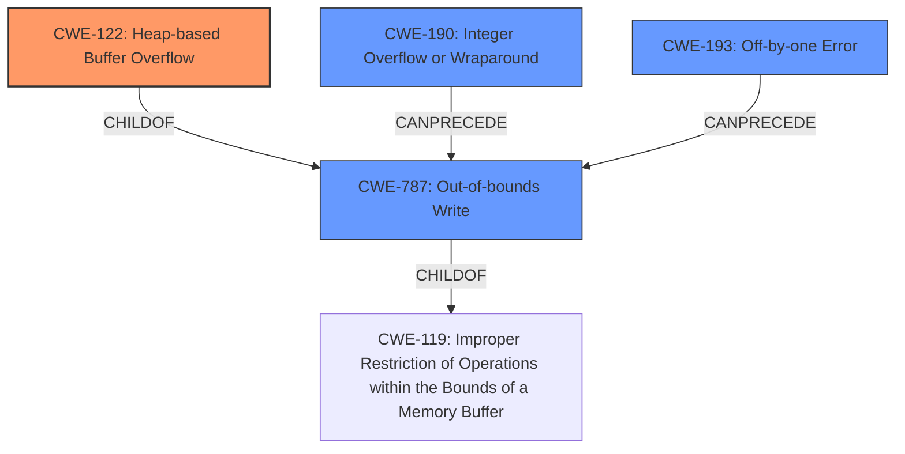

# Final Resolution for CVE-2021-38013

# Summary
| CWE ID  | CWE Name                     | Confidence | CWE Abstraction Level | CWE Vulnerability Mapping Label | CWE-Vulnerability Mapping Notes                                                                                                                                                           |
| :------ | :--------------------------- | :--------- | :-------------------- | :------------------------------ | :------------------------------------------------------------------------------------------------------------------------------------------------------------------------------------------- |
| CWE-122 | Heap-based Buffer Overflow   | 0.95       | Variant               | Allowed                         | Primary                                                                                                                                                                                   |
| CWE-787 | Out-of-bounds Write          | 0.20       | Base                  | Allowed                         | Alternate, less specific to CWE-122; Acknowledging this as heap buffer overflow, writing is out-of-bounds.                                                      |

## Evidence and Confidence

*   **Confidence Score:** 0.95
*   **Evidence Strength:** HIGH

## Relationship Analysis
The primary relationship is that CWE-122 is a variant of CWE-787, which is a child of CWE-119. This hierarchy guided the selection of CWE-122 as the most specific and appropriate classification. The analysis also considered potential chain relationships involving integer overflows (CWE-190) or off-by-one errors (CWE-193) potentially leading to the overflow, but these were deemed speculative based on the provided information.

## Vulnerability Chain
The vulnerability chain starts with a **ROOTCAUSE** that leads to a heap **buffer overflow** (CWE-122). The **WEAKNESS** allows a remote attacker who had compromised a WebUI renderer process to potentially perform a sandbox escape. The final impact is a sandbox escape. There is a potential missing link in the chain regarding the exact mechanism causing the overflow, which could involve integer overflows or off-by-one errors, but this cannot be confirmed with the current evidence.

## Summary of Analysis
The initial analysis correctly identified CWE-122 (Heap-based Buffer Overflow) as the primary weakness. The criticism provided valuable suggestions for improvement, including acknowledging CWE-787 (Out-of-bounds Write) and considering potential secondary CWEs like CWE-190 (Integer Overflow or Wraparound) and CWE-193 (Off-by-one Error).

The decision to classify this as CWE-122 is primarily based on the explicit mention of "heap **buffer overflow**" in the vulnerability description. The relationship analysis confirms that CWE-122 is a more specific variant of CWE-787, making it the optimal choice. The provided evidence is strong, resulting in a high confidence score of 0.95.

The selection of CWE-122 is at the optimal level of specificity because it identifies the specific type of **buffer overflow** occurring on the heap. While other CWEs could potentially contribute, they are not directly supported by the available evidence. The final justification acknowledges CWE-787 as a valid but less specific alternative.