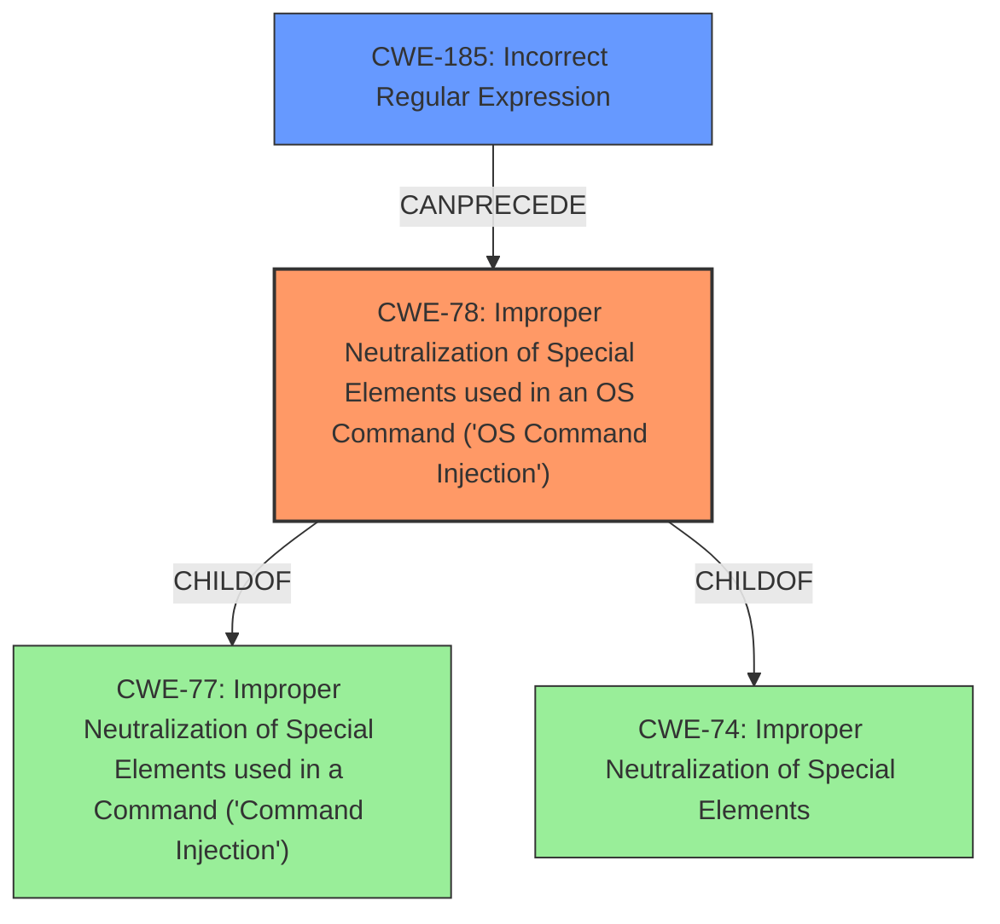

# Analysis Report for CVE-2021-38173

# Vulnerability Analysis Report: CVE-2021-38173

## Description

Btrbk before 0.31.2 allows command execution because of the mishandling of remote hosts filtering SSH commands using ssh_filter_btrbk.sh in authorized_keys.

## Vulnerability Description Key Phrases

**Rootcause:** mishandling of remote hosts filtering SSH commands
**Impact:** command execution
**Product:** Btrbk
**Version:** before 0.31.2
**Component:** ssh_filter_btrbk.sh in authorized_keys

## Analysis (with Relationship Data)

# Summary
| CWE ID | CWE Name | Confidence | CWE Abstraction Level | CWE Vulnerability Mapping Label | CWE-Vulnerability Mapping Notes |
|---|---|---|---|---|---|
| CWE-78 | Improper Neutralization of Special Elements used in an OS Command ('OS Command Injection') | 0.95 | Base | Allowed | Primary CWE |
| CWE-116 | Improper Encoding or Escaping of Data | 0.75 | Class | Allowed-with-Review | Secondary Candidate |

## Evidence and Confidence

*   **Confidence Score:** 0.85
*   **Evidence Strength:** HIGH

- **Analysis and Justification:**
  - *Explanation:* The vulnerability description clearly states that the **mishandling of remote hosts filtering SSH commands** leads to command execution. The CVE Reference Links Content Summary confirms that the `ssh_filter_btrbk.sh` script has a flawed regular expression for filtering commands, which allows attackers to bypass restrictions and execute arbitrary commands. This directly aligns with CWE-78 [Improper Neutralization of Special Elements used in an OS Command ('OS Command Injection')], a base-level CWE, because the root cause is the improper neutralization of special elements within an OS command. CWE-78 is preferred over its parent CWE-77 [Improper Neutralization of Special Elements used in a Command ('Command Injection')] because the vulnerability involves OS commands specifically. The Retriever Results also list CWE-78 with the highest score, further supporting this choice.

  - *Relationship Analysis:* CWE-78 is a child of CWE-77 and is related to CWE-74 [Improper Neutralization of Special Elements]. The vulnerability description emphasizes that the **mishandling of remote hosts filtering SSH commands** is the core issue and leads to OS command execution. The Retriever Results also list CWE-88 [Improper Neutralization of Argument Delimiters in a Command ('Argument Injection')] as a candidate, which can be related.

- **Confidence Score:**
  - Confidence: 0.95 (High confidence due to explicit mention of command execution and the specific details of the vulnerability)

---

- **Analysis and Justification:**
  - *Explanation:* The vulnerability's root cause involves the **mishandling of remote hosts filtering SSH commands**, specifically the flawed regular expression in `ssh_filter_btrbk.sh`. While CWE-78 focuses on the command injection aspect, CWE-116 [Improper Encoding or Escaping of Data] addresses the broader issue of improper data handling that allows the intended structure of the message (the command) to be compromised. The `ssh_filter_btrbk.sh` script fails to properly encode or escape the data being passed via SSH, leading to the command injection vulnerability. This is a class-level CWE, and while a more specific base-level CWE would be ideal, CWE-116 provides a useful secondary characterization of the vulnerability.

  - *Relationship Analysis:* CWE-116 is a class-level CWE, and it can be related to several other CWEs depending on the specific encoding or escaping issue. In this case, it contributes to the command injection vulnerability (CWE-78) by failing to properly sanitize the input. It can be considered a prerequisite weakness that allows the command injection to occur.

- **Confidence Score:**
  - Confidence: 0.75 (Medium confidence because while relevant, CWE-116 is a class-level CWE and doesn't directly address the command injection as precisely as CWE-78. It serves as a supporting weakness.)

---

## Criticism of Analysis

Okay, I've reviewed the provided analysis against the full CWE specifications. Here's my critique, focusing on the accuracy, completeness, and justification of the CWE mappings:

**Overall Assessment:**

The analysis is generally good and arrives at a reasonable primary CWE (CWE-78).  The justification is well-articulated and demonstrates a good understanding of the vulnerability and the relevant CWE definitions. The secondary CWE (CWE-116) is less strongly justified, and I will elaborate on that below.

**Detailed Critique:**

**1. CWE-78: Improper Neutralization of Special Elements used in an OS Command ('OS Command Injection')**

*   **Confidence:** High (0.95) - Justified and Appropriate.
*   **Abstraction Level:** Base - Correct and Preferred.
*   **Strengths:**
    *   The explanation correctly identifies the core issue: the failure to properly neutralize special elements within an OS command.
    *   It aligns with the vulnerability description's emphasis on the "mishandling of remote hosts filtering SSH commands" leading to command execution.
    *   It correctly distinguishes CWE-78 from its parent, CWE-77, by emphasizing the OS command context.
    *   The relationship analysis highlights the connection with CWE-77 and CWE-74, but appropriately narrows the focus to the OS command aspect.
    *   Using a Base level CWE is appropriate.
    *   The analysis correctly highlights that the flawed regular expression is the mechanism by which the neutralization fails.
*   **Areas for Potential Improvement:**
    *   Could briefly mention how the `ssh_filter_btrbk.sh` script *intended* to neutralize special elements, but failed due to the flawed regex. This emphasizes the *improper* aspect of the neutralization.
    *   Consider mentioning that the fix involved *correcting* the regular expression. This helps tie the weakness directly to the mitigation.

**2. CWE-116: Improper Encoding or Escaping of Data**

*   **Confidence:** Medium (0.75) - Weaker Justification
*   **Abstraction Level:** Class - Less Ideal.
*   **Strengths:**
    *   Recognizes that improper data handling contributes to the vulnerability.
    *   Acknowledge that CWE-116 is a class-level CWE, which is less precise than a base-level CWE.
*   **Weaknesses:**
    *   The justification for CWE-116 is weaker than that for CWE-78.  While it's true that the script *failed* to properly encode/escape, the *primary* failure is the incorrect *validation/filtering* of the command itself.  Encoding/Escaping would be a mitigation technique to prevent injection, but is not the root cause here.
    *   It argues that the script fails to properly "encode or escape the data being passed via SSH". However, the script's primary purpose was to *validate* (filter) the command, not necessarily to encode or escape it.
*   **Alternative/Supplemental CWE Candidates:**

    *   **CWE-185: Incorrect Regular Expression:** Since the core issue is the flawed regular expression used for filtering. This CWE is in the Retriever Results (with `Allowed-with-Review`) and it focuses on the error in the regex.  It may be chained with CWE-78, where the regex failure *leads* to the OS command injection.
    *   **CWE-791: Incomplete Filtering of Special Elements:**  This CWE is also listed in the Retriever Results. This one is much more direct, since the problem *is* that the regex *did not completely filter* special elements.
    *   **CWE-790: Improper Filtering of Special Elements:**  Since the regular expression is *improper*, and the goal was filtering, this is another candidate here.
    *   **CWE-88: Improper Neutralization of Argument Delimiters in a Command ('Argument Injection')**: As noted, the "CanAlsoBe" relationship to CWE-78 makes this another worthwhile candidate.
    *   **CWE-20: Improper Input Validation**: This could be a contributing weakness, but is so general as to not be very helpful.

**Recommendations:**

1.  **Strengthen the Description of CWE-78:** Emphasize the failure in `ssh_filter_btrbk.sh` to *properly validate* rather than just *mishandle* the command. Add that the fix is to *correct* the regex.

2.  **Reconsider the Secondary CWE:** I recommend replacing CWE-116 with **CWE-185: Incorrect Regular Expression**, since the core problem is the incorrect regex that was intended to filter dangerous commands.  Alternatively, **CWE-791** or **CWE-790** are also worthwhile candidates since those CWEs are for *Incomplete Filtering*. Add a note about the chaining relationship (regex failure *leads* to OS command injection).

3. **Remove CWE-116:** If you decide to keep CWE-78 and the *other* secondary CWE, remove CWE-116 from the list.

By making these changes, the analysis will be more accurate, complete, and better aligned with the CWE specifications, especially the mapping guidance.

## Final Resolution

# Summary
| CWE ID | CWE Name | Confidence | CWE Abstraction Level | CWE Vulnerability Mapping Label | CWE-Vulnerability Mapping Notes |
|---|---|---|---|---|---|
| CWE-78 | Improper Neutralization of Special Elements used in an OS Command ('OS Command Injection') | 0.95 | Base | Allowed | Primary CWE |
| CWE-185 | Incorrect Regular Expression | 0.85 | Class | Allowed-with-Review | Secondary Candidate |

## Evidence and Confidence

*   **Confidence Score:** 0.90
*   **Evidence Strength:** HIGH

## Relationship Analysis
The primary relationship is that **CWE-185** (Incorrect Regular Expression) **CANPRECEDE** **CWE-78** (Improper Neutralization of Special Elements used in an OS Command). The flawed regex (CWE-185) allowed the attacker to bypass the intended filtering, leading directly to the OS command injection (CWE-78). While other options like CWE-791 (Incomplete Filtering) were considered, CWE-185 more accurately reflects the specific mechanism of failure: an error in the regular expression itself.

## Vulnerability Chain
The vulnerability chain starts with a flawed regular expression (**CWE-185**). This flawed regex is intended to filter out malicious commands, but due to the error, it fails to properly neutralize special elements. This failure leads directly to **CWE-78**, where an attacker can inject arbitrary OS commands. The chain is clear: Incorrect Regex -> Failed Neutralization -> OS Command Injection -> Arbitrary Command Execution.

## Summary of Analysis
I agree with the initial analysis that **CWE-78** is the primary **ROOTCAUSE**. The vulnerability description clearly states the **mishandling of remote hosts filtering SSH commands** leads to command execution. The CVE Reference Links Content Summary confirms that the `ssh_filter_btrbk.sh` script has a flawed regular expression for filtering commands, which allows attackers to bypass restrictions and execute arbitrary commands. This is direct evidence. As the initial analysis states, "This directly aligns with CWE-78 [Improper Neutralization of Special Elements used in an OS Command ('OS Command Injection')], a base-level CWE, because the root cause is the improper neutralization of special elements within an OS command."

However, I agree with the criticism that the initial secondary CWE, **CWE-116**, is a weaker justification. The focus should be on the *incorrect regex* rather than a general encoding/escaping issue. Therefore, I am replacing **CWE-116** with **CWE-185**, Incorrect Regular Expression. The **ROOTCAUSE** involves the **mishandling of remote hosts filtering SSH commands**, specifically the flawed regular expression in `ssh_filter_btrbk.sh`. The core problem is the incorrect regex that was intended to filter dangerous commands. This is at the optimal level of specificity.

*Report generated on 2025-03-17 01:41:54*
