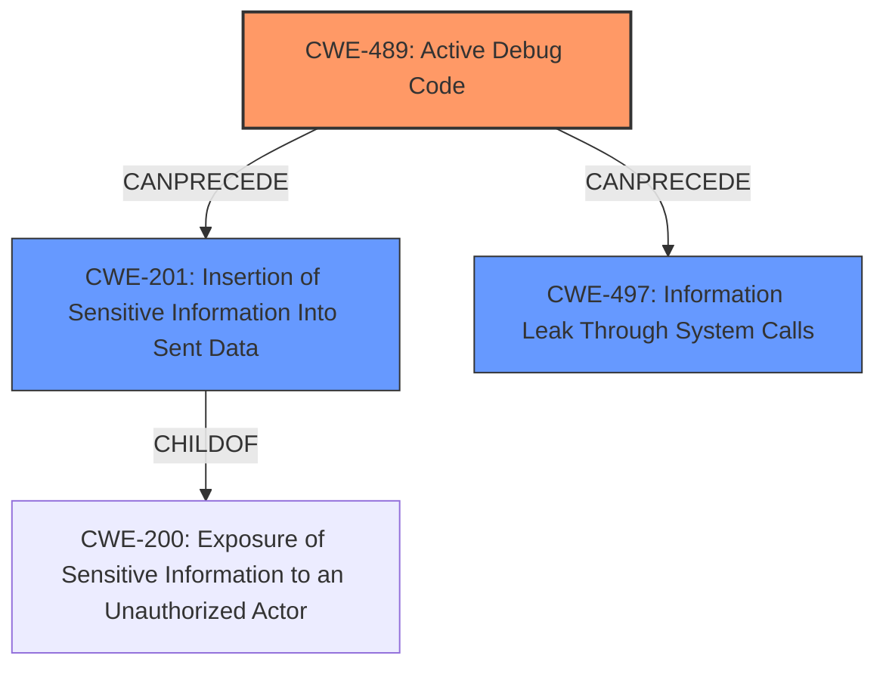

# Final Resolution for CVE-2021-38179

# Summary 
| CWE ID | CWE Name | Confidence | CWE Abstraction Level | CWE Vulnerability Mapping Label | CWE-Vulnerability Mapping Notes |
|---|---|---|---|---|---|
| CWE-489 | Active Debug Code | 0.9 | Base | Allowed | Primary CWE |
| CWE-497 | Information Leak Through System Calls | 0.6 | Base | Allowed | Secondary Candidate |
| CWE-201 | Insertion of Sensitive Information Into Sent Data | 0.5 | Base | Allowed | Secondary Candidate |

## Evidence and Confidence

*   **Confidence Score:** 0.8
*   **Evidence Strength:** MEDIUM

## Relationship Analysis
The decision was impacted by:
  - Parent-child hierarchical relationships: CWE-489 is the direct cause. CWE-497 and CWE-201 are potential consequences, with CWE-201 being a child of CWE-200, which represents information exposure.
  - Chain relationships showing progression of vulnerability: The chain starts with enabling debug code (CWE-489), which leads to the potential exposure of sensitive information being sent (CWE-201), possibly leaking system-level information (CWE-497).
  - Peer relationships that offered alternative classifications: CWE-201 was considered as a peer due to its focus on sensitive data exposure.
  - How abstraction levels influenced your selection: CWE-489 (Base) was selected as the primary because it directly represents the root cause. CWE-497 and CWE-201 (both Base) were considered as secondary due to their representation of potential consequences.

## Vulnerability Chain
The vulnerability chain starts with the **ROOTCAUSE** which is "**Debug function enabled by default**" (CWE-489). This allows an Admin User to see captured packet contents, potentially including user credentials. This leads to the exposure of sensitive information being sent (CWE-201), as the packet contents may contain credentials or other private data. Additionally, system-level information could be leaked (CWE-497) through the debugging functionality. The final impact is the unauthorized exposure of sensitive information.

## Summary of Analysis
The initial analysis and criticism were both well-reasoned. The initial analysis correctly identified CWE-489 as the primary weakness and provided a solid justification. The criticism offered valuable suggestions, particularly the exploration of CWE-200 and its descendants.

The final decision is based on the provided evidence, relationship analysis, and mapping guidance. The vulnerability description clearly states that the debugging function being enabled by default exposes user credentials. This directly aligns with CWE-489's description: "The product is deployed to unauthorized actors with debugging code still enabled or active, which can create unintended entry points or **expose sensitive information**."

The graph relationships influenced the selection by highlighting the potential consequences of CWE-489. While CWE-489 is the **rootcause**, the exposure of sensitive information is a direct impact. Therefore, CWE-201 (Insertion of Sensitive Information Into Sent Data) is added as a secondary candidate.

The selected CWEs are at the optimal level of specificity. CWE-489 is a Base CWE that directly represents the **rootcause**. CWE-201 and CWE-497 are also Base CWEs that capture the potential consequences of the vulnerability.

The addition of CWE-201 better reflects the vulnerability's impact, which is the exposure of sensitive information within the captured packets.