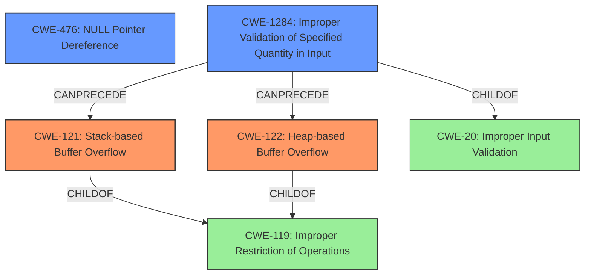

# Final Resolution for CVE-2021-3826

# Summary

| CWE ID | CWE Name | Confidence | CWE Abstraction Level | CWE Vulnerability Mapping Label | CWE-Vulnerability Mapping Notes |
|---|---|---|---|---|---|
| CWE-121 | Stack-based Buffer Overflow | 0.85 | Variant | Allowed | Primary CWE |
| CWE-122 | Heap-based Buffer Overflow | 0.85 | Variant | Allowed | Primary CWE |
| CWE-476 | NULL Pointer Dereference | 0.70 | Base | Allowed | Secondary Candidate CWE |
| CWE-1284 | Improper Validation of Specified Quantity in Input | 0.60 | Base | Allowed | Contributing factor to buffer overflow |

## Evidence and Confidence

*   **Confidence Score:** 0.82
*   **Evidence Strength:** HIGH

## Relationship Analysis
The primary relationship is the buffer overflow, which can occur on the stack (CWE-121) or heap (CWE-122). These are both variants of the more general **CWE-119 (Improper Restriction of Operations within the Bounds of a Memory Buffer)**. The **CWE-476 (NULL Pointer Dereference)** contributes to the crash resulting from the buffer overflow. **CWE-1284 (Improper Validation of Specified Quantity in Input)** can precede the buffer overflow by not validating the size of the mangled symbol. The abstraction levels (Variant and Base) were selected to provide appropriate specificity.

## Vulnerability Chain
The vulnerability chain starts with a crafted mangled symbol as input. **CWE-1284 (Improper Validation of Specified Quantity in Input)** occurs when the size of this input is not validated. This can then lead to either **CWE-121 (Stack-based Buffer Overflow)** or **CWE-122 (Heap-based Buffer Overflow)** when the input is processed. The **CWE-476 (NULL Pointer Dereference)** can then cause a crash, resulting in a denial of service. The root causes are the missing size validation and the potential missing null check, while the impacts are the buffer overflows and the resulting denial of service.

## Summary of Analysis
The initial analysis correctly identified **CWE-121 (Stack-based Buffer Overflow)** and **CWE-122 (Heap-based Buffer Overflow)** as primary weaknesses, as the vulnerability description explicitly states "Heap/stack buffer overflow". It also correctly identified **CWE-476 (NULL Pointer Dereference)** as a secondary weakness, based on the CVE reference summary that mentions "null pointer dereference."

The criticism suggested adding **CWE-1284 (Improper Validation of Specified Quantity in Input)**, and I agree with this assessment. The vulnerability description mentions a "crafted mangled symbol" which indicates an input that might not be validated for size. Thus, the **IMPROPER INPUT VALIDATION** (**CWE-1284**) is a good fit as a weakness that precedes the buffer overflow.

The graph relationships helped clarify the relationships between the CWEs. The parent-child relationships show that **CWE-121 (Stack-based Buffer Overflow)** and **CWE-122 (Heap-based Buffer Overflow)** are specific types of **CWE-119 (Improper Restriction of Operations)**. The chain relationship highlights how **CWE-1284 (Improper Validation of Specified Quantity in Input)** can precede the buffer overflows.

The selected CWEs are at the optimal level of specificity. While **CWE-119 (Improper Restriction of Operations)** could be used, the explicit mention of both heap and stack overflows justifies using the more specific variants.