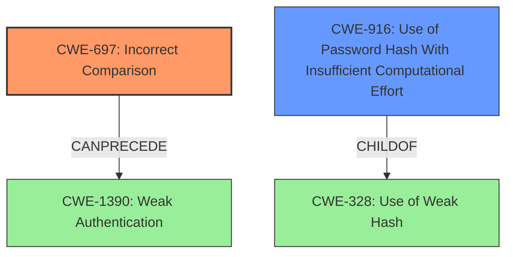

# Final Resolution for CVE-2021-3833

# Summary
| CWE ID | CWE Name | Confidence | CWE Abstraction Level | CWE Vulnerability Mapping Label | CWE-Vulnerability Mapping Notes |
|---|---|---|---|---|---|
| CWE-697 | Incorrect Comparison | 0.95 | Pillar | Primary | Discouraged |
| CWE-916 | Use of Password Hash With Insufficient Computational Effort | 0.8 | Base | Secondary | Allowed |

## Evidence and Confidence

*   **Confidence Score:** 0.9
*   **Evidence Strength:** HIGH

## Relationship Analysis
The primary **WEAKNESS** is **CWE-697 (Incorrect Comparison)**, which is a Pillar. Although it's a high-level category, it accurately describes the fundamental flaw in the code. **CWE-916 (Use of Password Hash With Insufficient Computational Effort)** is a child of **CWE-328 (Use of Weak Hash)**, and both relate to cryptographic issues. While MD5's weaknesses contribute to the vulnerability, the incorrect comparison is the direct cause. A potential vulnerability chain starts with **CWE-697** and can lead to authentication bypass.

## Vulnerability Chain
The vulnerability chain starts with the **ROOTCAUSE** which is **CWE-697 (Incorrect Comparison)**. Because the comparison is incorrect, an attacker can bypass authentication. The use of MD5 hashing, represented by **CWE-916 (Use of Password Hash With Insufficient Computational Effort)**, weakens the system further, making exploitation easier. The **ROOTCAUSE** **CWE-697** leads directly to an authentication bypass, potentially resulting in unauthorized access and further compromise of the system.

## Summary of Analysis
The initial analysis correctly identified **CWE-697 (Incorrect Comparison)** as the primary **WEAKNESS**. The criticism highlighted the importance of strengthening the justification and considering the impact of MD5. The final determination focuses on **CWE-697** because the vulnerability description explicitly states the use of a loose comparator. While **CWE-916 (Use of Password Hash With Insufficient Computational Effort)** contributes, the **incorrect comparison** is the more direct **ROOTCAUSE**. The graph relationships reinforce this by showing how **CWE-697** can directly lead to an authentication bypass. The selected CWEs represent the optimal level of specificity, given the provided evidence. **CWE-697** is a Pillar, but no more specific **WEAKNESS** is evident from the description alone.