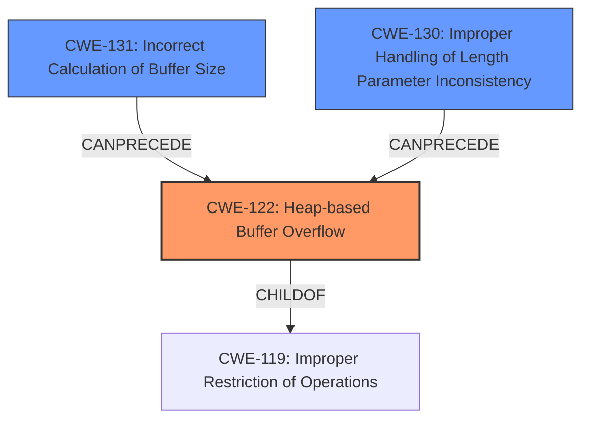

# Analysis Report for CVE-2021-3835

# Vulnerability Analysis Report: CVE-2021-3835

## Description

Buffer overflow in usb device class. Zephyr versions >= v2.6.0 contain Heap-based Buffer Overflow (CWE-122). For more information, see https//github.com/zephyrproject-rtos/zephyr/security/advisories/GHSA-fm6v-8625-99jf

## Vulnerability Description Key Phrases

**Weakness:** Heap-based Buffer Overflow (CWE-122)
**Product:** Zephyr
**Version:** versions >= v2.6.0
**Component:** usb device class

## Analysis (with Relationship Data)

# Summary
| CWE ID | CWE Name | Confidence | CWE Abstraction Level | CWE Vulnerability Mapping Label | CWE-Vulnerability Mapping Notes |
|---|---|---|---|---|---|
| CWE-122 | Heap-based Buffer Overflow | 1.0 | Variant | Primary | Allowed |
| CWE-131 | Incorrect Calculation of Buffer Size | 0.75 | Base | Secondary Candidate | Allowed |

## Evidence and Confidence

*   **Confidence Score:** 0.9
*   **Evidence Strength:** HIGH

- **Analysis and Justification:**  
  - *Explanation:* The vulnerability description explicitly states "**Heap-based Buffer Overflow (CWE-122)**" and the "CVE Reference Links Content Summary" section confirms this by detailing how the `memcpy` function in `net_buf_simple_add_mem` copies data into the buffer without proper bounds checking, leading to an out-of-bounds write in the heap. The detailed description of memory corruption due to exceeding allocated buffer size precisely matches CWE-122. The MITRE mapping guidance for CWE-122 states that it is ALLOWED. Also, the Retriever results listed CWE-122, albeit with a lower score compared to other CWEs; however, given the explicit mention and description, CWE-122 is the most accurate primary mapping.
  
  - *Relationship Analysis:* CWE-122 is a variant of CWE-119 (Improper Restriction of Operations within the Bounds of a Memory Buffer). While CWE-119 is a broader class, CWE-122 is a more specific variant, making it the preferred choice given the heap allocation detail.

- **Confidence Score:**  
  - Confidence: 1.0 (Explicitly mentioned and technically described in detail).

---

- **Analysis and Justification:**  
  - *Explanation:* The "CVE Reference Links Content Summary" section mentions that the code does not properly check if the provided data exceeds the allocated buffer size before copying it. This **incorrect calculation of buffer size** can lead to a buffer overflow, which is precisely what CWE-131 (Incorrect Calculation of Buffer Size) describes. The lack of proper size calculation is a contributing factor to the heap-based buffer overflow. The MITRE mapping guidance for CWE-131 states that it is ALLOWED. Although CWE-122 is the primary weakness, CWE-131 highlights the root cause of the size miscalculation.
  
  - *Relationship Analysis:* CWE-131 can precede CWE-122, as an incorrect calculation of the buffer size is a common cause of buffer overflows.

- **Confidence Score:**  
  - Confidence: 0.75 (The description supports a size miscalculation as a contributing factor).

## Criticism of Analysis

Okay, here's a review of the CWE analysis, incorporating the full CWE specifications you provided:

**Overall Assessment**

The analysis correctly identifies CWE-122 (Heap-based Buffer Overflow) as the primary weakness. The justification is solid, and the confidence score is appropriately high. The inclusion of CWE-131 (Incorrect Calculation of Buffer Size) as a secondary contributing factor is also reasonable and well-explained. However, some of the retriever results could be further elaborated on, as some of them point to root causes of the vulnerability as well.

**Detailed Review**

*   **CWE-122: Heap-based Buffer Overflow**

    *   **Confidence:** 1.0 - Justified. The vulnerability description directly mentions CWE-122, and the analysis provides ample evidence from the CVE Reference Links to support this classification. The summary clearly states that there is an out-of-bounds write to the heap, which aligns perfectly with CWE-122.
    *   **Abstraction Level:** Variant - Correct. CWE-122 is a Variant of the more general CWE-119, and it accurately describes the specific type of buffer overflow (heap-based).
    *   **Mapping Guidance:** The analysis correctly recognizes that the mapping guidance allows for the use of CWE-122.
    *   **CWE Examples:** Good set of examples, shows the variety of ways a heap overflow can occur
    *   **Potential Mitigations:** The analysis doesn't explicitly discuss mitigations, but they are available in the specification. Mitigations of use in this specific vulnerability would be the use of a language or compiler with automatic bounds checking. If this is not possible, then using automatic buffer overflow detection mechanisms provided by certain compilers or compiler extensions is also an option.

*   **CWE-131: Incorrect Calculation of Buffer Size**

    *   **Confidence:** 0.75 - Justified. The analysis accurately identifies the lack of proper bounds checking and the incorrect incrementing of the buffer length as contributing factors. This directly relates to an incorrect calculation of the buffer size needed.
    *   **Abstraction Level:** Base - Correct. CWE-131 represents a fundamental error in calculating the required buffer size.
    *   **Mapping Guidance:** The analysis acknowledges the mapping guidance and its allowance.
    *   **Potential Mitigations:** The analysis doesn't explicitly discuss mitigations, but they are available in the specification. The mitigations section of CWE-131 is particularly useful for this case. Using input validation on the size of the data to copy is a good potential mitigation. Furthermore, understanding the programming language's underlying representation of data would have assisted in identifying this vulnerability.

*   **Retriever Results**

    *   The retriever results show a variety of CWEs that could be related to the vulnerability. It is important to understand why these CWEs were identified, and whether they are related to the vulnerability.
    *   **CWE-130: Improper Handling of Length Parameter Inconsistency** - This is another possible candidate for a secondary weakness, as it relates to the code's failure to adequately handle the length of the input data and compare it to the buffer size. While CWE-131 focuses on the initial calculation, CWE-130 emphasizes the runtime handling of length discrepancies.
    *   **CWE-190: Integer Overflow or Wraparound** - If the calculation of the buffer size or the amount of data to be copied involves integer arithmetic, there's a risk of integer overflow. If an overflow occurs, it could lead to the allocation of a smaller-than-expected buffer, or a seemingly valid size check that bypasses the overflow. This is a valid, but more indirect concern.

**Recommendations for Improvement**

1.  **Expand on Retriever Results:** Briefly explain why the top results from the Retriever were considered and ultimately not chosen as primary or secondary CWEs. This will demonstrate a thorough analysis process.
2.  **Elaborate Potential Mitigations:** The "Potential Mitigations" sections for each CWE are very brief, or non-existent. These sections should be expanded to be more comprehensive in describing the specific ways the weakness can be addressed.
3.  **Consider CWE-130 as a Secondary Weakness:** In addition to CWE-131, the analysis could benefit from including CWE-130 (Improper Handling of Length Parameter Inconsistency) as a second secondary weakness. The lack of runtime checks against the available buffer space highlights this.

**Revised Summary Table (incorporating recommendations)**

| CWE ID | CWE Name | Confidence | CWE Abstraction Level | CWE Vulnerability Mapping Label | CWE-Vulnerability Mapping Notes |
|---|---|---|---|---|---|
| CWE-122 | Heap-based Buffer Overflow | 1.0 | Variant | Primary | Allowed |
| CWE-131 | Incorrect Calculation of Buffer Size | 0.75 | Base | Secondary Candidate | Allowed |
| CWE-130 | Improper Handling of Length Parameter Inconsistency | 0.5 | Base | Tertiary Candidate | Allowed |

**Conclusion**

The analysis is generally well-done and accurately identifies the primary CWE. The suggestions above aim to further refine the analysis by adding more context to the retriever results and elaborating on potential mitigations. By adding more information about the retriever results, and including CWE-130, the analysis would more fully cover the weaknesses of the code.

## Final Resolution

# Summary
| CWE ID | CWE Name | Confidence | CWE Abstraction Level | CWE Vulnerability Mapping Label | CWE-Vulnerability Mapping Notes |
|---|---|---|---|---|---|
| CWE-122 | Heap-based Buffer Overflow | 1.0 | Variant | Primary | Allowed |
| CWE-131 | Incorrect Calculation of Buffer Size | 0.75 | Base | Secondary Candidate | Allowed |
| CWE-130 | Improper Handling of Length Parameter Inconsistency | 0.5 | Base | Tertiary Candidate | Allowed |

## Evidence and Confidence

*   **Confidence Score:** 0.95
*   **Evidence Strength:** HIGH

## Relationship Analysis
The primary weakness is **CWE-122 (Heap-based Buffer Overflow)**, a variant of **CWE-119 (Improper Restriction of Operations within the Bounds of a Memory Buffer)**. **CWE-131 (Incorrect Calculation of Buffer Size)** and **CWE-130 (Improper Handling of Length Parameter Inconsistency)** can both precede **CWE-122**, contributing to the overflow. **CWE-131** describes the initial miscalculation, while **CWE-130** addresses the runtime failure to handle length discrepancies.

## Vulnerability Chain
The vulnerability chain starts with an **incorrect calculation of buffer size (CWE-131)**, or an **improper handling of length parameter inconsistency (CWE-130)**. This leads to a **heap-based buffer overflow (CWE-122)** when data is copied into the buffer without adequate bounds checking. The consequence is memory corruption, potentially leading to arbitrary code execution.

## Summary of Analysis
The initial analysis correctly identifies **CWE-122 (Heap-based Buffer Overflow)** as the primary weakness, supported by the explicit mention in the vulnerability description: "Zephyr versions >= v2.6.0 contain Heap-based Buffer Overflow (**CWE-122**)." The analysis also correctly identifies **CWE-131 (Incorrect Calculation of Buffer Size)** as a contributing factor. The criticism suggests expanding on the retriever results and including **CWE-130 (Improper Handling of Length Parameter Inconsistency)**, which I agree with. The final determination includes **CWE-122** as the primary **WEAKNESS**, with **CWE-131** and **CWE-130** as secondary **WEAKNESSES**. These CWEs are at the optimal level of specificity, providing a clear picture of the **ROOTCAUSE** and its consequences. The selection is based on the vulnerability description, relationship analysis, and mapping guidance. The high confidence is due to the explicit mention of **CWE-122** and the clear evidence supporting **CWE-131** and **CWE-130** as contributing factors.

*Report generated on 2025-03-18 00:54:25*
