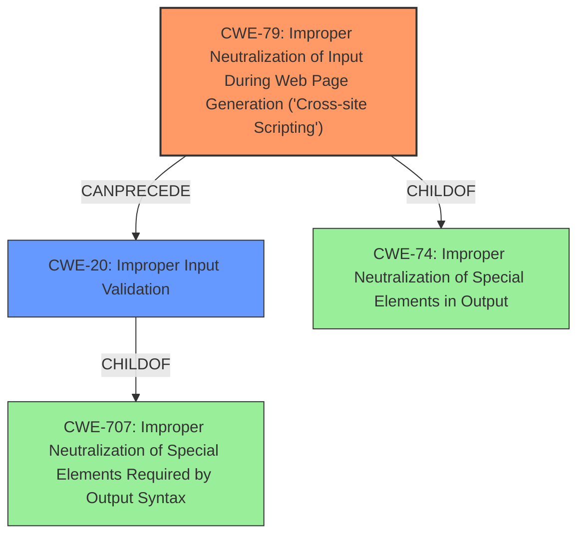

# Final Resolution for CVE-2021-38377

# Summary
| CWE ID | CWE Name | Confidence | CWE Abstraction Level | CWE Vulnerability Mapping Label | CWE-Vulnerability Mapping Notes |
|---|---|---|---|---|---|
| CWE-79 | Improper Neutralization of Input During Web Page Generation ('Cross-site Scripting') | 1.0 | Base | Allowed | Primary CWE. The vulnerability involves the injection of JavaScript code into a web page, which is a clear instance of XSS. |
| CWE-20 | Improper Input Validation | 0.7 | Class | Discouraged | Secondary candidate. The description mentions the lack of sanitization of HTML transformation results, which might be more accurately described as lacking input validation before these results are used to generate web page content. |
  
## Evidence and Confidence

*   **Confidence Score:** 0.9
*   **Evidence Strength:** HIGH

## Relationship Analysis
The primary weakness is CWE-79, a Base level CWE that directly addresses the **cross-site scripting** issue. The secondary weakness is CWE-20, which covers the lack of input validation. CWE-79 is a child of CWE-74 (Improper Neutralization of Special Elements in Output), and CWE-20 is a child of CWE-707 (Improper Neutralization of Special Elements Required by Output Syntax).

## Vulnerability Chain
The vulnerability chain starts with the **lack of input validation** (CWE-20) of HTML transformation results. This leads to **improper neutralization** (CWE-79) when the unsanitized data is used to generate web page content, resulting in **cross-site scripting**.

## Summary of Analysis
The initial analysis correctly identified CWE-79 as the primary weakness. The criticism suggested replacing CWE-116 and CWE-330 with CWE-20. Based on the vulnerability description stating that the "HTML transformation results are exempt from sanitization", it's more accurate to classify the secondary weakness as CWE-20 (Improper Input Validation), rather than CWE-116 (Improper Encoding or Escaping of Output) or CWE-330 (Insufficiently Random Values). The lack of sanitization can be seen as a failure to validate the input before using it to generate the web page, which aligns well with the description of CWE-20. This assessment is primarily based on the evidence from the vulnerability description and the mapping guidance for CWE-20, which states that it covers cases where input is not validated or incorrectly validated. The graph relationships show that CWE-20 can precede CWE-79, indicating that the input validation issue can lead to the **cross-site scripting** vulnerability.
CWE-79 is at the optimal level of specificity as it directly describes the **XSS** vulnerability, and CWE-20 is also at a reasonable level of specificity to describe the **lack of input validation**.