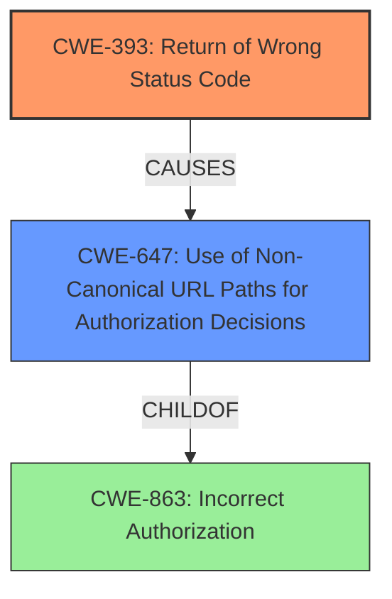

# Final Resolution for CVE-2021-38384

# Summary
| CWE ID | CWE Name | Confidence | CWE Abstraction Level | CWE Vulnerability Mapping Label | CWE-Vulnerability Mapping Notes |
|---|---|---|---|---|---|
| CWE-393 | Return of Wrong Status Code | 0.90 | Base | Primary CWE | The primary weakness is the incorrect return of a 403 status code when a 200 is expected. |
| CWE-647 | Use of Non-Canonical URL Paths for Authorization Decisions | 0.75 | Variant | Secondary Candidate | The incorrect return code can cause misconfiguration of security, and is related to non-canonical URL paths because it relates to trailing /. |

## Evidence and Confidence

*   **Confidence Score:** 0.85
*   **Evidence Strength:** HIGH

## Relationship Analysis
The primary relationship is the child-of relationship between CWE-647 and CWE-863 (which was the original secondary candidate). CWE-647 is a variant of CWE-863, making it a more specific fit. CWE-393 stands alone as the **ROOTCAUSE**, directly causing the misinterpretation. The abstraction levels were carefully considered, with CWE-393 being a Base and CWE-647 being a Variant, both preferred levels.

## Vulnerability Chain
The vulnerability chain starts with the **ROOTCAUSE**, CWE-393 (Return of Wrong Status Code). This leads to the misinterpretation of the system's state, potentially causing developers to implement **INCORRECT ACCESS CONTROL** policies based on the erroneous 403 status code. A more specific case of this misconfiguration is represented by CWE-647, where the non-canonical URL path (trailing slash) is mishandled, contributing to the authorization issue.

## Summary of Analysis
The initial analysis identified CWE-393 as the primary issue, which is validated by its direct relevance to the vulnerability description: "Serverless Offline 8.0.0 returns a 403 HTTP status code for a route that has a trailing / character, which might cause a developer to implement **incorrect access control**, because the actual behavior within the Amazon AWS environment is a 200 HTTP status code". The criticism suggested replacing CWE-863 with CWE-647, a more specific variant related to non-canonical URL paths (trailing slash).

The graph relationships reinforce this decision, demonstrating how CWE-647 is a child of CWE-863 and therefore a more precise classification. The final selection reflects the optimal level of specificity, with CWE-393 capturing the **ROOTCAUSE** and CWE-647 highlighting the specific misconfiguration stemming from the incorrect status code. The evidence strength is now considered high due to the specific alignment of CWE-647 with the trailing slash vulnerability.