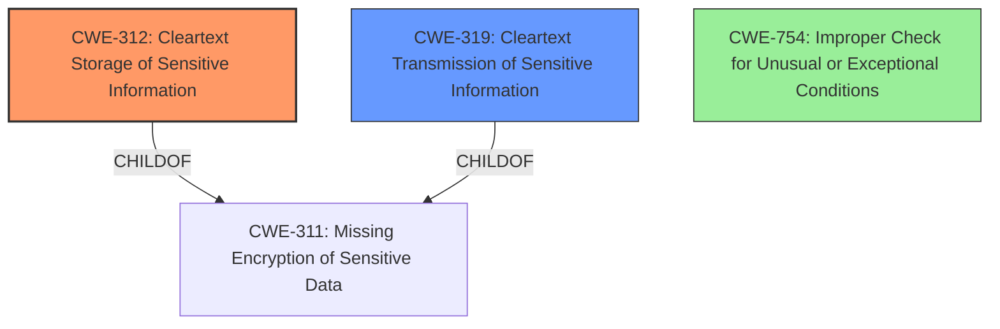

# Final Resolution for CVE-2021-38599

# Summary
| CWE ID | CWE Name | Confidence | CWE Abstraction Level | CWE Vulnerability Mapping Label | CWE-Vulnerability Mapping Notes |
|---|---|---|---|---|---|
| CWE-312 | Cleartext Storage of Sensitive Information | 0.9 | Base | Primary | Allowed; See CWE Specification for potential mitigations like encrypting data at rest. |
| CWE-319 | Cleartext Transmission of Sensitive Information | 0.7 | Base | Secondary | Allowed; See CWE Specification for potential mitigations like encrypting data before transmission. |
| CWE-754 | Improper Check for Unusual or Exceptional Conditions | 0.4 | Class | Supporting | Allowed-with-Review; Contributes to the root cause by failing to check for libsodium support. |

## Evidence and Confidence

*   **Confidence Score:** 0.8
*   **Evidence Strength:** HIGH

## Relationship Analysis
The primary relationship influencing the decision is the parent-child relationship between CWE-311 (Missing Encryption of Sensitive Data), and both CWE-312 and CWE-319. The analysis correctly identifies that while CWE-311 is related, it's a higher-level class, and the more specific Base-level CWEs (CWE-312 and CWE-319) are more appropriate. Additionally, CWE-754 is considered as a contributing factor, indicating a weakness in input validation, and has a ChildOf relationship to higher level classes.

## Vulnerability Chain
The vulnerability chain starts with the application's failure to check for libsodium support (CWE-754), which leads to the application storing sensitive information in **cleartext** (CWE-312) and transmitting sensitive information in **cleartext** (CWE-319). The impact is the potential exposure of sensitive data to unauthorized actors.

## Summary of Analysis
The initial analysis and the criticism both correctly identified the primary and secondary CWEs. The decision is based on the explicit mention of **cleartext** storage and transmission in the vulnerability description, making CWE-312 and CWE-319 the most appropriate choices. The graph relationships confirm that these are the most specific relevant CWEs. The inclusion of CWE-754 as a supporting CWE, as suggested in the criticism, provides a more complete picture of the vulnerability's root cause, which is the missing check for libsodium support. The selected CWEs are at the optimal level of specificity because they accurately describe the **cleartext** storage and transmission, while also acknowledging the underlying cause of the missing check. The vulnerability description clearly states "silently ignores the libsodium encryption key and uploads **cleartext** backups" which directly supports CWE-312 and CWE-319.