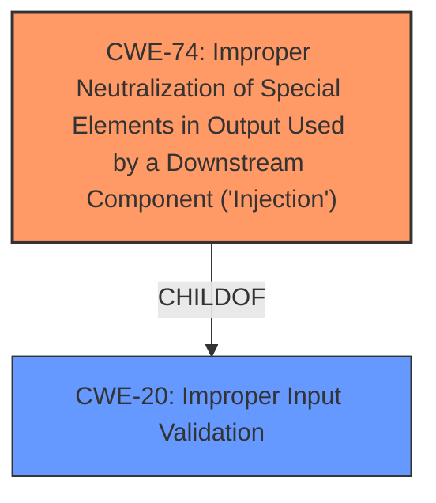

# Analysis Report for CVE-2021-38646

# Vulnerability Analysis Report: CVE-2021-38646

## Description

Microsoft Office Access Connectivity Engine Remote Code Execution Vulnerability

## Vulnerability Description Key Phrases

**Rootcause:** improper input validation
**Impact:** remote code execution
**Product:** Microsoft Office Access Connectivity Engine

## Analysis (with Relationship Data)

# Summary
| CWE ID | CWE Name | Confidence | CWE Abstraction Level | CWE Vulnerability Mapping Label | CWE-Vulnerability Mapping Notes |
|---|---|---|---|---|---|
| CWE-20 | Improper Input Validation | 0.75 | Class | Primary | Allowed-with-Review |

## Evidence and Confidence

*   **Confidence Score:** 0.75
*   **Evidence Strength:** MEDIUM

- **Analysis and Justification:**  
  - *Explanation:* The vulnerability description explicitly states that the **rootcause** is **"improper input validation"**. CWE-20 (Improper Input Validation) is a Class-level CWE that broadly covers this weakness. While more specific CWEs may exist, the provided information doesn't give enough detail to pinpoint a more precise cause. The "Retriever Results" list CWE-20, with a medium score, further supporting this selection. Given the lack of specific details, mapping to a more specific CWE would be speculative. The MITRE mapping guidance for CWE-20 is "Discouraged" because it is a Class and might have Base-level children that would be more appropriate. However, in this case, given the general description of the vulnerability, it is appropriate.
  
  - *Relationship Analysis:* CWE-20 is a class-level CWE, and has many child CWEs representing more specific types of input validation issues. Given more information a child CWE could be selected.

- **Confidence Score:**  
  - *Example:* Confidence: 0.75 (Medium evidence because the description specifies **improper input validation** as the **rootcause**, but lacks specific details).

## Criticism of Analysis

Okay, here's a detailed review of the provided analysis based on the full CWE specifications.

**Overall Assessment**

The analysis correctly identifies CWE-20 (Improper Input Validation) as a potential root cause. However, it's important to acknowledge that CWE-20 is a broad, high-level category. The analysis itself recognizes this, admitting that a more specific CWE might be preferable if more information were available.  The "Allowed-with-Review" label is appropriate here. The confidence level of 0.75 seems reasonable, reflecting the medium strength of the evidence.

**Detailed Critique**

1.  **Primary CWE Selection: CWE-20 (Improper Input Validation)**

    *   **Strengths:**
        *   The vulnerability description explicitly points to "improper input validation" as the root cause, making CWE-20 a logical initial choice.
        *   The justification correctly acknowledges the lack of specific details, preventing a premature commitment to a more granular CWE.
        *   The discussion of Relationship Analysis correctly calls out that more information could lead to selecting a child CWE.
    *   **Weaknesses:**
        *   CWE-20 is a very broad class.  The analysis should strongly emphasize the *need* for further investigation to refine the CWE selection. It doesn't just *allow* review, it *demands* it.
        *   The mapping guidance for CWE-20 explicitly states "Discouraged" due to frequent misuse and the availability of more specific children. While the analysis justifies its selection *given* the limited information, this warning should be highlighted more prominently.
        *   While mentioned, the analysis does not explore the "suggested alternatives" of CWE-1284, CWE-1285, CWE-1286, CWE-1287, CWE-1288, CWE-1289 or CWE-116 and how those might relate if the vulnerability was further explored.
        *   The Analysis is overly focused on the lack of information. The Summary of the Vulnerability calls out remote code execution, which strongly implies that this is not just a general validation issue, but related to some injection attack.

    *   **Recommendation:** Reiterate the need for further investigation to identify a more specific CWE. Strongly consider the children of CWE-20 as likely candidates if more details emerge.

2.  **Retriever Results Analysis**

    *   **Strengths:**
        *   The analysis correctly points out that the Retriever Results list CWE-20, further supporting its selection.
    *   **Weaknesses:**
        *   The analysis doesn't sufficiently leverage the other CWEs listed in the Retriever Results to inform the *possible* nature of the vulnerability.  While *Improper Input Validation* is the cause, what is being validated?
        *   The Retriever Results are being under utilized as a guide to what to explore next.

    *   **Recommendation:**
        *   Discuss the relevance of other Retriever Results entries. For example:
            *   **CWE-1336:** "Improper Neutralization of Special Elements Used in a Template Engine". Consider whether the input validation failure might relate to a template engine used within the Microsoft Office Access Connectivity Engine. A lack of proper escaping when a template is rendered can lead to Remote Code Execution.
            *   **CWE-1285:** "Improper Validation of Specified Index, Position, or Offset in Input". Check if this is related to using an index, position, or offset from input to access a buffer or file.
            *   **CWE-787:** "Out-of-bounds Write". Out-of-bounds writes can be caused by improper input validation.
            *   **CWE-23:** "Relative Path Traversal". Check if the vulnerability could be related to path traversal sequences in filenames or paths used by the software.

3.  **CWE Examples from Database**

    *   **Strengths:**
        *   Provides relevant examples of CVEs associated with CWE-20.
    *   **Weaknesses:**
        *   The list is good, but it doesn't show enough variety to lead an analyst to further explore how the vulnerability works.
    *   **Recommendation:**
        *   Add a CVE that involves database interaction (such as SQL injection, or LDAP injection) and OS command injection (CWE-78). This will give the analyst somewhere to start looking.

4.  **Relevant CWE Specifications**

    *   **Strengths:**
        *   The inclusion of full CWE specifications is excellent and allows for a thorough review.
    *   **Weaknesses:**
        *   The selection of CWE specifications is questionable. There is a lot of information that is not relevant given the vulnerability summary.
    *   **Recommendation:**
        *   The selection of CWEs for the specification section should be tailored to the possible vulnerabilities that are suggested by the vulnerability summary and the retriever results.

5.  **Mitigation Recommendations**

    *   **Strengths:**
        *   The analysis refers to Input Validation mitigations which is appropriate for CWE-20
    *   **Weaknesses:**
        *   Since the recommendation is to explore the potential CWE children, the team should also explore the potential mitigations for those CWEs.
    *   **Recommendation**
        *   Add mitigation recommendations for the potential CWE children to the mitigations analysis.

**Revised Summary Table**

| CWE ID | CWE Name | Confidence | CWE Abstraction Level | CWE Vulnerability Mapping Label | CWE-Vulnerability Mapping Notes |
|---|---|---|---|---|---|
| CWE-20 | Improper Input Validation | 0.60 | Class | Probable | Allowed-with-Review, *but requires significant further investigation*. Consider children CWEs, especially related to injection attacks (SQL, Command, LDAP, Template), path traversal, and/or out-of-bounds writes.  |

**Additional Recommendations**

*   **Targeted Investigation:** Based on the phrases "remote code execution" and "Microsoft Office Access Connectivity Engine," suggest specific areas for investigation:
    *   **Buffer Overflows:** Since it's an engine dealing with data connections, explore if there are any parsing operations for data formats (e.g., malformed database records, lengths). Are there any reads/writes that are not properly checked for size?
    *   **SQL Injection:** Investigate whether SQL queries are being constructed using unsanitized input.
    *   **Code Injection:** Determine if there's any way an attacker can inject code, e.g., through a specially crafted database schema or connection string, or other metadata.
*   **Tooling:** If possible, use static analysis tools to identify potential input validation vulnerabilities in the Microsoft Office Access Connectivity Engine.

By following these recommendations, the analysis can be made more robust and actionable, guiding security professionals towards a more precise understanding and mitigation of the vulnerability.

## Final Resolution

# Summary
| CWE ID | CWE Name | Confidence | CWE Abstraction Level | CWE Vulnerability Mapping Label | CWE-Vulnerability Mapping Notes |
|---|---|---|---|---|---|
| CWE-74 | Improper Neutralization of Special Elements in Output Used by a Downstream Component ('Injection') | 0.70 | Class | Primary | Discouraged, but used due to the likelihood of an injection vulnerability given the "remote code execution" and need for further specificity. |
| CWE-20 | Improper Input Validation | 0.60 | Class | Secondary Candidate | Discouraged, but represents the general class of **weakness**. |

## Evidence and Confidence

*   **Confidence Score:** 0.70
*   **Evidence Strength:** MEDIUM

## Relationship Analysis
The initial analysis correctly identified **CWE-20 (Improper Input Validation)** as a potential **root cause**, but it is too general. Given the "remote code execution" portion of the vulnerability description, it is highly likely that this is some type of injection vulnerability. **CWE-74 (Improper Neutralization of Special Elements in Output Used by a Downstream Component ('Injection'))** is a Class that can represent this type of **weakness**. **CWE-74** is a child of the **CWE-20 (Improper Input Validation)**. Further investigation is needed to determine which specific injection vulnerability is present.

## Vulnerability Chain
The vulnerability chain starts with **CWE-20 (Improper Input Validation)**, where the application fails to properly validate input. Because there is remote code execution, this likely leads to **CWE-74 (Improper Neutralization of Special Elements in Output Used by a Downstream Component ('Injection'))**, where the **unvalidated input** is used to construct a command or data structure, allowing an attacker to inject malicious code and achieve remote code execution. More information is needed to determine the exact injection type (SQL, OS Command, etc.).

## Summary of Analysis
The initial analysis identified **CWE-20 (Improper Input Validation)**. The criticism correctly points out that **CWE-20** is too general and that given the "remote code execution" portion of the vulnerability description, it is highly likely that this is some type of injection vulnerability. **CWE-74 (Improper Neutralization of Special Elements in Output Used by a Downstream Component ('Injection'))** is a Class that can represent this type of **weakness**. **CWE-74** is a child of **CWE-20 (Improper Input Validation)**. Further investigation is needed to determine which specific injection vulnerability is present. This assessment is based primarily on the vulnerability description provided: "Microsoft Office Access Connectivity Engine Remote Code Execution Vulnerability". The phrase "remote code execution" strongly suggests an injection-based vulnerability. The graph relationships influenced the decision to select **CWE-74**, which is a child of **CWE-20** and more specific to the likely vulnerability type.

*Report generated on 2025-03-17 03:05:32*
