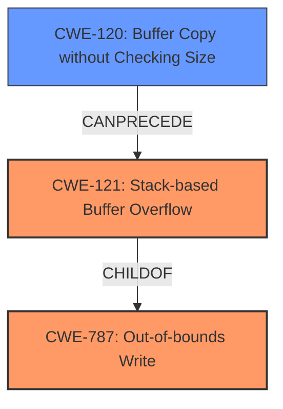

# Analysis Report for CVE-2021-38682

# Vulnerability Analysis Report: CVE-2021-38682

## Description

A stack buffer overflow vulnerability has been reported to affect QNAP device running QVR Elite, QVR Pro, QVR Guard. If exploited, this vulnerability allows attackers to execute arbitrary code. We have already fixed this vulnerability in the following versions of QVR Elite, QVR Pro, QVR Guard QuTS hero h5.0.0 QVR Elite 2.1.4.0 (2021/12/06) and later QuTS hero h4.5.4 QVR Elite 2.1.4.0 (2021/12/06) and later QTS 5.0.0 QVR Elite 2.1.4.0 (2021/12/06) and later QTS 4.5.4 QVR Elite 2.1.4.0 (2021/12/06) and later QTS 4.5.4 QVR Pro 2.1.3.0 (2021/12/06) and later QTS 5.0.0 QVR Pro 2.1.3.0 (2021/12/06) and later QTS 4.5.4 QVR Guard 2.1.3.0 and later QTS 5.0.0 QVR Guard 2.1.3.0 and later

## Vulnerability Description Key Phrases

**Rootcause:** stack buffer overflow
**Impact:** execute arbitrary code
**Attacker:** attackers
**Product:** QNAP device

## Analysis (with Relationship Data)

# Summary
| CWE ID | CWE Name | Confidence | CWE Abstraction Level | CWE Vulnerability Mapping Label | CWE-Vulnerability Mapping Notes |
|---|---|---|---|---|---|
| CWE-121 | Stack-based Buffer Overflow | 0.95 | Variant | Allowed | Primary CWE |
| CWE-120 | Buffer Copy without Checking Size of Input ('Classic Buffer Overflow') | 0.70 | Base | Allowed-with-Review | Secondary Candidate |

## Evidence and Confidence

*   **Confidence Score:** 0.90
*   **Evidence Strength:** HIGH

- **Analysis and Justification:**  
  - *Explanation:* The vulnerability description explicitly states a "**stack buffer overflow**" vulnerability. The primary match is CWE-121 (Stack-based Buffer Overflow), which is a Variant-level CWE and precisely describes the vulnerability. The **root cause** is a buffer overflow occurring on the stack, and the impact is the ability to execute arbitrary code. While CWE-119 (Improper Restriction of Operations within the Bounds of a Memory Buffer) could apply, it's discouraged due to its higher abstraction level. CWE-120 (Buffer Copy without Checking Size of Input) is also a good match, as a buffer copy operation might be the underlying cause of the overflow but the location of the buffer on the stack makes CWE-121 more specific. The retriever results support this assessment, with CWE-121 having a high score. The MITRE mapping guidance for CWE-121 indicates this is ALLOWED.

  - *Relationship Analysis:* "CWE-121 is a variant of CWE-119 (Improper Restriction of Operations within the Bounds of a Memory Buffer). It is also related to other buffer overflow CWEs, such as CWE-120 (Buffer Copy without Checking Size of Input) and CWE-122 (Heap-based Buffer Overflow). The vulnerability can lead to CWE-787 (Out-of-bounds Write) as a consequence of overflowing the buffer."

- **Confidence Score:**  
  - *Example:* Confidence: 0.95 (High confidence due to the explicit mention of "stack buffer overflow" in the vulnerability description.)

---

## Criticism of Analysis

Okay, here's a review of the analysis provided, considering the full CWE specifications:

**Overall Assessment:**

The analysis is generally well-reasoned and arrives at a sound conclusion. The primary CWE mapping to CWE-121 (Stack-based Buffer Overflow) is accurate and well-justified. The inclusion of CWE-120 as a secondary candidate is also reasonable, acknowledging a potential underlying cause. The confidence scores are appropriate.

However, there are a few areas where the analysis could be improved, particularly regarding the discussion of alternative CWEs and the implications of the chosen mappings.

**Detailed Review:**

1.  **Primary CWE Mapping: CWE-121 (Stack-based Buffer Overflow)**

    *   **Strengths:**
        *   The analysis correctly identifies the explicit statement of "stack buffer overflow" in the description as strong evidence for CWE-121.
        *   It acknowledges the Variant level of CWE-121, which aligns with the goal of using more specific CWEs.
        *   The confidence score of 0.95 is warranted due to the direct mention of the stack.

    *   **Areas for Improvement:**
        *   While the analysis mentions CWE-119 (Improper Restriction of Operations within the Bounds of a Memory Buffer) and why it's discouraged, it doesn't explicitly connect CWE-121 to its parent, CWE-787 (Out-of-bounds Write). Even though CWE-787 does not describe the location of the buffer, it can describe the cause of the overflow when mapped with CWE-121. While CWE-121 is a variant of CWE-787, it would be beneficial to include the parent in the summary table as a related CWE. CWE-787 has a Usage of "Allowed" in its Mapping Guidance, so it could serve as a useful reference to the cause of the vulnerability, especially given the lack of additional information about the implementation.
    *   The analysis could benefit from briefly mentioning how stack-based buffer overflows often occur (e.g., writing beyond the bounds of a local variable, overwriting the return address). This would provide additional context and further solidify the mapping.

2.  **Secondary CWE Mapping: CWE-120 (Buffer Copy without Checking Size of Input)**

    *   **Strengths:**
        *   The analysis correctly points out that CWE-120 represents a likely mechanism by which the stack buffer overflow occurs (i.e., a buffer copy without length checking).
        *   It acknowledges that CWE-121 is more specific due to the location of the buffer on the stack.

    *   **Areas for Improvement:**
        *   The analysis could briefly discuss how CWE-120 relates to the Potential Mitigations sections of the CWE specifications. For example, using safe string handling libraries (mentioned in CWE-120's mitigations) would directly address the issue of unchecked buffer copies, thus mitigating the stack buffer overflow. This would better connect the CWE mapping to concrete security practices.
        *   The Mapping Guidance section of CWE-120 emphasizes the "Allowed-with-Review" status due to potential misuse. The current analysis takes this into account.

3.  **Alternative CWEs Mentioned:**

    *   **CWE-119 (Improper Restriction of Operations within the Bounds of a Memory Buffer):** The analysis adequately explains why CWE-119 is discouraged (due to its higher abstraction level and the availability of more specific CWEs).
    *   It would be beneficial to discuss CWE-787 (Out-of-bounds Write), specifically regarding its relationship as parent to CWE-121. This would help explain the cause of the vulnerability.

4.  **Retriever Results:**

    *   The analysis mentions that the retriever results support the assessment, but it doesn't delve into why other high-scoring CWEs might be less appropriate. For example:
        *   **CWE-23 (Relative Path Traversal):** This is clearly irrelevant to a stack buffer overflow.
        *   **CWE-78 (Improper Neutralization of Special Elements used in an OS Command ('OS Command Injection')):** This might be raised if the overflow is triggered by a command line argument, but it's not the primary cause.
        *   **CWE-190 (Integer Overflow or Wraparound):** This could be indirectly related if an integer overflow leads to an incorrect buffer size calculation, but it's not the core issue.

5.  **General Comments:**

    *   **Clarity of Attack Vector:** The analysis could be strengthened by briefly describing the potential attack vectors. Although the advisory doesn't provide specific details, it's reasonable to infer that the vulnerability is likely exploitable via network access to the QNAP device, possibly through a vulnerable service listening on a specific port. Adding this would provide a more complete picture of the vulnerability.
    *   **Mitigations:** It would be useful to link the potential mitigations mentioned in the CWE specifications to the QNAP context. For instance, "Using a language with automatic memory management" (from CWE-121) is not a practical mitigation for an existing codebase, but "Using automatic buffer overflow detection mechanisms" (also from CWE-121) could be a feasible short-term solution.

**Revised Summary Table (with inclusion of parent CWE):**

| CWE ID | CWE Name | Confidence | CWE Abstraction Level | CWE Vulnerability Mapping Label | CWE-Vulnerability Mapping Notes |
|---|---|---|---|---|---|
| CWE-787 | Out-of-bounds Write | 0.95 | Base | Allowed | Parent CWE |
| CWE-121 | Stack-based Buffer Overflow | 0.95 | Variant | Allowed | Primary CWE |
| CWE-120 | Buffer Copy without Checking Size of Input ('Classic Buffer Overflow') | 0.70 | Base | Allowed-with-Review | Secondary Candidate |

**In summary,** the analysis is strong, but can be improved by more explicitly connecting the chosen CWEs to the underlying causes of the overflow, and by considering the practical implications of the mitigations described in the CWE specifications.

## Final Resolution

# Summary
| CWE ID | CWE Name | Confidence | CWE Abstraction Level | CWE Vulnerability Mapping Label | CWE-Vulnerability Mapping Notes |
|---|---|---|---|---|---|
| CWE-787 | Out-of-bounds Write | 0.95 | Base | Allowed | Parent CWE |
| CWE-121 | Stack-based Buffer Overflow | 0.95 | Variant | Allowed | Primary CWE |
| CWE-120 | Buffer Copy without Checking Size of Input ('Classic Buffer Overflow') | 0.70 | Base | Allowed-with-Review | Secondary Candidate |

## Evidence and Confidence

*   **Confidence Score:** 0.95
*   **Evidence Strength:** HIGH

## Relationship Analysis
The analysis focuses on hierarchical relationships to ensure specificity. CWE-121 (Stack-based Buffer Overflow) is a variant of CWE-787 (**Out-of-bounds Write**) and is also related to CWE-120 (Buffer Copy without Checking Size of Input). The decision to include CWE-787 as a parent CWE enhances the understanding of the **root cause** which is an out-of-bounds write, while CWE-121 specifies the location on the stack. CWE-120 describes a potential mechanism leading to the overflow, strengthening the chain.

## Vulnerability Chain
The vulnerability chain begins with a buffer copy operation (CWE-120) that lacks proper size checking. This leads to an **out-of-bounds write** (CWE-787) specifically on the stack (CWE-121), resulting in the ability to execute arbitrary code. The initial flaw is the unchecked buffer copy, and the ultimate impact is code execution.

## Summary of Analysis
The initial analysis and criticism both converge on the conclusion that CWE-121 (Stack-based Buffer Overflow) is the most appropriate primary CWE due to the explicit mention of "stack buffer overflow" in the vulnerability description. The inclusion of CWE-787 as a parent is beneficial. The relationship analysis confirms that CWE-121 is a variant of CWE-787, providing a more complete picture of the vulnerability's cause and location. The evidence provided is strong: "A stack buffer overflow vulnerability has been reported... If exploited, this vulnerability allows attackers to execute arbitrary code." This directly supports the selection of CWE-121 and the resulting impact. CWE-121 is at the optimal level of specificity, providing more detail than the more general CWE-119 while accurately reflecting the nature of the vulnerability. The addition of CWE-787 as parent allows for a clearer understanding of the cause of the vulnerability.

*Report generated on 2025-03-18 00:55:58*
