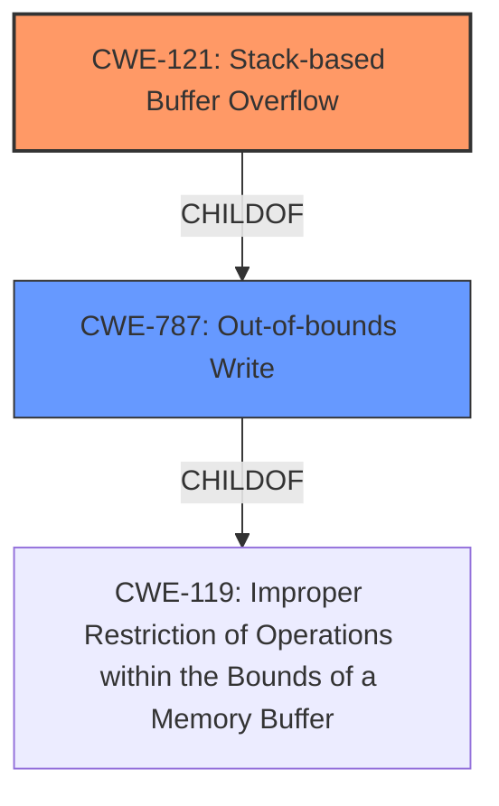

# Analysis Report for CVE-2021-38689

# Vulnerability Analysis Report: CVE-2021-38689

## Description

A stack buffer overflow vulnerability has been reported to affect QNAP device running QVR Elite, QVR Pro, QVR Guard. If exploited, this vulnerability allows attackers to execute arbitrary code. We have already fixed this vulnerability in the following versions of QVR Elite, QVR Pro, QVR Guard QuTS hero h5.0.0 QVR Elite 2.1.4.0 (2021/12/06) and later QuTS hero h4.5.4 QVR Elite 2.1.4.0 (2021/12/06) and later QTS 5.0.0 QVR Elite 2.1.4.0 (2021/12/06) and later QTS 4.5.4 QVR Elite 2.1.4.0 (2021/12/06) and later QTS 4.5.4 QVR Pro 2.1.3.0 (2021/12/06) and later QTS 5.0.0 QVR Pro 2.1.3.0 (2021/12/06) and later QTS 4.5.4 QVR Guard 2.1.3.0 (2021/12/06) and later QTS 5.0.0 QVR Guard 2.1.3.0 (2021/12/06) and later

## Vulnerability Description Key Phrases

**Rootcause:** stack buffer overflow
**Impact:** execute arbitrary code
**Attacker:** attackers
**Product:** QNAP device

## Analysis (with Relationship Data)

# Summary
| CWE ID | CWE Name | Confidence | CWE Abstraction Level | CWE Vulnerability Mapping Label | CWE-Vulnerability Mapping Notes |
|---|---|---|---|---|---|
| CWE-121 | Stack-based Buffer Overflow | 1.0 | Variant | Allowed | Primary CWE |
| CWE-119 | Improper Restriction of Operations within the Bounds of a Memory Buffer | 0.6 | Class | Discouraged | Secondary Candidate |

## Evidence and Confidence

*   **Confidence Score:** 0.9
*   **Evidence Strength:** HIGH

- **Analysis and Justification:**  
  - *Explanation:* The vulnerability description explicitly states a "**stack buffer overflow**" as the root cause. The CVE Reference Links Content Summary confirms "**A stack buffer overflow vulnerability**" and identifies "**Stack buffer overflow**" as a weakness. This aligns directly with CWE-121 (Stack-based Buffer Overflow), which is a Variant-level CWE. The description of CWE-121, "A stack-based buffer overflow condition is a condition where the buffer being overwritten is allocated on the stack," perfectly matches the reported vulnerability. While CWE-119 (Improper Restriction of Operations within the Bounds of a Memory Buffer) could be considered as a more general case, the specific mention of "stack" makes CWE-121 a more precise and appropriate choice. The Retriever Results also lists CWE-121.

  - *Relationship Analysis:* CWE-121 is a variant of the more general CWE-119 (Improper Restriction of Operations within the Bounds of a Memory Buffer). The vulnerability could also be analyzed with CWE-787 (Out-of-bounds Write), which is a parent of CWE-121.

- **Confidence Score:**  
  - Confidence: 1.0 (Explicit mention of "stack buffer overflow" in the vulnerability description and CVE reference links)

## Criticism of Analysis

Okay, here's a review of the analysis, incorporating the full CWE specifications you've provided.

**Overall Assessment**

The analysis is generally strong, especially in identifying CWE-121 (Stack-based Buffer Overflow) as the primary weakness. The justification is clear, well-supported by the vulnerability description and CVE summary, and aligns with CWE's mapping guidance. The consideration of alternative CWEs and the explanation for preferring CWE-121 demonstrate a good understanding of the nuances involved. The analysis correctly identifies CWE-119 as a parent weakness, while also referencing CWE-787, parent of CWE-121, that could have been considered.

**Detailed Review**

1.  **Primary CWE Match: CWE-121 (Stack-based Buffer Overflow)**

    *   **Strengths:**
        *   The analysis uses the explicit "stack buffer overflow" from the vulnerability description as the primary indicator.
        *   It correctly recognizes CWE-121 as a *Variant* level CWE, which is preferred for root cause mapping.
        *   The justification clearly explains how the definition of CWE-121 ("A stack-based buffer overflow condition is a condition where the buffer being overwritten is allocated on the stack...") directly matches the vulnerability.
        *   Confidence is appropriately high (1.0).

    *   **Potential Improvements (Minor):**
        *   While well-justified, consider briefly mentioning potential mitigation strategies associated with CWE-121.  For example: "Mitigations include using compiler extensions like the /GS flag in Microsoft Visual Studio to detect buffer overflows on the stack at runtime, or implementing bounds checking on input."  This adds a practical dimension to the analysis.

    *   **Alignment with CWE Specification:** The analysis aligns perfectly with the CWE-121 specification, especially the "Mapping Guidance" section that encourages mapping to the *Variant* level when appropriate.

2.  **Secondary Candidate: CWE-119 (Improper Restriction of Operations within the Bounds of a Memory Buffer)**

    *   **Strengths:**
        *   The analysis appropriately recognizes CWE-119 as a more general *Class*-level CWE that could apply, but is less precise than CWE-121.
        *  Correctly identifies it as a parent of CWE-121.

    *   **Potential Improvements:**
        *   Emphasize the "Discouraged" usage of CWE-119 according to its specification.  The analysis already notes that CWE-121 is more specific, but explicitly stating that CWE-119 is discouraged without further refinement would solidify the reasoning.
        *  Also consider that CWE-787 is a parent of CWE-121.

    *   **Alignment with CWE Specification:** The analysis acknowledges the potential, but correctly prioritizes CWE-121 due to the specific information available. This aligns with the CWE-119 specification's "Mapping Guidance" section, which states it's "commonly misused in low-information vulnerability reports" and suggests considering its children.

3.  **Retriever Results:**

    *   The retriever results list several other CWEs. Here's how they stack up:

        *   **CWE-120 (Buffer Copy without Checking Size of Input):**  While a buffer overflow is occurring, the provided information doesn't explicitly state that the root cause is a missing size check during a buffer copy.  It's possible, but not confirmed.
        *   **CWE-23 (Relative Path Traversal):**  Unlikely to be relevant unless the buffer overflow is used to influence file paths. The analysis should explicitly rule this out.
        *   **CWE-78 (OS Command Injection):**  Similarly unlikely unless the buffer overflow is used to inject commands. Explicitly rule this out.
        *   **CWE-190 (Integer Overflow):** Possible if an integer overflow leads to incorrect buffer size calculations, but not explicitly stated.
        *   **CWE-1284 (Improper Validation of Specified Quantity in Input):** Similar to CWE-190, this could be a contributing factor if a size is read from input and not validated.
        *   **CWE-22 (Improper Limitation of a Pathname to a Restricted Directory):** Same comment as for CWE-23.
        *   **CWE-122 (Heap-based Buffer Overflow):** Contradicts the explicit "stack" designation and should be ruled out definitively.
        *   **CWE-77 (Improper Neutralization of Special Elements used in a Command):** Same comment as for CWE-78.
        *   **CWE-126 (Buffer Over-read):** It is possible that there is also a buffer over-read in the application code. More information is required.

4.  **Confidence Score**

    *   Confidence score is accurate. The vulnerability description mentions "stack buffer overflow" as the root cause.

**Recommendations**

1.  **Explicitly Rule Out Irrelevant CWEs:** Briefly mention why CWE-23, CWE-78, and CWE-122 are *not* applicable to avoid potential confusion. Even a short statement like "While the vulnerability allows arbitrary code execution, there is no evidence to suggest that it relates to command injection (CWE-78) or path traversal (CWE-23)" would be helpful. Also say that CWE-122 doesn't apply since it is explicitly a *stack* buffer overflow, not *heap*.
2.  **Consider CWE-787 as an Alternative Parent CWE:** Mention the possibility of using CWE-787 as a parent of CWE-121 in the Relationship Analysis.
3.  **Enhance Justification with Mitigation Examples:** Include 1-2 specific mitigation strategies associated with CWE-121 in the justification to make the analysis more practical.
4.  **Emphasize "Discouraged" Usage of CWE-119:** Reiterate that the CWE specification discourages using CWE-119 when more specific weaknesses are known.

By incorporating these suggestions, the analysis can become even more robust and demonstrate a deeper understanding of the CWE framework and its intended usage.

## Final Resolution

# Summary
| CWE ID | CWE Name | Confidence | CWE Abstraction Level | CWE Vulnerability Mapping Label | CWE-Vulnerability Mapping Notes |
|---|---|---|---|---|---|
| CWE-121 | Stack-based Buffer Overflow | 1.0 | Variant | Allowed | Primary CWE |
| CWE-787 | Out-of-bounds Write | 0.7 | Base | Allowed | Secondary Candidate |

## Evidence and Confidence

*   **Confidence Score:** 0.95
*   **Evidence Strength:** HIGH

## Relationship Analysis
The primary weakness is CWE-121 (**CWE-121: Stack-based Buffer Overflow**) which is a variant of CWE-119 (**CWE-119: Improper Restriction of Operations within the Bounds of a Memory Buffer**) and a child of CWE-787 (**CWE-787: Out-of-bounds Write**). CWE-121 is chosen as the primary due to the explicit mention of "stack buffer overflow" in the vulnerability description. CWE-787 is included as a secondary candidate because it represents the **WEAKNESS** of writing outside the intended buffer, and is a parent of CWE-121.

## Vulnerability Chain
The vulnerability chain starts with a **ROOTCAUSE** of inadequate bounds checking when writing to a stack-allocated buffer (CWE-121). An attacker can provide input that exceeds the buffer's capacity. This leads to an out-of-bounds write (CWE-787) on the stack, overwriting adjacent memory locations. The consequence of this is arbitrary code execution.

## Summary of Analysis
The initial analysis correctly identified CWE-121 (**CWE-121: Stack-based Buffer Overflow**) as the primary **WEAKNESS**. The vulnerability description explicitly mentions "stack buffer overflow," providing strong evidence for this classification.

The criticism provided helpful suggestions, including:
* Explicitly ruling out irrelevant CWEs such as CWE-23 (**CWE-23: Relative Path Traversal**), CWE-78 (**CWE-78: Improper Neutralization of Special Elements used in a Command**), and CWE-122 (**CWE-122: Heap-based Buffer Overflow**). These are not applicable because the description does not indicate command injection, path traversal, or heap allocation.
* Considering CWE-787 (**CWE-787: Out-of-bounds Write**) as an alternative parent CWE, which is now included as a secondary candidate.
* Enhancing justification with mitigation examples, such as using compiler extensions like /GS or implementing bounds checking.
* Emphasizing the discouraged usage of CWE-119 (**CWE-119: Improper Restriction of Operations within the Bounds of a Memory Buffer**) when more specific weaknesses are known.

The final decision is to classify this as CWE-121 (**CWE-121: Stack-based Buffer Overflow**) as the primary **WEAKNESS** because the vulnerability description explicitly states a "stack buffer overflow". CWE-787 (**CWE-787: Out-of-bounds Write**) is added as a secondary candidate because it is a parent of CWE-121 and describes the **WEAKNESS** of writing beyond the buffer boundary. The classification reflects the optimal level of specificity based on available evidence. The confidence score is high (0.95) due to the direct match with the vulnerability description.

*Report generated on 2025-03-18 00:57:29*
