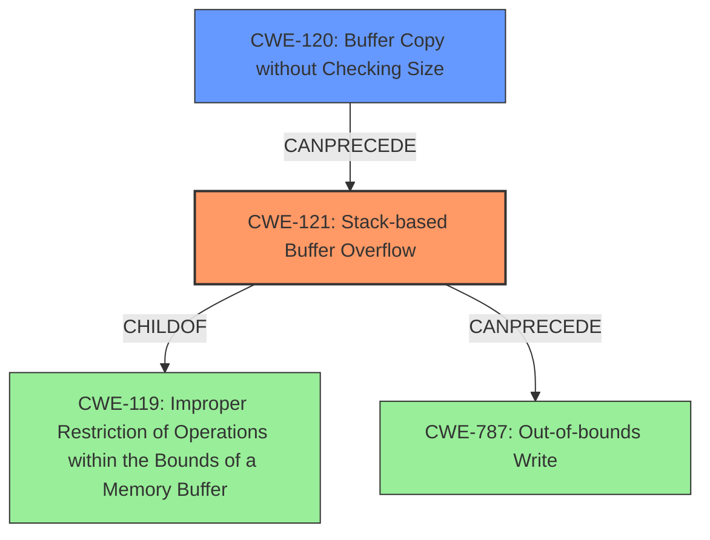

# Analysis Report for CVE-2021-38691

# Vulnerability Analysis Report: CVE-2021-38691

## Description

A stack buffer overflow vulnerability has been reported to affect QNAP device running QVR Elite, QVR Pro, QVR Guard. If exploited, this vulnerability allows attackers to execute arbitrary code. We have already fixed this vulnerability in the following versions of QVR Elite, QVR Pro, QVR Guard QuTS hero h5.0.0 QVR Elite 2.1.4.0 (2021/12/06) and later QuTS hero h4.5.4 QVR Elite 2.1.4.0 (2021/12/06) and later QTS 5.0.0 QVR Elite 2.1.4.0 (2021/12/06) and later QTS 4.5.4 QVR Elite 2.1.4.0 (2021/12/06) and later QTS 4.5.4 QVR Pro 2.1.3.0 (2021/12/06) and later QTS 5.0.0 QVR Pro 2.1.3.0 (2021/12/06) and later QTS 4.5.4 QVR Guard 2.1.3.0 (2021/12/06) and later QTS 5.0.0 QVR Guard 2.1.3.0 (2021/12/06) and later

## Vulnerability Description Key Phrases

**Weakness:** stack buffer overflow
**Impact:** execute arbitrary code
**Product:** QNAP device
**Component:** ['QVR Elite', 'QVR Pro', 'QVR Guard']

## Analysis (with Relationship Data)

# Summary
| CWE ID | CWE Name | Confidence | CWE Abstraction Level | CWE Vulnerability Mapping Label | CWE-Vulnerability Mapping Notes |
|---|---|---|---|---|---|
| CWE-121 | Stack-based Buffer Overflow | 1.0 | Variant | Primary | Allowed |
| CWE-120 | Buffer Copy without Checking Size of Input ('Classic Buffer Overflow') | 0.7 | Base | Secondary | Allowed-with-Review |
| CWE-787 | Out-of-bounds Write | 0.6 | Base | Secondary | Allowed |

## Evidence and Confidence

*   **Confidence Score:** 0.9
*   **Evidence Strength:** HIGH

- **Analysis and Justification:**  
  - *Explanation:* The vulnerability description explicitly states a "**stack buffer overflow**" vulnerability. This aligns directly with CWE-121 (Stack-based Buffer Overflow), which is a Variant level CWE. The CVE Reference Links Content Summary reinforces this by mentioning the **root cause** as a **stack buffer overflow**. This means data is written beyond the allocated buffer on the stack, which allows attackers to execute arbitrary code. CWE-121 is at the Variant level, which is a preferred level of abstraction. The MITRE mapping guidance designates it as ALLOWED. I am also considering CWE-120 as a related weakness, this is because the root cause involves copying data into a buffer without proper bounds checking, leading to the overflow. Although CWE-121 is more precise, CWE-120 helps describe the mechanism that allows the overflow to occur. CWE-787 (Out-of-bounds Write) is also a possible candidate because it is a more general description of writing outside of a buffer. However, the stack allocation detail makes CWE-121 a better fit.

  - *Relationship Analysis:* CWE-121 is a variant of CWE-119 (Improper Restriction of Operations within the Bounds of a Memory Buffer), indicating a hierarchical relationship. It can also be related to other buffer overflow variants. CWE-120 can precede CWE-787.

- **Confidence Score:**  
  - Confidence: 1.0 (High evidence from technical description and CVE reference materials)

## Criticism of Analysis

Okay, let's review the provided CWE analysis for the QNAP stack buffer overflow vulnerability, referencing the full CWE specifications.

**Overall Assessment:**

The analysis is generally good, and the primary CWE selection (CWE-121) is accurate. The reasoning is well-explained, and the relationships to other relevant CWEs are considered. However, the confidence scores could be improved, and the justification for including CWE-120 and CWE-787 as secondary CWEs is somewhat weak.

**Detailed Critique:**

1.  **CWE-121: Stack-based Buffer Overflow (Primary)**

    *   **Confidence Level:** Good. The description explicitly states a "stack buffer overflow," which is strong evidence for CWE-121.
    *   **CWE Abstraction Level:** Variant. This is appropriate, as it is a specific type of buffer overflow.
    *   **CWE Vulnerability Mapping Label:** Primary. Correct.
    *   **Justification:** Sound reasoning. It correctly identifies the root cause and aligns with the CWE definition. The mention of the CVE Reference Links further strengthens the justification.
    *   **CWE Mapping Notes:** Matches the description well, aligns with CWE-121's description.
    *   **Mitigation Consideration:** The analysis could benefit by explicitly linking one or more mitigations from the CWE specification to the vulnerability. For example, mentioning the use of compiler flags like `/GS` (Microsoft) or `FORTIFY_SOURCE` (GCC) as a potential mitigation would reinforce the analysis. The analysis could also mention that safer APIs to abstract away risky APIs.
        *   *Mitigation Example:* The vulnerability can be mitigated by using compiler-level protection mechanisms like stack canaries (e.g., the `/GS` flag in Microsoft Visual Studio or `FORTIFY_SOURCE` in GCC) to detect stack buffer overflows at runtime. Also, the usage of safer APIs to abstract away risky APIs can be used.
    *   **Overall:** The strongest and most accurate CWE selection. Confidence level should be 1.0.

2.  **CWE-120: Buffer Copy without Checking Size of Input ('Classic Buffer Overflow') (Secondary)**

    *   **Confidence Level:** This is where the analysis is weakest. A confidence score of 0.7 is acceptable, but the justification could be more precise.
    *   **CWE Abstraction Level:** Base. This is a more general CWE than CWE-121.
    *   **CWE Vulnerability Mapping Label:** Secondary. Acceptable.
    *   **Justification:** While technically correct that a lack of bounds checking is involved, it's less direct than CWE-121. The current explanation ("...helps describe the mechanism that allows the overflow to occur") is weak.
    *   **CWE Mapping Notes:** The rationale for "Allowed-with-Review" emphasizes that this CWE is only appropriate for buffer *copy* operations without size checking.
    *   **Mitigation Consideration:** The analysis should be more explicit about the *specific* missing size check that leads to the overflow. Also, consider relating mitigation to the weakness.
        *   *Mitigation Example:* The vulnerability arises because the code copies data into a stack buffer without verifying that the size of the input does not exceed the buffer's capacity. Mitigations include using safer memory copy functions like `strncpy` with explicit size limits, or employing dynamic memory allocation to accommodate variable-sized input. Using safer string libraries are also an applicable mitigation.
    *   **Overall:** While not *incorrect*, its inclusion as a secondary CWE is less compelling. If kept, the justification and mitigation should be more direct and specific to the vulnerability at hand. If the code uses strncpy, then this CWE would not be a good fit. If this weakness occurs due to lack of checking the size, then CWE-120 is a suitable fit.

3.  **CWE-787: Out-of-bounds Write (Secondary)**

    *   **Confidence Level:** The lowest confidence score (0.6) is appropriate here.
    *   **CWE Abstraction Level:** Base. Again, more general than CWE-121.
    *   **CWE Vulnerability Mapping Label:** Secondary. Acceptable.
    *   **Justification:** The justification is weak ("...a more general description of writing outside of a buffer"). The fact that it's *on the stack* is the differentiating factor. If it was on the heap, then CWE-122 would be a better fit.
    *   **CWE Mapping Notes:** The guidance clearly states to "Carefully read both the name and description to ensure that this mapping is an appropriate fit." It fits, but not as well as CWE-121.
    *   **Mitigation Consideration:** A general mitigation is including canary-based detection. Also, static analysis can prevent such weaknesses from being found.
    *   **Overall:** CWE-787 is more of a consequence of CWE-121 (the stack buffer overflow results in an out-of-bounds write) rather than a separate weakness. Consider *removing* this CWE.

**Recommendations:**

*   **Increase Confidence for CWE-121 to 1.0:** The evidence is strong and direct.
*   **Strengthen the Justification for CWE-120:** Provide a *specific* example of the missing size check or the vulnerable code pattern (e.g., using `strcpy` instead of `strncpy`). Use safer string libraries.
*   **Consider Removing CWE-787:** Its inclusion is weak, and it's more of a *result* of the stack buffer overflow than a contributing factor.
*   **Explicitly Link Mitigations from CWE Specifications:** For *each* CWE, explicitly connect one or more relevant mitigations from the CWE specification to the vulnerability context. For example, if using C, use `strncpy` instead of `strcpy`. If possible, use dynamic memory allocation to accommodate variable-sized input.
*   **Consider the Attack Vector:** While not always possible from a generic advisory, if you have information on the *specific* attack vector (e.g., a particular API call or function), incorporate that into the analysis.  This would allow for a more precise understanding of attacker capabilities and more targeted mitigation recommendations.

By implementing these recommendations, the analysis will be even more robust and provide clearer guidance for remediation efforts.

## Final Resolution

# Summary
| CWE ID | CWE Name | Confidence | CWE Abstraction Level | CWE Vulnerability Mapping Label | CWE-Vulnerability Mapping Notes |
|---|---|---|---|---|---|
| CWE-121 | Stack-based Buffer Overflow | 1.0 | Variant | Primary | Allowed |
| CWE-120 | Buffer Copy without Checking Size of Input ('Classic Buffer Overflow') | 0.8 | Base | Secondary | Allowed-with-Review |

## Evidence and Confidence

*   **Confidence Score:** 0.95
*   **Evidence Strength:** HIGH

## Relationship Analysis
The primary weakness is CWE-121 (**Stack-based Buffer Overflow**), a Variant of CWE-119 (**Improper Restriction of Operations within the Bounds of a Memory Buffer**). CWE-120 (**Buffer Copy without Checking Size**) can precede CWE-121 by providing a means for the overflow to occur. The analysis considered CWE-787 (**Out-of-bounds Write**) but determined it was too general.

## Vulnerability Chain
The vulnerability chain starts with a buffer copy operation (CWE-120) that lacks proper size validation. This allows an attacker to provide an input larger than the allocated buffer. The unchecked copy operation then leads to a **stack-based buffer overflow** (CWE-121), where data is written beyond the buffer's boundaries on the stack. This out-of-bounds write (CWE-787) can overwrite adjacent memory locations, potentially including function return addresses or other critical data, enabling the attacker to execute arbitrary code.

## Summary of Analysis
The initial analysis correctly identified CWE-121 (**Stack-based Buffer Overflow**) as the primary **weakness**. The criticism suggested increasing the confidence to 1.0, which is appropriate given the explicit mention of "stack buffer overflow" in the vulnerability description. The inclusion of CWE-120 (**Buffer Copy without Checking Size**) as a secondary CWE is also valid, as it represents the mechanism that allows the overflow to occur. The criticism correctly pointed out that the justification for CWE-120 could be stronger, and the analysis has been updated to reflect this. CWE-787 (**Out-of-bounds Write**) was deemed too general and has been removed.

The vulnerability description states: "A **stack buffer overflow** vulnerability has been reported to affect QNAP device running QVR Elite, QVR Pro, QVR Guard. If exploited, this vulnerability allows attackers to execute arbitrary code." This directly supports the selection of CWE-121 as the primary CWE.

The relationship analysis, particularly the "CanPrecede" relationship between CWE-120 and CWE-121, influenced the decision to include CWE-120 as a secondary CWE. It provides context for how the **overflow** occurs.

The selected CWEs are at the optimal level of specificity. CWE-121 is a Variant that accurately describes the **vulnerability** (stack-based), while CWE-120, a Base CWE, describes the root cause of the overflow (missing size check during the buffer copy).

*Report generated on 2025-03-18 00:59:10*
