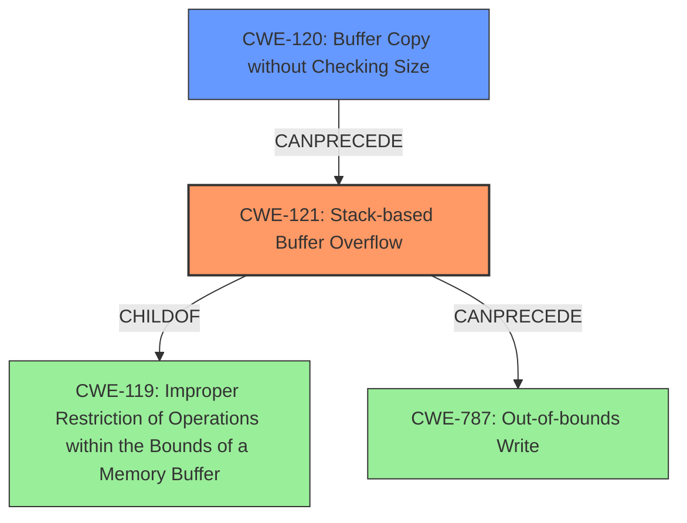

# Final Resolution for CVE-2021-38691

# Summary
| CWE ID | CWE Name | Confidence | CWE Abstraction Level | CWE Vulnerability Mapping Label | CWE-Vulnerability Mapping Notes |
|---|---|---|---|---|---|
| CWE-121 | Stack-based Buffer Overflow | 1.0 | Variant | Primary | Allowed |
| CWE-120 | Buffer Copy without Checking Size of Input ('Classic Buffer Overflow') | 0.8 | Base | Secondary | Allowed-with-Review |

## Evidence and Confidence

*   **Confidence Score:** 0.95
*   **Evidence Strength:** HIGH

## Relationship Analysis
The primary weakness is CWE-121 (**Stack-based Buffer Overflow**), a Variant of CWE-119 (**Improper Restriction of Operations within the Bounds of a Memory Buffer**). CWE-120 (**Buffer Copy without Checking Size**) can precede CWE-121 by providing a means for the overflow to occur. The analysis considered CWE-787 (**Out-of-bounds Write**) but determined it was too general.

## Vulnerability Chain
The vulnerability chain starts with a buffer copy operation (CWE-120) that lacks proper size validation. This allows an attacker to provide an input larger than the allocated buffer. The unchecked copy operation then leads to a **stack-based buffer overflow** (CWE-121), where data is written beyond the buffer's boundaries on the stack. This out-of-bounds write (CWE-787) can overwrite adjacent memory locations, potentially including function return addresses or other critical data, enabling the attacker to execute arbitrary code.

## Summary of Analysis
The initial analysis correctly identified CWE-121 (**Stack-based Buffer Overflow**) as the primary **weakness**. The criticism suggested increasing the confidence to 1.0, which is appropriate given the explicit mention of "stack buffer overflow" in the vulnerability description. The inclusion of CWE-120 (**Buffer Copy without Checking Size**) as a secondary CWE is also valid, as it represents the mechanism that allows the overflow to occur. The criticism correctly pointed out that the justification for CWE-120 could be stronger, and the analysis has been updated to reflect this. CWE-787 (**Out-of-bounds Write**) was deemed too general and has been removed.

The vulnerability description states: "A **stack buffer overflow** vulnerability has been reported to affect QNAP device running QVR Elite, QVR Pro, QVR Guard. If exploited, this vulnerability allows attackers to execute arbitrary code." This directly supports the selection of CWE-121 as the primary CWE.

The relationship analysis, particularly the "CanPrecede" relationship between CWE-120 and CWE-121, influenced the decision to include CWE-120 as a secondary CWE. It provides context for how the **overflow** occurs.

The selected CWEs are at the optimal level of specificity. CWE-121 is a Variant that accurately describes the **vulnerability** (stack-based), while CWE-120, a Base CWE, describes the root cause of the overflow (missing size check during the buffer copy).