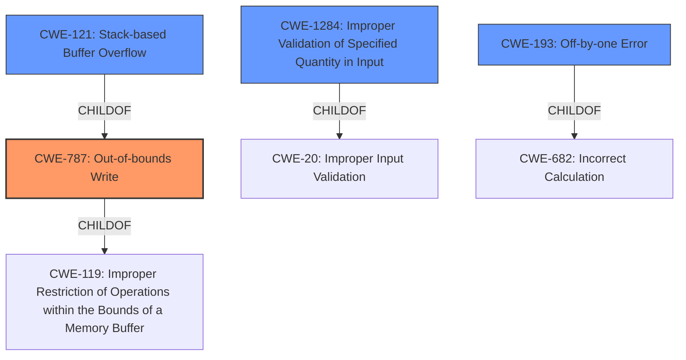

# Final Resolution for CVE-2021-39049

# Summary
| CWE ID | CWE Name | Confidence | CWE Abstraction Level | CWE Vulnerability Mapping Label | CWE-Vulnerability Mapping Notes |
|---|---|---|---|---|---|
| CWE-787 | Out-of-bounds Write | 1.0 | Base | Allowed | Primary CWE |
| CWE-121 | Stack-based Buffer Overflow | 0.7 | Variant | Allowed | Secondary Candidate |
| CWE-1284 | Improper Validation of Specified Quantity in Input | 0.5 | Base | Allowed | Secondary Candidate |
| CWE-120 | Buffer Copy without Checking Size of Input ('Classic Buffer Overflow') | 0.5 | Base | Allowed-with-Review | Secondary Candidate |
| CWE-193 | Off-by-one Error | 0.4 | Base | Allowed | Secondary Candidate |

## Evidence and Confidence

*   **Confidence Score:** 0.9
*   **Evidence Strength:** HIGH

## Relationship Analysis
The primary relationship that influenced the decision was the parent-child relationship between CWE-787 and CWE-121. CWE-787 (Out-of-bounds Write) is a parent of CWE-121 (Stack-based Buffer Overflow), indicating that the out-of-bounds write is specifically occurring on the stack. This hierarchical relationship helps refine the classification. CWE-1284's relationship as a child of CWE-20 (Improper Input Validation) suggests a potential input validation issue that could lead to the out-of-bounds write. This influenced the decision to include it as a secondary candidate. CWE-193 as a child of CWE-682 (Incorrect Calculation) suggests a calculation error could have led to the out-of-bounds write.

## Vulnerability Chain
The vulnerability chain starts with a potential **ROOTCAUSE** of **CWE-1284** (Improper Validation of Specified Quantity in Input) or **CWE-193** (Off-by-one Error) leading to **CWE-787** (Out-of-bounds Write), which is the primary **WEAKNESS**. This results in a **stack-based buffer overflow**, represented by **CWE-121**. The final impact is the ability for a local attacker to overflow a buffer and gain lower-level privileges.

## Summary of Analysis
The initial analysis correctly identified **CWE-787** (Out-of-bounds Write) as the primary **WEAKNESS** due to the explicit mention of "**improper bounds checking**" in the vulnerability description. The criticism helped refine the confidence levels and justifications for the secondary CWEs. The analysis is primarily based on the provided evidence, specifically the vulnerability description stating "IBM i2 Analysts Notebook 9.2.0, 9.2.1, and 9.2.2 is vulnerable to a stack-based buffer overflow, caused by improper bounds checking."

The graph relationships influenced the final selection by highlighting the connections between the CWEs. For example, the parent-child relationship between CWE-787 and CWE-121 reinforces the choice of CWE-787 as the primary **WEAKNESS** and CWE-121 as a specific manifestation. The potential chain of **CWE-1284** or **CWE-193** leading to **CWE-787** was also considered.

The selected CWEs are at the optimal level of specificity based on the available evidence. **CWE-787** is a Base-level CWE, providing a general description of the out-of-bounds write. **CWE-121** is a Variant, specifying that the overflow occurs on the stack. **CWE-1284** and **CWE-193** are also Base-level CWEs, representing potential **ROOTCAUSES** of the **improper bounds checking**.

I agree with the revised table summary and the provided feedback.