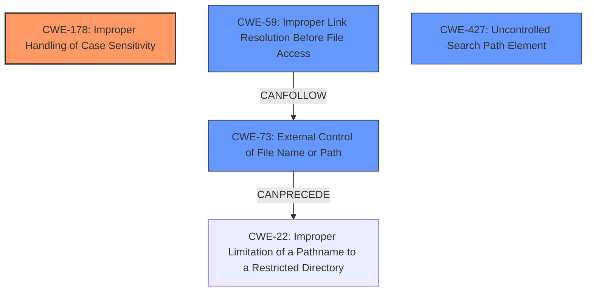

# Analysis Report for CVE-2021-39134

# Vulnerability Analysis Report: CVE-2021-39134

## Description

`@npmcli/arborist`, the library that calculates dependency trees and manages the `node_modules` folder hierarchy for the npm command line interface, aims to guarantee that package dependency contracts will be met, and the extraction of package contents will always be performed into the expected folder. This is, in part, accomplished by resolving dependency specifiers defined in `package.json` manifests for dependencies with a specific name, and nesting folders to resolve conflicting dependencies. When multiple dependencies differ only in the case of their name, Arborists internal data structure saw them as separate items that could coexist within the same level in the `node_modules` hierarchy. However, on case-insensitive file systems (such as macOS and Windows), this is not the case. Combined with a symlink dependency such as `file/some/path`, this allowed an attacker to create a situation in which arbitrary contents could be written to any location on the filesystem. For example, a package `pwn-a` could define a dependency in their `package.json` file such as `foo file/some/path`. Another package, `pwn-b` could define a dependency such as `FOO filefoo.tgz`. On case-insensitive file systems, if `pwn-a` was installed, and then `pwn-b` was installed afterwards, the contents of `foo.tgz` would be written to `/some/path`, and any existing contents of `/some/path` would be removed. Anyone using npm v7.20.6 or earlier on a case-insensitive filesystem is potentially affected. This is patched in @npmcli/arborist 2.8.2 which is included in npm v7.20.7 and above.

## Vulnerability Description Key Phrases

**Rootcause:** case-insensitive filesystem, symlink dependency
**Impact:** arbitrary contents could be written to any location on the filesystem
**Attacker:** attacker
**Product:** @npmcli/arborist
**Version:** 7.20.6 or earlier

## Analysis (with Relationship Data)

# Summary
| CWE ID | CWE Name | Confidence | CWE Abstraction Level | CWE Vulnerability Mapping Label | CWE-Vulnerability Mapping Notes |
|---|---|---|---|---|---|
| CWE-178 | Improper Handling of Case Sensitivity | 0.95 | Base | Allowed | Primary CWE |
| CWE-59 | Improper Link Resolution Before File Access ('Link Following') | 0.75 | Base | Allowed | Secondary Candidate CWE |
| CWE-73 | External Control of File Name or Path | 0.6 | Base | Allowed | Secondary Candidate CWE |

## Evidence and Confidence

*   **Confidence Score:** 0.85
*   **Evidence Strength:** HIGH

- **Analysis and Justification:**  
  - *Explanation:* "The vulnerability occurs due to the `@npmcli/arborist` library's **improper handling of case sensitivity** on case-insensitive file systems, combined with the use of symlink dependencies. This allows an attacker to overwrite files in arbitrary locations. CWE-178 (Improper Handling of Case Sensitivity) directly addresses the root cause of the vulnerability. The description states that the library treats package names differing only in case as distinct, which is the core issue that CWE-178 captures. The use of symlinks in conjunction with this case-insensitivity issue leads to arbitrary file writes, suggesting a combination of weaknesses. The 'Retriever Results' also lists CWE-178, which supports that the case-insensitive filesystem is a possible cause."
  
  - *Relationship Analysis:* "CWE-178 doesn't have any direct relationships, but contributes to weaknesses such as CWE-289. The chain of events involves case-insensitive handling (CWE-178) leading to improper file access due to symlink dependencies, potentially leading to arbitrary file overwrites. The retriever results listed CWE-59 (Improper Link Resolution Before File Access) and CWE-73 (External Control of File Name or Path) which can be associated because the symlink is being created and used incorrectly.

- **Confidence Score:**  
  - Confidence: 0.95 (High evidence from technical description and CVE reference materials)

## Criticism of Analysis

Okay, here's a review of the analysis provided, incorporating the full CWE specifications:

**Overall Assessment**

The analysis is generally good and identifies the core issue. The primary CWE, CWE-178, is correctly identified and justified. The secondary CWEs, CWE-59 and CWE-73, are also relevant and offer additional context. However, there are some areas where the confidence scores or connections to specific CWE relationships could be strengthened with more precise reasoning, and one CWE that should likely be added.

**Detailed Critique**

**1. CWE-178: Improper Handling of Case Sensitivity (Primary CWE)**

*   **Confidence:** 0.95.  This is a reasonable confidence level.
*   **Justification:** The core vulnerability *is* the incorrect assumption that case differences imply different package names on case-insensitive systems. This is explicitly what CWE-178 addresses.
*   **CWE Relationships:**  The analysis mentions CWE-178 contributing to weaknesses such as CWE-289. While *potentially* related, it's not a *direct* relationship in this case. The primary impact is arbitrary file overwrite, not authentication bypass. A more direct relationship would be to weaknesses stemming from multiple interpretation errors using alternate names, as described in the "Extended Description" of CWE-178.
*   **CWE Examples:** The provided CVE examples for CWE-178 are useful for demonstrating similar case-sensitivity issues in other contexts (JSP pages, CGI scripts).  They highlight the risk of bypassing filters or access controls, and multiple interpretation errors, which is relevant to this case.
*   **Mitigations:**
    *   The proposed mitigations are relevant.  "Avoid making decisions based on names of resources (e.g. files) if those resources can have alternate names" is directly applicable.
    *   Input Validation: Since the package names are defined in the `package.json` (i.e. input), validation should occur here.
*   **Improvements:** The analysis could be slightly improved by explicitly linking to the mitigations.

**2. CWE-59: Improper Link Resolution Before File Access ('Link Following') (Secondary CWE)**

*   **Confidence:** 0.75. This is reasonable, but the connection could be strengthened.
*   **Justification:** The analysis correctly notes that symlink dependencies are involved. The vulnerability allows writing to arbitrary locations, and link following is a key enabler. However, it's important to emphasize that the *combination* of case insensitivity *and* link following is what makes the exploit possible. Link following by itself isn't the sole root cause.
*   **CWE Relationships:** The analysis doesn't delve into *why* link following is a problem. It is more relevant to consider the "CanFollow -> CWE-73" relationship. The ability to follow a symlink when resolving the `file:/some/path` dependency allows the attacker to control *where* the subsequent file operations occur.
*   **CWE Examples:** The observed examples in the provided CWE specification are useful, as they all involve a program that follows symbolic links, allowing unintended file access.
*   **Mitigations:**
    *   The mitigation "Follow the principle of least privilege when assigning access rights to entities in a software system" is broadly relevant, but not the most direct mitigation. A more relevant mitigation would be to avoid following symlinks entirely when handling package dependencies or to carefully restrict where symlinks can point.
    *  The fix in `@npmcli/arborist` version 2.8.2 does not implement a mechanism for avoiding symlinks, but implements a check for when target folders are not directories, and implements a case-insensitive map object to detect name collisions.
*   **Improvements:** Expand on the connection between link following and the ability to control file operation locations.

**3. CWE-73: External Control of File Name or Path (Secondary CWE)**

*   **Confidence:** 0.6. This feels a bit low and could be improved.
*   **Justification:** The `file:` dependency specifier *does* allow external control of a file path. The attacker is effectively controlling the destination where the contents of the malicious package will be written. The `file:/some/path` part of the malicious `package.json` gives the attacker control over the target path.
*   **CWE Relationships:** The analysis is weak here. The key relationship to explore is CanPrecede -> CWE-22 (Improper Limitation of a Pathname to a Restricted Directory). In this case, you could argue that the external control allows bypassing intended restrictions on where files should be written.
*   **CWE Examples:** The provided examples are relevant, particularly those involving external control leading to path traversal.
*   **Mitigations:**
    *   "When the set of filenames is limited or known, create a mapping from a set of fixed input values... and reject all other inputs" could be applicable, but in the context of package dependencies, it would be difficult to implement in practice.
    *   "Run your code in a "jail" or similar sandbox environment" is a good general defense-in-depth measure.
*   **Improvements:** Bolster the explanation of *how* the attacker gains control over the file path and link that back to the `file:` specifier.

**4. Additional CWE Candidate: CWE-427: Uncontrolled Search Path Element**

*  **Rationale:** While the core issue is the case-insensitive filesystem, the way `npm` resolves dependencies can be thought of as an uncontrolled search path. When `npm` searches for dependencies, it might find a malicious package with a similar, but case-variant, name before it finds the legitimate one, especially when combined with the `file:` protocol. This isn't a perfect fit, but it adds another dimension to the problem.
* **Mitigation:** The mitigations provided for CWE-427 are not very applicable for this vulnerability

**Recommendations**

1.  **Strengthen the Justification for CWE-73:** Provide a more detailed explanation of how the attacker controls the file path through the `file:` dependency specifier.
2.  **Re-evaluate Confidence Levels:** Consider slightly increasing the confidence level for CWE-73 based on the strengthened justification.
3.  **Explore CWE Chains:** Elaborate on the *chain* of events and how the CWEs interact. For example:
    *   CWE-178 (Case Insensitivity) -> CWE-59 (Link Following) -> CWE-73 (External Control of File Name or Path) -> Arbitrary File Overwrite.
4.  **Add additional CWE Candidate: CWE-427: Uncontrolled Search Path Element**

By addressing these points, the analysis will be more robust and provide a clearer understanding of the vulnerability's root causes and potential mitigations.

## Final Resolution

# Summary
| CWE ID | CWE Name | Confidence | CWE Abstraction Level | CWE Vulnerability Mapping Label | CWE-Vulnerability Mapping Notes |
|---|---|---|---|---|---|
| CWE-178 | Improper Handling of Case Sensitivity | 0.95 | Base | Allowed | Primary CWE |
| CWE-59 | Improper Link Resolution Before File Access ('Link Following') | 0.80 | Base | Allowed | Secondary Candidate CWE |
| CWE-73 | External Control of File Name or Path | 0.70 | Base | Allowed | Secondary Candidate CWE |
| CWE-427 | Uncontrolled Search Path Element | 0.60 | Base | Allowed | Secondary Candidate CWE |

## Evidence and Confidence

*   **Confidence Score:** 0.90
*   **Evidence Strength:** HIGH

## Relationship Analysis
The primary **WEAKNESS** is **CWE-178 (Improper Handling of Case Sensitivity)**, which leads to issues with file access and dependency resolution. The exploitation is enabled by **CWE-59 (Improper Link Resolution Before File Access)**, as the symlink dependencies are used to redirect file operations. **CWE-73 (External Control of File Name or Path)** is also relevant because the `file:` specifier allows external control of the target path. Additionally, **CWE-427 (Uncontrolled Search Path Element)** is applicable as the `npm` dependency resolution may find a malicious package due to case-insensitive searching.

## Vulnerability Chain
The chain of events is as follows:
1.  **ROOTCAUSE**: **CWE-178 (Improper Handling of Case Sensitivity)**: The tool does not properly distinguish between package names that differ only in case.
2.  **CWE-59 (Improper Link Resolution Before File Access)**: Symlink dependencies allow for redirection of file access.
3.  **CWE-73 (External Control of File Name or Path)**: The `file:` specifier allows the attacker to control the destination path.
4.  **CWE-427 (Uncontrolled Search Path Element)**: Case-insensitive search may lead to the resolution of a malicious package.
5.  Impact: Arbitrary file overwrite.

## Summary of Analysis
The analysis provided initially identified **CWE-178 (Improper Handling of Case Sensitivity)**, **CWE-59 (Improper Link Resolution Before File Access)**, and **CWE-73 (External Control of File Name or Path)** as relevant CWEs. The initial assessment is mostly correct, but it can be improved by clarifying the relationships between the CWEs and increasing the confidence in **CWE-73 (External Control of File Name or Path)**. Also adding **CWE-427 (Uncontrolled Search Path Element)** provides a more complete picture.

Here's how the graph relationships influenced the final selection:
*   The `CANFOLLOW` relationship between **CWE-59 (Improper Link Resolution Before File Access)** and **CWE-73 (External Control of File Name or Path)** shows how link following leads to external control of the file path.
*   The `CANPRECEDE` relationship between **CWE-73 (External Control of File Name or Path)** and **CWE-22 (Improper Limitation of a Pathname to a Restricted Directory)** highlights how external control bypasses intended restrictions.

The selected CWEs are at the optimal level of specificity because they directly address the root causes and contributing factors of the vulnerability. The core **WEAKNESS** is the **improper handling of case sensitivity**, which leads to a vulnerability when combined with symlinks and external control of file paths. The inclusion of **CWE-427 (Uncontrolled Search Path Element)** further refines the understanding of how a malicious package might be resolved in the first place.

The evidence from the vulnerability description supports this classification:
> "When multiple dependencies differ only in the case of their name, Arborists internal data structure saw them as separate items that could coexist within the same level in the `node_modules` hierarchy. However, on case-insensitive file systems (such as macOS and Windows), this is not the case. Combined with a symlink dependency such as `file/some/path`, this allowed an attacker to create a situation in which arbitrary contents could be written to any location on the filesystem."

This quote directly demonstrates the **improper handling of case sensitivity** and the use of symlinks to achieve arbitrary file writes.

*Report generated on 2025-03-16 23:01:22*
