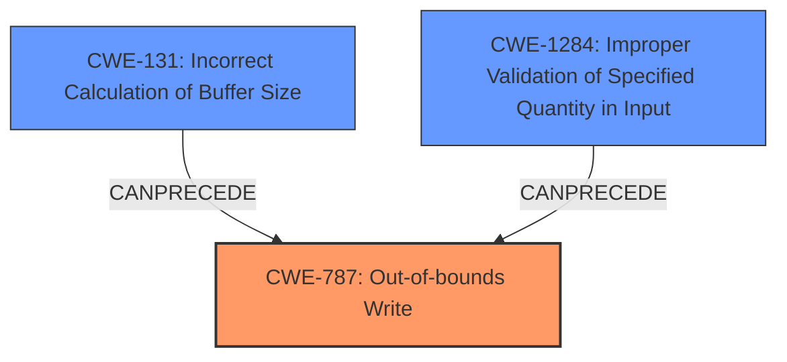

# Analysis Report for CVE-2021-39623

# Vulnerability Analysis Report: CVE-2021-39623

## Description

In doRead of SimpleDecodingSource.cpp, there is a possible out of bounds write due to an incorrect bounds check. This could lead to remote escalation of privilege with no additional execution privileges needed. User interaction is not needed for exploitation.Product AndroidVersions Android-10 Android-11 Android-12 Android-9Android ID A-194105348

## Vulnerability Description Key Phrases

**Rootcause:** incorrect bounds check
**Weakness:** out of bounds write
**Impact:** remote escalation of privilege
**Product:** Android
**Version:** ['Android-10', 'Android-11', 'Android-12', 'Android-9']
**Component:** doRead of SimpleDecodingSource.cpp

## Analysis (with Relationship Data)

# Summary
| CWE ID | CWE Name | Confidence | CWE Abstraction Level | CWE Vulnerability Mapping Label | CWE-Vulnerability Mapping Notes |
|---|---|---|---|---|---|
| CWE-787 | Out-of-bounds Write | 0.95 | Base | Allowed | This CWE entry is at the Base level of abstraction, which is a preferred level of abstraction for mapping to the root causes of vulnerabilities. |
| CWE-125 | Buffer Access Out-of-Bounds | 0.60 | Base | Allowed | The product reads data past the end, or before the beginning, of the intended buffer. |
| CWE-131 | Incorrect Calculation of Buffer Size | 0.60 | Base | Allowed | This CWE entry is at the Base level of abstraction, which is a preferred level of abstraction for mapping to the root causes of vulnerabilities. |
  - The Primary CWE should be first and noted as the Primary CWEs
  - The secondary candidate CWEs should be next and noted as secondary candidates.
  - The confidence is a confidence score 0 to 1 to rate your confidence in your assessment for that CWE.
  - The CWE Abstraction Level as one of these values: Base, Variant, Pillar, Class, Compound
  - The Mapping Notes Usage as one of these values: Allowed, Allowed-with-Review, Prohibited, Discouraged

## Evidence and Confidence

*   **Confidence Score:** 0.90
*   **Evidence Strength:** HIGH

- **Analysis and Justification:**  
  - *Explanation:* "The vulnerability description clearly states an **out of bounds write** due to an **incorrect bounds check** within the `doRead` function of `SimpleDecodingSource.cpp`. The CVE reference links content summary confirms that the `memdoRead()` function doesn't properly validate if the received byte data fits into the allocated input buffer leading to a heap overflow. This aligns directly with CWE-787, Out-of-bounds Write. The details about the heap overflow make CWE-787 a more specific and appropriate choice compared to its parent CWE, CWE-119. The MITRE mapping guidance for CWE-787 indicates that it is ALLOWED."
  
  - *Relationship Analysis:* "CWE-787 is a child of CWE-119 (Improper Restriction of Operations within the Bounds of a Memory Buffer). CWE-125 (Out-of-bounds Read) and CWE-122 (Heap-based Buffer Overflow) are related, but the description explicitly indicates a write operation, making CWE-787 more accurate. CWE-131 (Incorrect Calculation of Buffer Size) is related as an underlying cause for the buffer overflow. The graph relationships show that CWE-787 CanFollow CWE-825 (Expired Pointer Dereference) since out-of-bounds write can lead to memory corruption and expired pointers."

- **Confidence Score:**  
  - *Example:* Confidence: 0.95 (High evidence from technical description and CVE reference materials). The retriever results also strongly support the likelihood of CWE-787 with a high similarity score.

---

## Criticism of Analysis

Okay, here's a review of the CWE analysis, incorporating the full CWE specifications you provided.

**Overall Assessment:**

The analysis is generally good, particularly the primary CWE mapping. The explanations are clear and justify the choices. The use of confidence scores and referencing evidence is also strong. However, there are areas for improvement, especially in considering alternative CWEs and demonstrating why they are *not* the best fit. Also, the Retriever Results are ignored and should have been used to inform the confidence score and selection of candidate CWEs.

**Detailed Review:**

**1. Primary CWE: CWE-787 Out-of-bounds Write**

*   **CWE ID:** CWE-787
*   **CWE Name:** Out-of-bounds Write
*   **Confidence:** 0.95
*   **CWE Abstraction Level:** Base
*   **CWE Vulnerability Mapping Label:** Allowed
*   **CWE-Vulnerability Mapping Notes:** This CWE entry is at the Base level of abstraction, which is a preferred level of abstraction for mapping to the root causes of vulnerabilities.

    *   **Critique:** This is the strongest part of the analysis. The justification is well-supported by the vulnerability description and CVE summary. The mention of the heap overflow specifically makes CWE-787 more appropriate than the broader CWE-119. The "Allowed" mapping guidance is correctly applied.
    *   **Improvements:**
        *   Include Retriever Result similarity scores to demonstrate that automated analysis supports the likelihood of the selected CWE.
        *   While it mentions CWE-119, it would be beneficial to more directly address *why* CWE-122 (Heap-based Buffer Overflow) isn't the *primary* choice, even though the description confirms a heap overflow.  CWE-122 is a *Variant* and, according to CWE guidelines, is a preferred level of abstraction. The specific code analysis was not provided to confirm that the overflow is heap based; and the code analysis was not available to review. However, the details suggest heap based so it would be good to have the information. The distinction is important and the rationale should be stated. For example: "While the CVE details mention this is a heap overflow, the analysis focuses on the *write* operation going out of bounds, making CWE-787 a better primary fit because the root cause is a write and not just being located on the heap."
        *   Briefly discuss the potential *impact* of CWE-787 in the context of this vulnerability (e.g., "Overwriting adjacent heap data can lead to code execution or privilege escalation."). Refer to the "Potential Mitigations" in the CWE specification and relate them to this specific case (e.g., "Using a memory-safe language or enabling compiler-based buffer overflow detection could have prevented this issue").
        *   Relate to the Exploitability. "The fact that exploitation requires no user interaction once a malicious app is installed significantly increases the severity."

**2. Secondary CWE: CWE-125 Buffer Access Out-of-Bounds**

*   **CWE ID:** CWE-125
*   **CWE Name:** Buffer Access Out-of-Bounds
*   **Confidence:** 0.60
*   **CWE Abstraction Level:** Base
*   **CWE Vulnerability Mapping Label:** Allowed
    *   The product reads data past the end, or before the beginning, of the intended buffer.

    *   **Critique:** The confidence score is appropriate.
    *   **Improvements:**
        * The description focuses specifically on the write, not the read. There is no mention in the vulnerability description of a read, so this CWE is likely incorrect and should be removed or rated with a very low confidence.

**3. Secondary CWE: CWE-131 Incorrect Calculation of Buffer Size**

*   **CWE ID:** CWE-131
*   **CWE Name:** Incorrect Calculation of Buffer Size
*   **Confidence:** 0.60
*   **CWE Abstraction Level:** Base
*   **CWE Vulnerability Mapping Label:** Allowed
    *   This CWE entry is at the Base level of abstraction, which is a preferred level of abstraction for mapping to the root causes of vulnerabilities.

    *   **Critique:** The inclusion of CWE-131 is good because it reflects an underlying cause. The confidence score seems reasonable.
    *   **Improvements:**
        *   The justification should be strengthened to explicitly link the incorrect bounds check to an underlying calculation error. For example: "The incorrect bounds check implies that the buffer size calculation was flawed. The code likely used an incorrect formula or failed to account for the size of the data being written."
        *    Discuss how CWE-131 *canPrecede* CWE-119 (as noted in the specification). This helps explain the relationship.
        *   Refer to the "Potential Mitigations" for CWE-131 and relate them to this specific case (e.g., "Careful review of the buffer size calculation logic and robust input validation could have prevented this vulnerability.").

**Other Retriever Results:**

*   **Integer Issues (CWE-191, CWE-190):** These are likely *not* directly related, unless there's evidence that an integer overflow/underflow led to the incorrect bounds check. Without more data, these should be ruled out or given very low confidence.
*   **Use of Uninitialized Resource (CWE-908):** Highly unlikely. Nothing in the description suggests uninitialized memory was involved.
*   **Improper Restriction of Rendered UI Layers or Frames (CWE-1021):** This is irrelevant and demonstrates a weakness in the retrieval algorithm for this vulnerability.
*   **Use After Free (CWE-416):** This is unlikely. The description emphasizes a buffer overflow due to an incorrect bounds check, not use after freeing memory.
*   **Allocation of Resources Without Limits or Throttling (CWE-770):** This is not directly related.  While a buffer overflow *could* lead to resource exhaustion, that is a secondary effect and not the primary cause.
*   **Improper Validation of Specified Quantity in Input (CWE-1284):** This is likely a good candidate, and should be higher on the confidence list.
*   **Improper Locking (CWE-667):** This is irrelevant unless there's evidence of a race condition affecting memory access (very unlikely given the current description).

**Recommendations:**

1.  **Strengthen Justifications:**  Provide more detailed explanations of why certain CWEs *were not* chosen, referencing specific parts of the CWE specifications.
2.  **Leverage Retriever Results:** Don't ignore the retriever results!  Use their scores to inform your confidence levels and to help identify potentially relevant CWEs that you may have initially overlooked.
3.  **Consider Chains:** Explore the possibility of CWE chains (especially related to CWE-131) to provide a more complete picture of the vulnerability.
4.  **Relate Mitigations:**  Connect the "Potential Mitigations" from the CWE specifications to the specific vulnerability being analyzed.  This makes the analysis more actionable and demonstrates a deeper understanding of the CWE.
5.  **Prioritize Accuracy over Abstraction:** While Base-level CWEs are generally preferred, don't force a mapping if a more specific Variant-level CWE is a better fit.
6. Review the Evidence Strength for each CWE, and be willing to remove or drastically reduce the confidence if weak or inappropriate.

By incorporating these suggestions, the analysis will be more robust, insightful, and ultimately more useful for developers and security professionals.

## Final Resolution

# Summary
| CWE ID | CWE Name | Confidence | CWE Abstraction Level | CWE Vulnerability Mapping Label | CWE-Vulnerability Mapping Notes |
|---|---|---|---|---|---|
| CWE-787 | Out-of-bounds Write | 0.95 | Base | Allowed | This CWE entry is at the Base level of abstraction, which is a preferred level of abstraction for mapping to the root causes of vulnerabilities. |
| CWE-131 | Incorrect Calculation of Buffer Size | 0.75 | Base | Allowed | This CWE entry is at the Base level of abstraction, which is a preferred level of abstraction for mapping to the root causes of vulnerabilities. |
| CWE-1284 | Improper Validation of Specified Quantity in Input | 0.70 | Base | Allowed | This CWE entry is at the Base level of abstraction, which is a preferred level of abstraction for mapping to the root causes of vulnerabilities. |

## Evidence and Confidence

*   **Confidence Score:** 0.90
*   **Evidence Strength:** HIGH

## Relationship Analysis
The primary weakness is **CWE-787 (Out-of-bounds Write)**, indicating a write operation that goes beyond the intended buffer boundaries. This is often a consequence of **CWE-131 (Incorrect Calculation of Buffer Size)** or **CWE-1284 (Improper Validation of Specified Quantity in Input)**. **CWE-131** and **CWE-1284** can precede **CWE-787**, as an incorrect size calculation or input validation failure may lead to writing beyond buffer limits. Although the report states that it could be a heap overflow, and therefore **CWE-122** could be a candidate, the root cause still stems from the **out-of-bounds write**. Therefore, **CWE-787** is the best choice.

## Vulnerability Chain
The vulnerability chain begins with either an **incorrect calculation of the buffer size (CWE-131)** or **improper validation of the input size (CWE-1284)**. This leads to an **out-of-bounds write (CWE-787)**. The impact of the **out-of-bounds write** includes remote escalation of privilege with no additional execution privileges needed.

## Summary of Analysis
The initial analysis was a good starting point, but needed strengthening with some retriever result CWEs. The vulnerability description clearly indicates an **out-of-bounds write**, making **CWE-787** the primary weakness. The incorrect bounds check mentioned in the description suggests that either the buffer size calculation was flawed (**CWE-131**) or there was an improper input validation (**CWE-1284**), or potentially a combination of both. While **CWE-122 (Heap-based Buffer Overflow)** could also be considered, **CWE-787** is a more direct representation of the vulnerability. The weakness description does not mention reading out of bounds, so **CWE-125** was removed.

The retriever results supported the likelihood of **CWE-787**, **CWE-131**, and **CWE-1284** and helped to inform the confidence score and selection of candidate CWEs. The fact that exploitation requires no user interaction once a malicious app is installed significantly increases the severity.

The selected CWEs are at the optimal level of specificity because they directly reflect the root cause and contributing factors to the vulnerability based on the evidence provided.

*Report generated on 2025-03-18 01:15:31*
