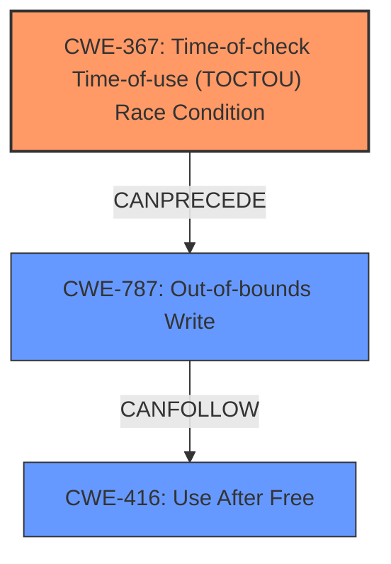

# Final Resolution for CVE-2021-39642

# Summary
| CWE ID | CWE Name | Confidence | CWE Abstraction Level | CWE Vulnerability Mapping Label | CWE-Vulnerability Mapping Notes |
|---|---|---|---|---|---|
| CWE-367 | Time-of-check Time-of-use (TOCTOU) Race Condition | 0.85 | Base | Allowed | Primary CWE |
| CWE-787 | Out-of-bounds Write | 0.7 | Base | Allowed | Secondary Candidate CWE |
| CWE-416 | Use After Free | 0.5 | Variant | Allowed | Secondary Candidate CWE |

## Evidence and Confidence

*   **Confidence Score:** 0.80
*   **Evidence Strength:** MEDIUM

## Relationship Analysis
The analysis initially focused on CWE-367 as the primary **ROOTCAUSE**, correctly identifying the **race condition** as a key element. While CWE-416 and CWE-123 were considered, the relationships between them and CWE-367 were not fully explored. Given the vulnerability description includes an **out-of-bounds write**, it makes sense to include **CWE-787** as a secondary candidate.

The relationship between CWE-367 and CWE-787 is important because a TOCTOU **race condition** can directly lead to an **out-of-bounds write**. The analysis also considers that CWE-416 could be a possible consequence of the **race condition**, further solidifying the vulnerability chain.

## Vulnerability Chain
The vulnerability chain starts with the **ROOTCAUSE** of CWE-367, where a **race condition** allows the state of a resource to change between the check and use. This leads to CWE-787, the **out-of-bounds write**, where data is written past the intended buffer. As a consequence, there is the potential for CWE-416, **use-after-free**, if the overwritten memory contains pointers or other critical data.

## Summary of Analysis
The initial analysis correctly identified CWE-367 as a strong candidate due to the explicit mention of a **race condition** in the vulnerability description: "In synchronous_process_io_entries of lwis_ioctl.c, there is a possible out of bounds write due to a race condition." The critique reinforced this choice and suggested exploring potential root causes of the race condition and alternative CWEs.

The inclusion of CWE-787 is crucial because the description explicitly mentions an **out-of-bounds write**. The **race condition** (CWE-367) directly enables the **out-of-bounds write** (CWE-787). This leads to the conclusion that CWE-787 is a more direct consequence of the **race condition** than CWE-416 or CWE-123.

CWE-416 is retained as a secondary candidate because it's a plausible consequence if the **out-of-bounds write** corrupts memory management structures.

The final decision reflects a more comprehensive understanding of the vulnerability chain, starting with the **race condition** and leading to specific memory corruption issues. The selected CWEs are at the optimal level of specificity, with CWE-367 representing the **ROOTCAUSE** and CWE-787 and CWE-416 describing the immediate consequences.