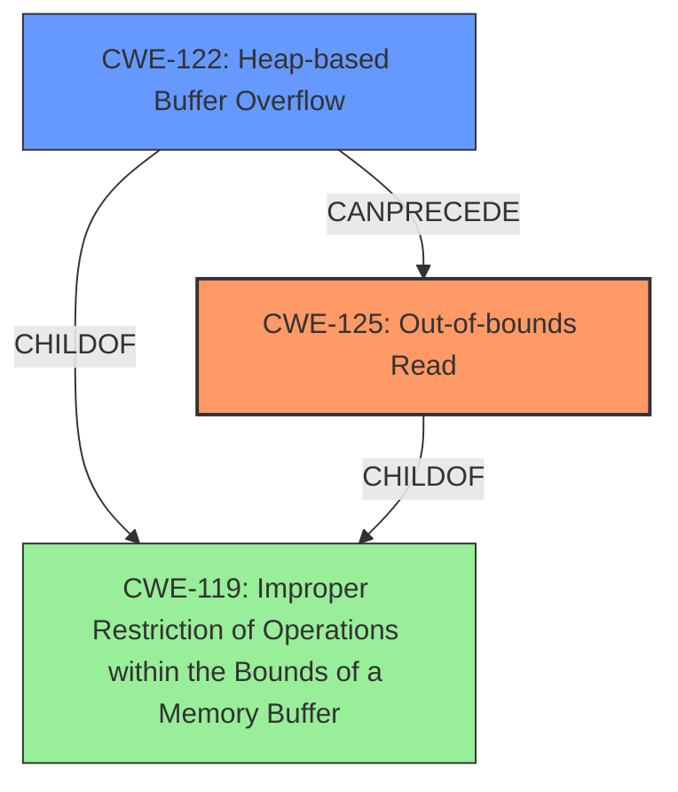

# Final Resolution for CVE-2021-39665

# Summary
| CWE ID | CWE Name | Confidence | CWE Abstraction Level | CWE Vulnerability Mapping Label | CWE-Vulnerability Mapping Notes |
|---|---|---|---|---|---|
| CWE-125 | Out-of-bounds Read | 0.95 | Base | Allowed | This CWE entry is at the Base level of abstraction, which is a preferred level of abstraction for mapping to the root causes of vulnerabilities. Caused by a **heap buffer overflow** leading to information disclosure. Mitigate via strict input validation and memory safety mechanisms. |
| CWE-122 | Heap-based Buffer Overflow | 0.75 | Variant | Allowed | This CWE entry is at the Variant level of abstraction, which is a preferred level of abstraction for mapping to the root causes of vulnerabilities. Root cause of **out-of-bounds read** (CWE-125). Occurs when writing past allocated heap memory. Mitigate via bounds checking, safe memory management, and overflow detection. |

## Evidence and Confidence

*   **Confidence Score:** 0.90
*   **Evidence Strength:** HIGH

## Relationship Analysis
The analysis focuses on the hierarchical relationship between CWE-122 and its parent CWE-119, and the chain relationship where CWE-122 (Heap-based Buffer Overflow) leads to CWE-125 (**Out-of-bounds Read**). The abstraction levels (Base and Variant) are appropriate. The relationship analysis shows a clear progression: a **heap buffer overflow** writes past the allocated memory, corrupting data, which is then accessed by an **out-of-bounds read**, leading to information disclosure.

## Vulnerability Chain
The vulnerability chain starts with a **heap buffer overflow** (CWE-122). This overflow corrupts adjacent memory. Subsequently, an **out-of-bounds read** (CWE-125) occurs, accessing the corrupted memory and leading to information disclosure. The **heap overflow** is the **root cause**, and the **out-of-bounds read** is the direct consequence that leads to the impact.

## Summary of Analysis
The initial analysis and the provided criticism are both accurate. The vulnerability description clearly indicates an "**out of bounds read due to a heap buffer overflow**". The evidence is strong, with confirmations from the CVE Reference Links Content Summary ("**out-of-bounds read**") and the commit message ("Prevent out-of-bounds read"). CWE-125 (Out-of-bounds Read) is correctly identified as the primary weakness because it is the direct effect observed. CWE-122 (Heap-based Buffer Overflow) is the **root cause** that triggers the out-of-bounds read.

The graph relationships confirm that CWE-122, a Variant, leads to CWE-125, a Base CWE, both children of CWE-119. The selected CWEs are at the optimal level of specificity, as they directly describe the vulnerability and its cause. Using CWE-119 directly would be too general.

The assessment is heavily based on the provided evidence, specifically the vulnerability description: "In checkSpsUpdated of AAVCAssembler.cpp, there is a possible **out of bounds read due to a heap buffer overflow**." This evidence directly supports the selection of CWE-125 and CWE-122.