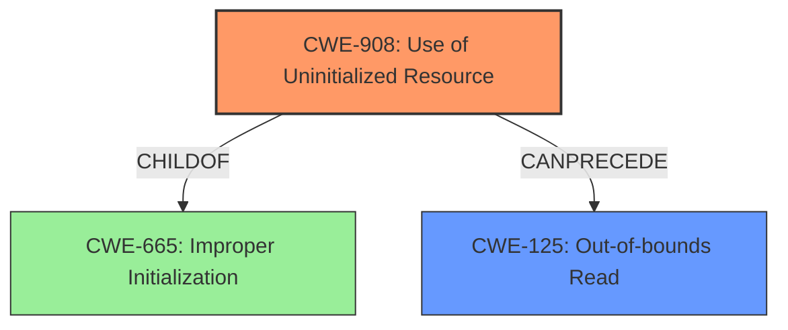

# Final Resolution for CVE-2021-39671

# Summary
| CWE ID  | CWE Name                       | Confidence | CWE Abstraction Level | CWE Vulnerability Mapping Label | CWE-Vulnerability Mapping Notes |
|---------|--------------------------------|------------|-----------------------|---------------------------------|-------------------------------|
| **CWE-908** | **Use of Uninitialized Resource** | 0.90       | Base                  | Allowed                         | Primary CWE                   |
| CWE-125 | Out-of-bounds Read             | 0.70       | Base                  | Allowed                         | Secondary Candidate           |

## Evidence and Confidence

*   **Confidence Score:** 0.90
*   **Evidence Strength:** HIGH

## Relationship Analysis
The primary relationship impacting the decision is the hierarchical relationship between CWE-665 (**Improper Initialization**) and CWE-908 (**Use of Uninitialized Resource**), where CWE-908 is a more specific child of CWE-665. The chain relationship also played a role, with CWE-908 potentially preceding CWE-125 (**Out-of-bounds Read**). The abstraction level of CWE-908 (Base) is preferred for root cause analysis.

## Vulnerability Chain
The vulnerability chain starts with the **uninitialized data** (CWE-908), which, when used as an index or offset, leads to an out-of-bounds read (CWE-125), resulting in information disclosure.

## Summary of Analysis
The initial analysis correctly identified CWE-908 (**Use of Uninitialized Resource**) as the primary **ROOTCAUSE**. The vulnerability description explicitly states "In code generated by aidl_const_expressions.cpp, there is a possible out of bounds read due to **uninitialized data**." This is direct evidence supporting the selection of CWE-908. The criticism suggested considering a more specific variant of CWE-908, such as CWE-457 (**Missing Initialization of a Variable**) or CWE-824 (**The product accesses or uses a pointer that has not been initialized.**). However, the available information does not specify whether the **uninitialized data** is specifically a variable or a pointer; thus, CWE-908 remains the most appropriate and general classification. The relationship analysis confirmed that CWE-908 is a more specific child of CWE-665 (**Improper Initialization**), justifying its selection over the parent class. The decision is based on the provided evidence and the desire to maintain the optimal level of specificity.