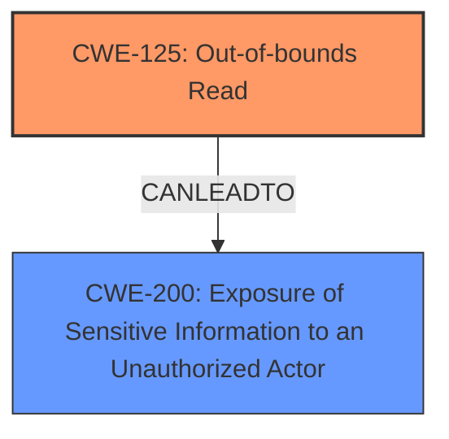

# Final Resolution for CVE-2021-39688

# Summary
| CWE ID | CWE Name | Confidence | CWE Abstraction Level | CWE Vulnerability Mapping Label | CWE-Vulnerability Mapping Notes |
|---|---|---|---|---|---|
| CWE-125 | Out-of-bounds Read | 0.95 | Base | Allowed | Primary CWE |
| CWE-200 | Exposure of Sensitive Information to an Unauthorized Actor | 0.6 | Class | Allowed-with-Review | Secondary Candidate |

## Evidence and Confidence

*   **Confidence Score:** 0.9
*   **Evidence Strength:** HIGH

## Relationship Analysis
The primary relationship that impacted the decision was the direct match of the vulnerability description to **CWE-125** (Out-of-bounds Read). While **CWE-203** (Information Exposure Through Discrepancy) was initially considered, **CWE-200** (Exposure of Sensitive Information to an Unauthorized Actor) is a more appropriate secondary classification as it more directly represents the consequence of the **out-of-bounds read**. **CWE-200** is a class-level CWE, but in this case, it's acceptable because the specific type of information exposure isn't detailed enough to map to a more specific base CWE. The hierarchical relationship places **CWE-125** as a more specific cause that can lead to the more general **CWE-200**.

## Vulnerability Chain
The vulnerability chain starts with the **ROOTCAUSE**, which is an out-of-bounds read (**CWE-125**). This **WEAKNESS** allows the program to access memory locations it shouldn't, leading to the exposure of sensitive information (**CWE-200**). The final impact is local information disclosure. There are no missing links based on the provided description, although the exact mechanism of the **out-of-bounds read** (e.g., incorrect index calculation) isn't specified.

## Summary of Analysis
The initial analysis correctly identified **CWE-125** as the primary **WEAKNESS** due to the explicit mention of an "**out of bounds read**" in the vulnerability description. The criticism suggested strengthening the justification for the secondary candidate and considering other options.

Based on the criticism and further analysis, **CWE-200** is a better fit than **CWE-203** as a secondary classification. The vulnerability description clearly states that the **out-of-bounds read** leads to "local **information disclosure**". While **CWE-203** involves observable discrepancies, **CWE-200** directly addresses the exposure of sensitive information.

The final decision is based on the following evidence:

*   Vulnerability Description: "In TBD of TBD, there is a possible **out of bounds read** due to TBD. This could lead to local **information disclosure** with no additional execution privileges needed."
*   **CWE-125** Description: "The product reads data past the end, or before the beginning, of the intended buffer."
*   **CWE-200** Description: "The product exposes sensitive information to an unauthorized actor."

The selected CWEs are at the optimal level of specificity. **CWE-125** is a base-level CWE that directly addresses the **ROOTCAUSE**. **CWE-200** is a class-level CWE, which is appropriate because the specific type of exposed information is not detailed. If the type of information disclosure were more specific (e.g., exposure of credentials), a more specific child of **CWE-200** might be selected.