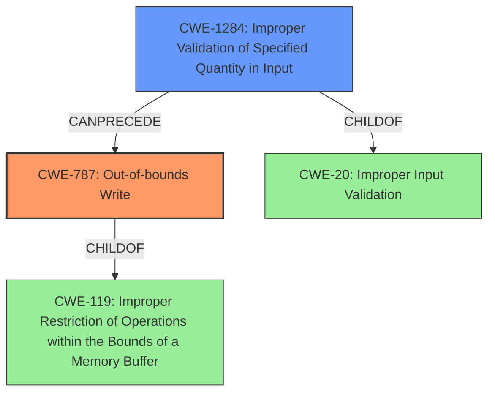

# Final Resolution for CVE-2021-39708

# Summary
| CWE ID | CWE Name | Confidence | CWE Abstraction Level | CWE Vulnerability Mapping Label | CWE-Vulnerability Mapping Notes |
|---|---|---|---|---|---|
| CWE-787 | Out-of-bounds Write | 0.85 | Base | Allowed | Primary CWE. The vulnerability description explicitly states an **out of bounds write** due to an **incorrect bounds check**. |
| CWE-1284 | Improper Validation of Specified Quantity in Input | 0.6 | Base | Allowed | Secondary CWE. Because the **incorrect bounds check** leads to the **out of bounds write**. The specified quantity (size/length) was not properly validated.|

## Evidence and Confidence

*   **Confidence Score:** 0.75
*   **Evidence Strength:** MEDIUM

## Relationship Analysis
The most impactful relationship was the parent-child relationship between CWE-787 (Out-of-bounds Write) and CWE-119 (Improper Restriction of Operations within the Bounds of a Memory Buffer). While CWE-119 is a parent, it is discouraged when a more specific child like CWE-787 is applicable. The child relationship between CWE-1284 (Improper Validation of Specified Quantity in Input) and CWE-20 (Improper Input Validation) highlights that the root cause is a failure to validate input. The chain relationship shows CWE-1284 can precede CWE-787: improper validation leads to an out-of-bounds write.

## Vulnerability Chain
The vulnerability chain starts with the **incorrect bounds check** (CWE-1284), which allows an **out-of-bounds write** (CWE-787). The **incorrect bounds check** is a failure of input validation, where the quantity (size/length) of the input is not properly validated. This leads to writing data beyond the intended buffer, potentially causing remote escalation of privilege.

## Summary of Analysis
The initial analysis was mostly correct, but it incorrectly identified the primary CWE as CWE-125 (Out-of-bounds Read), when the vulnerability description explicitly stated "**out of bounds write**". The criticism correctly pointed out that CWE-787 (Out-of-bounds Write) is the more accurate and specific choice. The analysis is based on the provided evidence, specifically the phrase "**out of bounds write** due to an **incorrect bounds check**". The graph relationships influenced the final selection by showing the connection between the **improper input validation** (CWE-1284) and the resulting **out-of-bounds write** (CWE-787). The selected CWEs are at the optimal level of specificity because CWE-787 directly reflects the vulnerability, and CWE-1284 identifies the root cause of the **incorrect bounds check**. I agree with the criticism that CWE-787 is more appropriate, and therefore, I am updating the primary CWE.