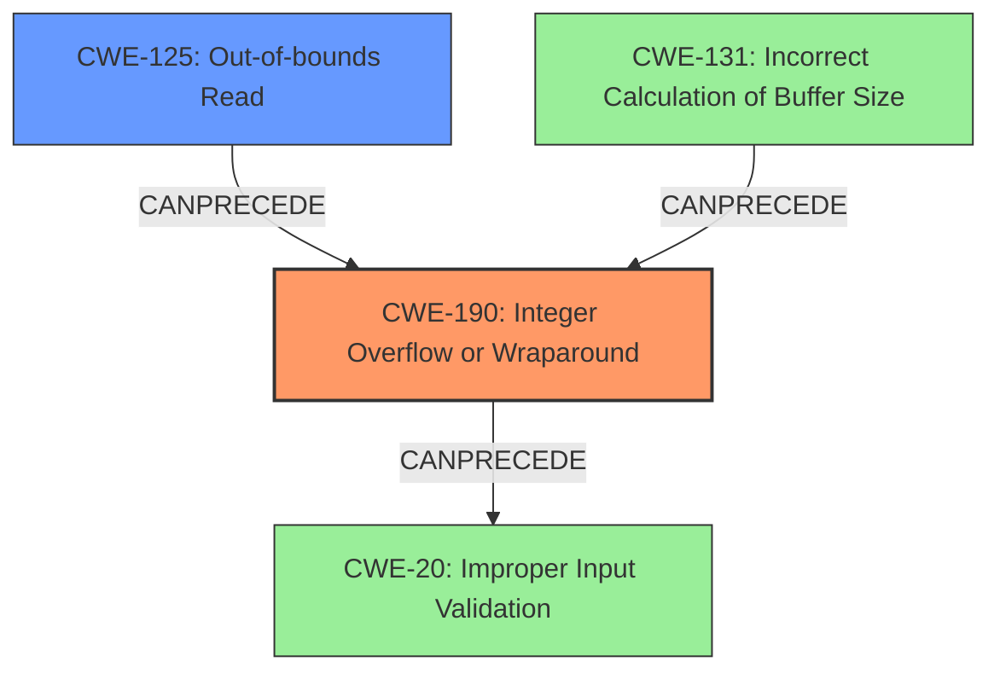

# Final Resolution for CVE-2021-39762

# Summary
| CWE ID | CWE Name | Confidence | CWE Abstraction Level | CWE Vulnerability Mapping Label | CWE-Vulnerability Mapping Notes |
|---|---|---|---|---|---|
| CWE-190 | Integer Overflow or Wraparound | 0.9 | Base | Allowed | Primary CWE: The vulnerability is caused by an integer overflow during a calculation related to media processing. |
| CWE-125 | Out-of-bounds Read | 0.7 | Base | Allowed | Secondary CWE: The integer overflow directly leads to an out-of-bounds read, as the overflowed value is used as an index, resulting in remote information disclosure. |

## Evidence and Confidence

*   **Confidence Score:** 0.9
*   **Evidence Strength:** HIGH

## Relationship Analysis
The primary weakness is **CWE-190 (Integer Overflow or Wraparound)**, which occurs when a calculation results in a value exceeding the maximum representable value. This leads directly to **CWE-125 (Out-of-bounds Read)** because the overflowed value is then used as an invalid index to access memory. While **CWE-131 (Incorrect Calculation of Buffer Size)** is related, the vulnerability description directly links the **overflow** to the out-of-bounds read, making **CWE-125** a more direct consequence. Input validation, or lack thereof (**CWE-20 Improper Input Validation**), could be a contributing factor to the **integer overflow**, however, the **overflow** itself is the core problem. Both **CWE-190** and **CWE-125** are base-level CWEs, which are preferred for root cause analysis.

## Vulnerability Chain
The vulnerability chain starts with an **integer overflow (CWE-190)** during a calculation, likely related to media processing in the Tremolo component. The **overflowed** value is then used as an index to access a buffer, leading to an **out-of-bounds read (CWE-125)**. This results in remote information disclosure, as sensitive data outside the intended buffer can be read.

## Summary of Analysis
The initial analysis correctly identified **CWE-190 (Integer Overflow or Wraparound)** as the primary weakness and **CWE-125 (Out-of-bounds Read)** as the secondary weakness. The criticism suggested further exploration of alternative CWEs and a deeper explanation of how the overflow leads to the out-of-bounds read.

The vulnerability description states "In tremolo, there is a possible out of bounds read due to an **integer overflow**." This direct link between the **integer overflow** and the out-of-bounds read provides strong evidence for these classifications. The fact that the CVE Reference Links Content Summary highlights an "Information Disclosure vulnerability exists within the Media Framework component of Android 12L" implies that the out-of-bounds read directly caused information disclosure.

The graph relationships influenced the decision by highlighting potential alternative CWEs, such as **CWE-131 (Incorrect Calculation of Buffer Size)**, which could arise from an **integer overflow**. However, the direct connection between the **overflow** and the out-of-bounds read, as described in the vulnerability report, made **CWE-125** the more appropriate secondary weakness.

The selected CWEs are at the optimal level of specificity because they directly address the root cause (**CWE-190**) and the immediate consequence (**CWE-125**) of the vulnerability.