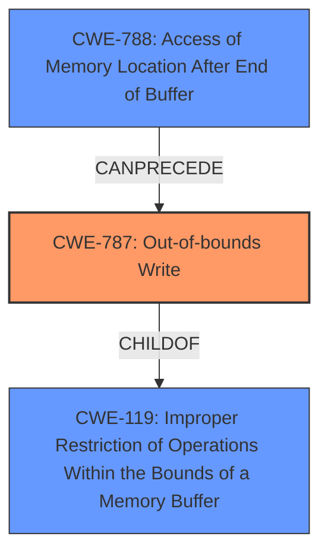

# Final Resolution for CVE-2021-39820

# Summary
| CWE ID | CWE Name | Confidence | CWE Abstraction Level | CWE Vulnerability Mapping Label | CWE-Vulnerability Mapping Notes |
|---|---|---|---|---|---|
| CWE-787 | Out-of-bounds Write | 0.95 | Base | Allowed | Primary CWE. Vulnerability is described as a write beyond buffer boundary, leading to potential arbitrary code execution. Directly matches the description of CWE-787. |
| CWE-788 | Access of Memory Location After End of Buffer | 0.75 | Base | Discouraged | Secondary Candidate. CVE reference identifies this as a root cause, but it's discouraged in favor of more specific CWEs like CWE-787 when the access operation is known to be a write. |

## Evidence and Confidence

*   **Confidence Score:** 0.95
*   **Evidence Strength:** HIGH

## Relationship Analysis
The decision to primarily classify this vulnerability as CWE-787 was influenced by its direct relationship as a child of CWE-119 (Improper Restriction of Operations Within the Bounds of a Memory Buffer). While CWE-119 is a class-level CWE and less specific, CWE-787 provides a base-level description focusing on the "write" operation that goes out of bounds. Although the specific type of buffer (heap or stack) isn't specified, the base-level CWE-787 is more appropriate than the class-level CWE-119. CWE-788 was considered as a possible root cause, but the analysis correctly favors CWE-787 because it explicitly describes the vulnerability's write operation.

## Vulnerability Chain
The vulnerability chain starts with the insecure handling of a malicious TIFF file, leading to an **out-of-bounds write (CWE-787)**. This **weakness** allows an attacker to write data past the end of the intended buffer, potentially overwriting critical program data or injecting malicious code. The **impact** of this vulnerability is arbitrary code execution in the context of the current user.

## Summary of Analysis
The initial analysis and the subsequent criticism both converge on the conclusion that CWE-787 (Out-of-bounds Write) is the most appropriate primary classification for this vulnerability. This assessment is based on the direct match between the vulnerability description ("Out-of-bounds Write") and the CWE-787 description.

The vulnerability description explicitly states: "Adobe InDesign versions 16.3 (and earlier), and 16.3.1 (and earlier) is affected by an Out-of-bounds Write vulnerability due to insecure handling of a malicious TIFF file, potentially resulting in arbitrary code execution in the context of the current user."

The graph relationships, specifically CWE-787 being a child of CWE-119, reinforce the decision by placing it within the context of broader memory management issues. The mapping guidance for CWE-787 supports its usage as a base-level CWE. The retriever score for CWE-787 is high, further solidifying its relevance. The choice of CWE-787 is at the optimal level of specificity because it accurately describes the **weakness** (out-of-bounds write) without making assumptions about the specific type of memory being affected (heap or stack).