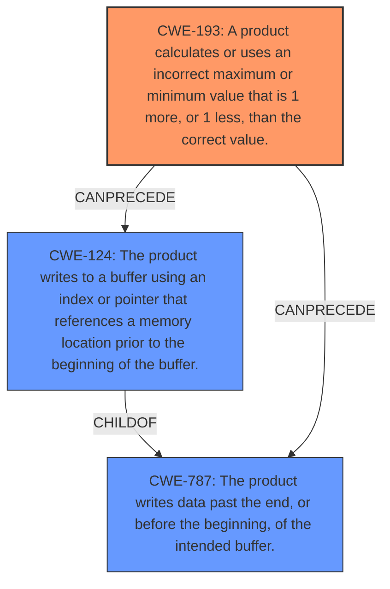

# Final Resolution for CVE-2021-3999

# Summary
| CWE ID | CWE Name | Confidence | CWE Abstraction Level | CWE Vulnerability Mapping Label | CWE-Vulnerability Mapping Notes |
|---|---|---|---|---|---|
| CWE-193 | A product calculates or uses an incorrect maximum or minimum value that is 1 more, or 1 less, than the correct value. | 1.0 | Base | Allowed | Primary CWE: The vulnerability is caused by an **off-by-one buffer overflow and underflow** in `getcwd()`. |
| CWE-124 | The product writes to a buffer using an index or pointer that references a memory location prior to the beginning of the buffer. | 0.7 | Base | Allowed | Secondary Candidate: The vulnerability description mentions an **underflow** condition. |
| CWE-787 | The product writes data past the end, or before the beginning, of the intended buffer. | 0.6 | Base | Allowed | Secondary Candidate: The **overflow** condition could lead to an out-of-bounds write. |

## Evidence and Confidence

*   **Confidence Score:** 0.9
*   **Evidence Strength:** HIGH

## Relationship Analysis
The primary **weakness** is identified as CWE-193, which directly addresses the **off-by-one error**. The secondary **weaknesses**, CWE-124 and CWE-787, are consequences of this error, specifically the buffer underwrite and out-of-bounds write, respectively. The hierarchical relationship shows that CWE-124 is a child of CWE-787, indicating that the underwrite is a specific type of out-of-bounds write. The chain relationship illustrates that the **off-by-one error** can lead to either a buffer underwrite or an out-of-bounds write, ultimately causing memory corruption.

## Vulnerability Chain
The vulnerability chain starts with an **off-by-one error (CWE-193)** in the `getcwd()` function. This error can then lead to either a buffer underwrite **(CWE-124)**, where data is written before the beginning of the allocated buffer, or an out-of-bounds write **(CWE-787)**, where data is written past the end of the buffer. Both of these conditions can cause memory corruption, which could potentially lead to arbitrary code execution and privilege escalation.

## Summary of Analysis
The initial analysis correctly identifies CWE-193 as the primary **weakness** due to the explicit mention of an **off-by-one error** in the vulnerability description. The inclusion of CWE-124 and CWE-787 is justified as they represent potential consequences of this error.

The vulnerability description explicitly states an "**off-by-one buffer overflow and underflow** in the `getcwd()` function of glibc. This directly aligns with CWE-193 (Off-by-one Error). The vulnerability occurs when the buffer size is exactly 1, leading to memory corruption."

The criticism correctly points out that further explanation of the mechanisms by which the **off-by-one error** leads to out-of-bounds writes or reads would strengthen the analysis. It also suggests exploring potential contributing factors such as integer overflows or incorrect buffer size calculations.

The graph relationships influenced the final selection by highlighting how the **off-by-one error** can directly precede either a buffer underwrite or an out-of-bounds write. This reinforces the importance of CWE-193 as the root cause and CWE-124 and CWE-787 as consequences.

The selected CWEs are at the optimal level of specificity because they directly address the specific flaws described in the vulnerability. CWE-193 captures the **off-by-one error**, while CWE-124 and CWE-787 represent the potential consequences of this error.