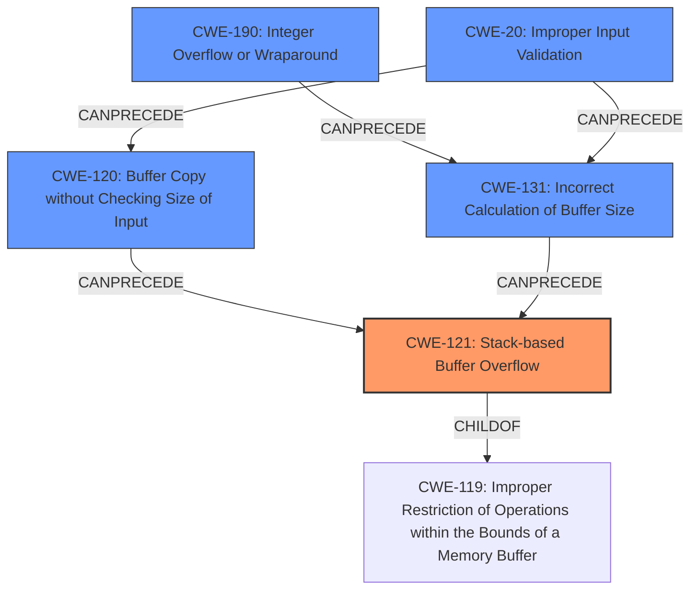

# Analysis Report for CVE-2021-39990

# Vulnerability Analysis Report: CVE-2021-39990

## Description

The screen lock module has a Stack-based Buffer Overflow vulnerability.Successful exploitation of this vulnerability may affect user experience.

## Vulnerability Description Key Phrases

**Weakness:** Stack-based Buffer Overflow
**Impact:** affect user experience
**Product:** screen lock module

## Analysis (with Relationship Data)

# Summary
| CWE ID | CWE Name | Confidence | CWE Abstraction Level | CWE Vulnerability Mapping Label | CWE-Vulnerability Mapping Notes |
|---|---|---|---|---|---|
| CWE-121 | Stack-based Buffer Overflow | 1.0 | Variant | Allowed | Primary CWE |

## Evidence and Confidence

*   **Confidence Score:** 1.0
*   **Evidence Strength:** HIGH

- **Analysis and Justification:**  
  - *Explanation:* The vulnerability description explicitly states a "**Stack-based Buffer Overflow**" vulnerability exists in the screen lock module. CWE-121 (Stack-based Buffer Overflow) directly matches this description. CWE-121 is a Variant of CWE-119 (Improper Restriction of Operations within the Bounds of a Memory Buffer) which is a more general class of buffer overflow vulnerabilities, but CWE-121 is more specific and therefore more appropriate.
  
  - *Relationship Analysis:* CWE-121 is a variant of CWE-119.

- **Confidence Score:**  
  - Confidence: 1.0 (The vulnerability description directly states the CWE.)

## Criticism of Analysis

## Critique of the Analysis

The analysis correctly identifies CWE-121 (Stack-based Buffer Overflow) as the primary CWE based on the vulnerability description. The confidence score of 1.0 is justified since the description explicitly names the vulnerability type. The evidence strength is HIGH due to this direct match.

However, there are several points to consider that would improve the analysis:

**1. Completeness and Specificity:**

*   While CWE-121 is a good starting point, the analysis could be enhanced by exploring potential root causes. The analysis correctly identifies CWE-121 as a variant of CWE-119.

**2. Relationships and Chains:**

*   The analysis mentions the relationship between CWE-121 and CWE-119. It's beneficial but needs more details on how they relate to each other. For example, a chain of weaknesses leading to the Stack-based Buffer Overflow could be present.
*   Specifically, the analysis lacks exploring possible preceding CWEs such as:
    *   **CWE-120 (Buffer Copy without Checking Size of Input):**  Is the overflow caused by copying data into a stack buffer without proper size checks?  This is a common scenario.
    *   **CWE-131 (Incorrect Calculation of Buffer Size):** Was the buffer allocated on the stack too small due to an incorrect size calculation?
    *   **CWE-20 (Improper Input Validation):**  Was the input, which ultimately caused the overflow, not properly validated, allowing it to exceed the buffer's capacity?
    *   **CWE-190 (Integer Overflow or Wraparound):** Could an integer overflow have led to an insufficient buffer size calculation?

**3. Retriever Results Examination:**

*   The retriever results table suggests other relevant CWEs. While CWE-121 is the most direct match, the analysis should consider why other CWEs appear high in the results and rule them out with reasoning if necessary. For example:
    *   **CWE-125 (Out-of-bounds Read):** Could the vulnerability involve reading data beyond the allocated buffer's bounds *before* the overflow occurs? It is possible to have a read leading to a write.
    *   **CWE-120 (Buffer Copy without Checking Size of Input):**  This is a very common cause for buffer overflows, as mentioned above. It's a strong candidate for a root cause.
    *   **CWE-190 (Integer Overflow or Wraparound):** If the buffer size calculation involves arithmetic, an integer overflow could be a contributing factor.
    *   **CWE-131 (Incorrect Calculation of Buffer Size):** Was the stack buffer size calculated incorrectly?

**4. Mitigations:**

*   The analysis should discuss mitigations specific to CWE-121 *and* potential root causes. The provided CWE specifications offer mitigations for all the CWEs discussed above.
*   Consider including some of these mitigations in the analysis report to provide actionable security recommendations.  For example, for CWE-121:
    *   Use compiler extensions that automatically detect buffer overflows (e.g., /GS flag in Visual Studio, FORTIFY\_SOURCE in GCC).
    *   Implement bounds checking on input.
    *   Use abstraction libraries to handle risky APIs.
*   For CWE-20 (if applicable as a potential root cause): Implement robust input validation.
*   For CWE-131 (if applicable): carefully calculate buffer sizes.
*    For CWE-120 (if applicable): check the size of the input before copying to ensure it does not exceed the buffer size.

**5. Observed Examples from CWE database:**

*   The analysis includes observed examples of CWE-119. Since the identified CWE is CWE-121, adding observed examples of CWE-121 would reinforce the mapping. For example, the analysis could include CVE-2021-35395.

**Revised Summary Table (Example with Potential Chain):**

| CWE ID | CWE Name | Confidence | CWE Abstraction Level | CWE Vulnerability Mapping Label | CWE-Vulnerability Mapping Notes |
|---|---|---|---|---|---|
| CWE-121 | Stack-based Buffer Overflow | 0.9 | Variant | Allowed | Primary CWE |
| CWE-120 | Buffer Copy without Checking Size of Input ('Classic Buffer Overflow') | 0.7 | Base | Allowed-with-Review | Possible Root Cause: Data copied to the stack buffer without size check. |
| CWE-20 | Improper Input Validation | 0.5 | Class | Discouraged | Contributing Factor: Input may not be properly validated, enabling a larger than expected input.|

**Improved Analysis Snippet (Example):**

"The vulnerability description explicitly states a 'Stack-based Buffer Overflow' vulnerability exists in the screen lock module. CWE-121 (Stack-based Buffer Overflow) directly matches this description. While CWE-121 is a Variant of CWE-119 (Improper Restriction of Operations within the Bounds of a Memory Buffer), it is more specific and therefore more appropriate.  However, it is important to consider potential root causes of this overflow. A likely cause is CWE-120 (Buffer Copy without Checking Size of Input), where data is copied into the stack buffer without verifying its size. This could be due to a missing or inadequate size check before the copy operation.  Furthermore, the root cause may be related to CWE-20, as a lack of input validation may allow an attacker to control the size of the input copied to the stack buffer. The lack of input validation may also be directly related to CWE-120.  Another possible contributing factor is CWE-131, in which an incorrect calculation of buffer size may have led to the size of the buffer on the stack being too small. If an integer overflow occurred when calculating the buffer size before allocation, that would be an example of CWE-190."

In conclusion, the initial analysis correctly identifies the primary CWE. However, a deeper investigation into potential root causes, relationships, and mitigations, as suggested by the retriever results and the full CWE specifications, would significantly improve the overall quality and usefulness of the analysis.

## Final Resolution

# Summary
| CWE ID | CWE Name | Confidence | CWE Abstraction Level | CWE Vulnerability Mapping Label | CWE-Vulnerability Mapping Notes |
|---|---|---|---|---|---|
| CWE-121 | Stack-based Buffer Overflow | 0.9 | Variant | Allowed | Primary CWE |
| CWE-120 | Buffer Copy without Checking Size of Input ('Classic Buffer Overflow') | 0.7 | Base | Allowed-with-Review | Secondary Candidate: Potential Root Cause |
| CWE-190 | Integer Overflow or Wraparound | 0.4 | Base | Allowed | Secondary Candidate: Contributing Factor to Incorrect Buffer Size Calculation |
| CWE-131 | Incorrect Calculation of Buffer Size | 0.4 | Base | Allowed | Secondary Candidate: Contributing Factor to Incorrect Buffer Size Calculation |
| CWE-20 | Improper Input Validation | 0.3 | Class | Discouraged | Secondary Candidate: Contributing Factor to Input Size |

## Evidence and Confidence

*   **Confidence Score:** 0.7
*   **Evidence Strength:** MEDIUM

## Relationship Analysis
The analysis considers the parent-child relationship between CWE-121 and CWE-119, correctly identifying CWE-121 as a more specific variant. It also explores potential chain relationships, considering CWE-120, CWE-131, CWE-190 and CWE-20 as potential causes that could precede CWE-121. The abstraction levels influenced the decision to prefer the base-level CWEs for potential root causes.

## Vulnerability Chain
The vulnerability chain starts with a potential root cause such as **CWE-20 (Improper Input Validation)**, **CWE-131 (Incorrect Calculation of Buffer Size)**, **CWE-190 (Integer Overflow or Wraparound)** and/or **CWE-120 (Buffer Copy without Checking Size of Input)**. The incorrect calculation of the buffer size, or unchecked copy leads to **CWE-121 (Stack-based Buffer Overflow)**. The overflow on the stack then leads to the impact of affecting user experience.

## Summary of Analysis
The initial analysis correctly identified **CWE-121 (Stack-based Buffer Overflow)** as the primary weakness based on the vulnerability description stating "Stack-based Buffer Overflow vulnerability". However, the criticism highlighted the need to investigate potential root causes and contributing factors. The retriever results also suggested other relevant CWEs.

The graph relationships influenced the final selection by highlighting potential chains of weaknesses. **CWE-120 (Buffer Copy without Checking Size of Input)** was identified as a potential root cause because it's a common scenario where data is copied into a stack buffer without proper size checks. **CWE-131 (Incorrect Calculation of Buffer Size)** and **CWE-190 (Integer Overflow or Wraparound)** were considered as contributing factors because they could lead to the buffer being allocated too small on the stack. **CWE-20 (Improper Input Validation)** was considered as a possible contributing factor, allowing the input to exceed the buffer's capacity.

The selected CWEs are at the optimal level of specificity. **CWE-121 (Stack-based Buffer Overflow)** is a specific variant of buffer overflow. The other CWEs are base-level and can directly contribute to the **WEAKNESS**. The evidence for **CWE-121 (Stack-based Buffer Overflow)** is strong due to the direct mention in the vulnerability description. The evidence for the other CWEs is less direct, but plausible given the nature of buffer overflows. The final confidence score is 0.7, reflecting the strong evidence for the primary **WEAKNESS** but the less certain evidence for the contributing factors.

*Report generated on 2025-03-18 01:27:28*
