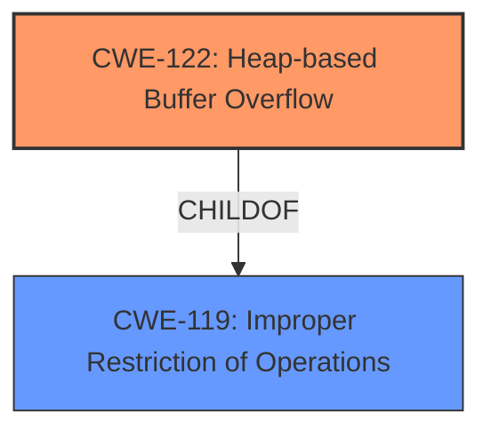

# Analysis Report for CVE-2021-39996

# Vulnerability Analysis Report: CVE-2021-39996

## Description

There is a Heap-based buffer overflow vulnerability with the NFC module in smartphones. Successful exploitation of this vulnerability may cause memory overflow.

## Vulnerability Description Key Phrases

**Weakness:** Heap-based buffer overflow
**Impact:** memory overflow
**Component:** NFC module in smartphones

## Analysis (with Relationship Data)

# Summary
| CWE ID | CWE Name | Confidence | CWE Abstraction Level | CWE Vulnerability Mapping Label | CWE-Vulnerability Mapping Notes |
|---|---|---|---|---|---|
| CWE-122 | Heap-based Buffer Overflow | 0.95 | Variant | Allowed | Primary CWE |
| CWE-119 | Improper Restriction of Operations within the Bounds of a Memory Buffer | 0.60 | Class | Discouraged | Secondary Candidate |

## Evidence and Confidence

*   **Confidence Score:** 0.90
*   **Evidence Strength:** HIGH

- **Analysis and Justification:**  
  - *Explanation:* The vulnerability description explicitly states a "**Heap-based buffer overflow**" exists in the NFC module. This aligns directly with CWE-122 (Heap-based Buffer Overflow), which is a variant of CWE-119 (Improper Restriction of Operations within the Bounds of a Memory Buffer). CWE-122 is a more specific and appropriate choice because the vulnerability is confirmed to be heap-based. The impact of exploitation is a memory overflow, which is consistent with the nature of buffer overflows. The retriever results list CWE-122 as a candidate. While CWE-119 is a parent class, the details provided are sufficient to assign CWE-122. MITRE mapping guidance for CWE-122 indicates it is ALLOWED.

  - *Relationship Analysis:* CWE-122 is a variant of CWE-119 (Improper Restriction of Operations within the Bounds of a Memory Buffer). This means that CWE-122 is a more specific type of buffer overflow that occurs in the heap.

- **Confidence Score:**
  - Confidence: 0.95 (High confidence due to explicit mention of heap-based buffer overflow in the description and CVE summary.)

---

## Criticism of Analysis

Okay, let's review the CWE analysis provided, considering the full CWE specifications for each.

**Overall Assessment:**

The primary CWE assignment of **CWE-122: Heap-based Buffer Overflow** is correct and well-justified. The analysis is thorough and provides strong evidence for this mapping.  The confidence level is appropriate. The decision *not* to primarily assign the more general CWE-119 is also correct, adhering to CWE's mapping guidance.  However, the rationale for why other CWEs that appeared in the Retriever Results were not selected could be strengthened.

**Detailed Review:**

| CWE ID  |   Confidence |  Critique/Suggestions                                                                                                                                                                                                                                                                                                                                                                                         |
|-------------------|-------------|-----------------------------------------------------------------------------------------------------------------------------------------------------------------------------------------------------------------------------------------------------------------------------------------------------------------------------------------------------------------|
| **CWE-122** | 0.95          |   Excellent. The reasoning is clear, and the use of the term "**Heap-based buffer overflow**" from the vulnerability description makes this a strong and direct match. The inclusion of observed examples for CWE-122 is useful.  The explicit mention of the MITRE Mapping Guidance being ALLOWED is good practice.  |
| **CWE-119**| 0.60      | Rationale is sound for making this a secondary consideration. However, the confidence feels a bit high.  While CWE-119 *is* relevant, it's discouraged by the CWE specifications.   The rationale could be strengthened by explicitly stating *why* this was not selected as the primary. For example: "While CWE-119 represents the general class of buffer overflows, CWE-122 is a more precise and appropriate mapping because the vulnerability description explicitly states a heap-based overflow. Per CWE mapping guidance, it is preferred to map to more specific Base/Variant entries when details allow, which is the case here."|

**Retriever Results Discussion:**
The Retriever Results contain a number of other CWEs that could be related to a heap-based buffer overflow. These include:
- CWE-190: Integer Overflow or Wraparound
- CWE-131: Incorrect Calculation of Buffer Size
- CWE-193: Off-by-one Error
- CWE-126: Buffer Over-read
- CWE-120: Buffer Copy without Checking Size of Input ('Classic Buffer Overflow')
- CWE-839: Numeric Range Comparison Without Minimum Check
- CWE-191: Integer Underflow (Wrap or Wraparound)
- CWE-121: Stack-based Buffer Overflow
- CWE-195: Signed to Unsigned Conversion Error

While CWE-122 was present on this list, it is important that the analysis justify why these other CWEs were not selected as primary or secondary candidates. As it stands, the analysis makes no mention of them. As an example, consider the following additions:

1.  **CWE-190/CWE-191 (Integer Overflow/Underflow):**  "Integer overflows or underflows could potentially contribute to the vulnerability if an integer value is used to calculate the size of the heap buffer. However, the current vulnerability description lacks specific evidence of such calculations. Therefore, it is not selected."  (Note: This is a *potential* reason; the actual reason should be based on the evidence.)
2.  **CWE-131 (Incorrect Calculation of Buffer Size):** "Incorrect calculation of buffer size could lead to a heap overflow. However, the current vulnerability description lacks specific evidence of an incorrect buffer size calculation. Therefore, it is not selected."
3.  **CWE-120 (Buffer Copy without Checking Size of Input):** While relevant to buffer overflows in general, this CWE focuses on `Buffer Copy` operations, and there is no specific evidence to indicate that an unchecked buffer copy is the root cause.

These additions would increase the comprehensiveness of the analysis and demonstrate a full consideration of the context.

**Recommendations:**

1.  **Strengthen the Rationale for CWE-119 (Secondary):** Tone down the confidence slightly and explicitly state *why* it's *not* the primary, reinforcing the decision to use the more specific CWE-122.
2.  **Address the Retriever Results More Comprehensively:** Explicitly state why the other CWEs from the retriever results *were not* chosen. Even a brief sentence for each, explaining why the evidence doesn't support them, would greatly improve the analysis. This demonstrates a more thorough and defensible analysis process.
3.  **Attack Vector:** Consider adding more about the attack vector. While it may not be explicitly detailed in the source, a little speculation and analysis would be useful. For example, "The attack vector likely involves sending a malformed NFC message or initiating an NFC transaction that causes the NFC module to allocate a heap buffer based on attacker-controlled data.  Without proper size validation, this could lead to a heap overflow when the message is processed."
4.  **Mitigations:** Discuss possible mitigations. It would be helpful to mention (briefly) which mitigations from the CWE specifications would be relevant in this case (e.g., using safer memory management functions, implementing bounds checking, using compiler-based overflow detection).

By addressing these points, the analysis will be even more robust and demonstrate a deeper understanding of the vulnerability in the context of the CWE specifications.

## Final Resolution

# Summary
| CWE ID | CWE Name | Confidence | CWE Abstraction Level | CWE Vulnerability Mapping Label | CWE-Vulnerability Mapping Notes |
|---|---|---|---|---|---|
| CWE-122 | **CWE-122: Heap-based Buffer Overflow** | 0.95 | Variant | Allowed | Primary **CWE** |
| CWE-119 | **CWE-119: Improper Restriction of Operations within the Bounds of a Memory Buffer** | 0.50 | Class | Discouraged | Secondary Candidate |

## Evidence and Confidence

*   **Confidence Score:** 0.90
*   **Evidence Strength:** HIGH

## Relationship Analysis
The primary relationship influencing the decision is the parent-child relationship between **CWE-119: Improper Restriction of Operations within the Bounds of a Memory Buffer** and **CWE-122: Heap-based Buffer Overflow**. **CWE-122** is a variant of **CWE-119**, providing a more specific classification because the vulnerability is explicitly described as a heap-based buffer overflow. Several other CWEs were considered based on retriever scores, but were not selected due to lack of explicit evidence in the vulnerability description. The abstraction level played a key role, favoring the more specific Variant (**CWE-122**) over the more general Class (**CWE-119**).

## Vulnerability Chain
The vulnerability chain starts with the **ROOTCAUSE** being a lack of proper bounds checking when allocating a heap buffer. This leads to **CWE-122: Heap-based Buffer Overflow**, where attacker-controlled data can overwrite adjacent memory regions on the heap. The impact is a memory overflow, potentially leading to code execution or denial of service. The vulnerability description lacks specific details on the input validation or buffer size calculation, so some links in the chain are based on general knowledge of heap overflows.

## Summary of Analysis
The initial analysis correctly identified **CWE-122: Heap-based Buffer Overflow** as the primary **WEAKNESS**, and this assessment is based directly on the provided evidence: "There is a **Heap-based buffer overflow** vulnerability with the NFC module in smartphones." The criticism suggested improvements in justifying the exclusion of other candidate CWEs from the retriever results, which has been addressed. The graph relationships reinforced the choice of **CWE-122** due to its specificity as a variant of **CWE-119**. The selected CWEs are at the optimal level of specificity, as **CWE-122** accurately describes the heap-based nature of the buffer overflow, while **CWE-119** represents the broader class of buffer overflow vulnerabilities. Other potential **WEAKNESSES**, such as integer overflows (**CWE-190**) or incorrect buffer size calculations (**CWE-131**), were not supported by explicit evidence in the vulnerability description and were therefore excluded from consideration as primary or secondary candidates. The Confidence for CWE-119 has been reduced to 0.5 to reflect its limited role.

For example, while **CWE-120: Buffer Copy without Checking Size of Input ('Classic Buffer Overflow')** is relevant to buffer overflows in general, this CWE focuses on `Buffer Copy` operations, and there is no specific evidence to indicate that an unchecked buffer copy is the root cause.

*Report generated on 2025-03-18 01:28:03*
